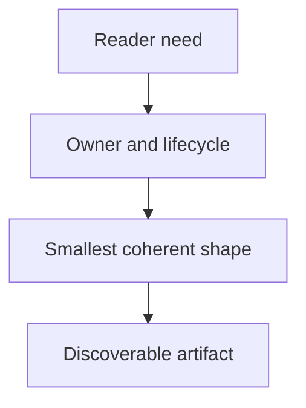

## Purpose

Choose a durable location, hierarchy, and representation.

## Approach

Shape content around reader goals, ownership, discoverability, and lifecycle while preserving existing structural conventions.

## How it should be done

Identify the reader and retrieval question; inspect the containing structure; choose the smallest meaningful location and representation; keep authority with the owning record; preserve navigation and lifecycle; assess moves before changing existing content.

## Design view

