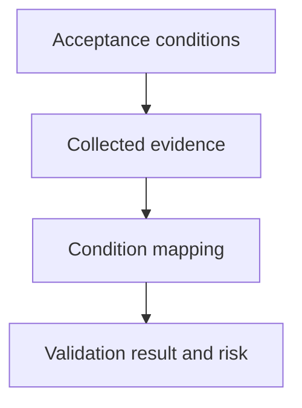

## Purpose

Map observable evidence to acceptance conditions and residual risk.

## Approach

Compare collected evidence with each acceptance condition, distinguish pass from unsupported claims, and record remaining risk.

## How it should be done

Create an acceptance-to-evidence matrix; inspect the actual diff and test results; mark each condition passed, failed, blocked, or untested; separate observations from inferences; record residual risk, recovery, and commit readiness.

## Design view

