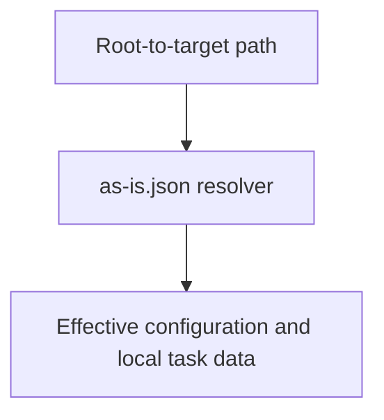

# as-is Data Resolution - as-is

## Purpose

Provide preparation-time resolution for distributed `as-is.json` data, including
root configuration and local transient task metadata, without replacing
human-facing Markdown context.

## Design

The component is organized around preparation-time configuration and task
metadata resolution.

- Pre-render layout plan: use the repository's Markdown Mermaid surface without assuming fixed dimensions; arrange three visible nodes and two labeled edges as a compact top-to-bottom resolution flow. Rendered geometry remains untested because no local renderer is configured.

[as-is](../../as-is.md#design) / [Components](../as-is.md#design) / **as-is Data Resolution**

### Effective configuration resolution

- Read `as-is.json` files along the root-to-target directory chain.
- Cascade `configuration`; keep `task` and other local data non-cascading.
- Produce an in-memory effective view without rewriting source files.
- Parse present `configuration` and `task` values strictly as objects.
- Report malformed JSON, unsafe paths, and invalid configuration as incomplete
  diagnostics rather than silently recovering.