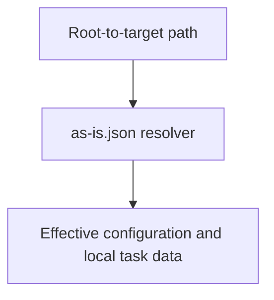

# as-is Data Resolution - as-is

## Purpose

Provide preparation-time resolution for distributed `as-is.json` data, including
root configuration and local transient task metadata, without replacing
human-facing Markdown context.

## Design

The component is organized around the following relationships and flow.

Parent: [as-is](../../as-is.md#design)

- Read `as-is.json` files along the root-to-target directory chain.
- Cascade `configuration`; keep `task` and other local data non-cascading.
- Produce an in-memory effective view without rewriting source files.
- Parse present `configuration` and `task` values strictly as objects.
- Report malformed JSON, unsafe paths, and invalid configuration as incomplete
  diagnostics rather than silently recovering.

## Links

- [`resolver.ts`](resolver.ts) — bounded preparation-time resolver.
- [`resolver.test.ts`](resolver.test.ts) — deterministic resolution tests.
- [`../as-is-setup/as-is.md`](../as-is-setup/as-is.md) — related setup component.

## Changelog

- Initial resolver component added for distributed `as-is.json` data.
