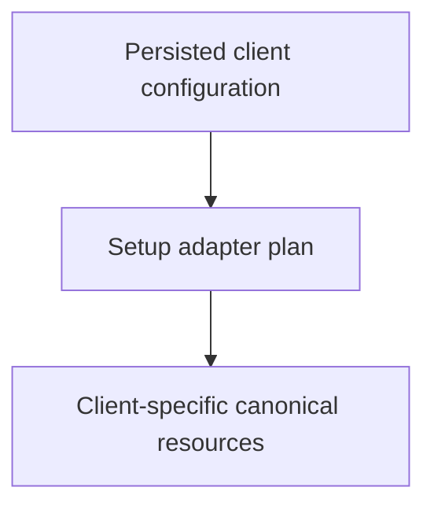

# as-is Setup - as-is

## Purpose

Provide the deterministic setup component that detects persisted client
configuration and exposes the as-is bundle's canonical skills and agents to
that client without copying resources or discovering them from unrelated
locations.

## Design

The component is organized around the following relationships and flow.

[as-is](../../as-is.md#design) / [Components](../as-is.md#design) / **as-is Setup**

- `setup.ts` is the executable boundary for deterministic client setup.
- `skills/` and `agents/` at the bundle root are the canonical resource
  folders.
- Each selected client receives an explicit adapter plan without copying
  canonical resources or overwriting unrelated targets.
- Existing configuration and relative links are preserved and validated.
- Detection uses persisted files and folders; automation may supply an explicit
  client root.

## Links

- [`setup.ts`](setup.ts) — detection, wiring, and JSON-safe configuration update.
- [`setup.test.ts`](setup.test.ts) — focused deterministic filesystem tests.
