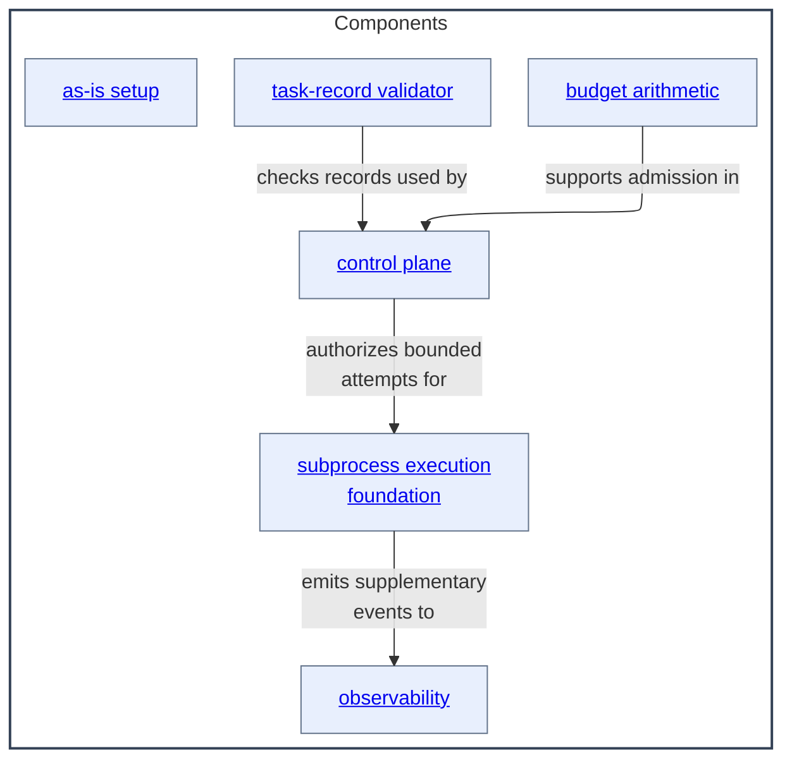

# Components - as-is

## Purpose

Own the repository's implementation components: focused runtime, resolution, control, validation, setup, execution, and observability responsibilities with independent source and test boundaries.

## Components

| Component | Purpose |
| --- | --- |
| [as-is setup](as-is-setup/as-is.md#design) | Detect clients and wire canonical resources without copying them. |
| [budget arithmetic](budget-control/as-is.md#design) | Historical component context for the migrated budget functionality; current implementation is under [`core/modules/task-control`](../core/modules/task-control/as-is.md#design). |
| [control plane](control-plane/as-is.md#design) | Historical component context for the migrated control-plane functionality; current implementation is under [`core/modules/task-control`](../core/modules/task-control/as-is.md#design). |
| [observability](observability/as-is.md#design) | Emit supplementary execution telemetry and bounded trace evidence. |
| [subprocess execution foundation](subprocess-execution-foundation/as-is.md#design) | Run bounded worker attempts through a detached host-neutral foundation. |
| [task-record validator](task-record-validator/as-is.md#design) | Check task-record invariants mechanically. |

## Design

The Components area groups implementation boundaries by responsibility rather than by execution order. Each child owns its source, focused tests, durable record, and component-specific history.

**Lineage**: [as-is](../as-is.md#design) / **Components**

### Component relationship map

The arrows show supported information and control relationships, not a mandatory execution sequence. Setup remains a client-wiring boundary; the other components are consumed by the host-neutral execution and context surfaces as their contracts require.

## Links

- [`../docs/component-task-record-protocol.md`](../docs/component-task-record-protocol.md) — shared component and task-record protocol.
- [`../docs/execution-contract.md`](../docs/execution-contract.md) — host-neutral execution boundary.
