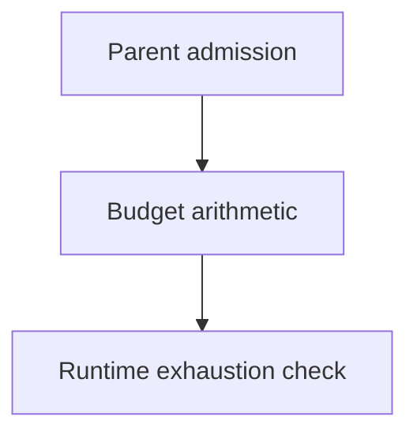

# Budget Arithmetic - as-is

This historical component record is retained for migration history. The current budget implementation and focused tests are documented under [`core/modules/task-control/as-is.md`](../../core/modules/task-control/as-is.md); this record is not a current source catalog.

## Purpose

Provide the smallest shared arithmetic seam for durable parent admission and
runtime budget exhaustion checks.

## Design

The component was organized around shared admission and exhaustion arithmetic.
The implementation moved to the task-control family; this record preserves the
historical component boundary and migration context without creating a second
authority.

**Lineage**: [as-is](../../as-is.md#design) / [Components](../as-is.md#design) / **Budget Arithmetic**

### Admission and exhaustion arithmetic

- Provide shared arithmetic for parent admission and runtime exhaustion checks.
- Leave allocations, approvals, extensions, and monetary enforcement to task
  records and the control plane.
- Preserve unknown provider observations as unavailable rather than zero.
