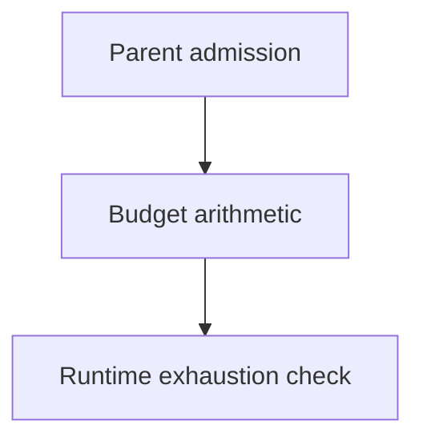

# Budget Arithmetic

## Purpose

Provide the smallest shared arithmetic seam for durable parent admission and
runtime budget exhaustion checks.

## Design

The component is organized around the following relationships and flow.

- Provide shared arithmetic for parent admission and runtime exhaustion checks.
- Leave allocations, approvals, extensions, and monetary enforcement to task
  records and the control plane.
- Preserve unknown provider observations as unavailable rather than zero.

## Links
