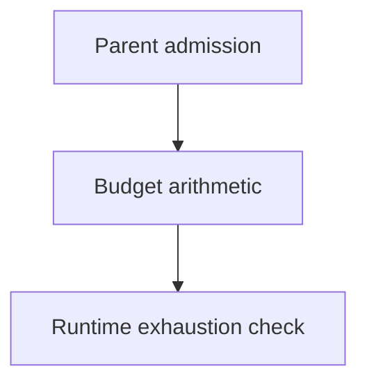

# Budget Arithmetic

## Purpose

Provide the smallest shared arithmetic seam for durable parent admission and
runtime budget exhaustion checks.

## Diagram

## Boundary

Task records and the control plane remain budget authority. This component does
not store allocations, approve extensions, or enforce monetary cost. Unknown
provider observations remain unavailable/unknown.

## Links

- `changelog.md` — concise completed-task history.
