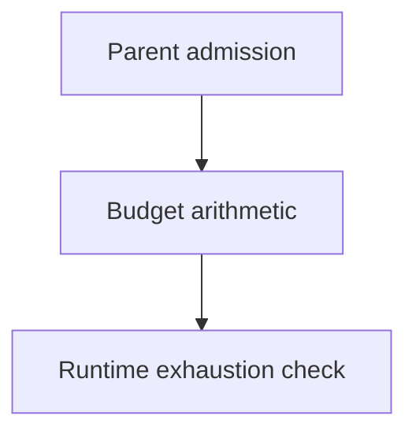

# Budget Arithmetic - as-is

## Purpose

Provide the smallest shared arithmetic seam for durable parent admission and
runtime budget exhaustion checks.

## Design

The component is organized around shared admission and exhaustion arithmetic.

- Pre-render layout plan: use the repository's Markdown Mermaid surface without assuming fixed dimensions; arrange three visible nodes and two labeled edges as a compact top-to-bottom arithmetic flow. Rendered geometry remains untested because no local renderer is configured.

[as-is](../../as-is.md#design) / [Components](../as-is.md#design) / **Budget Arithmetic**

### Admission and exhaustion arithmetic

- Provide shared arithmetic for parent admission and runtime exhaustion checks.
- Leave allocations, approvals, extensions, and monetary enforcement to task
  records and the control plane.
- Preserve unknown provider observations as unavailable rather than zero.
