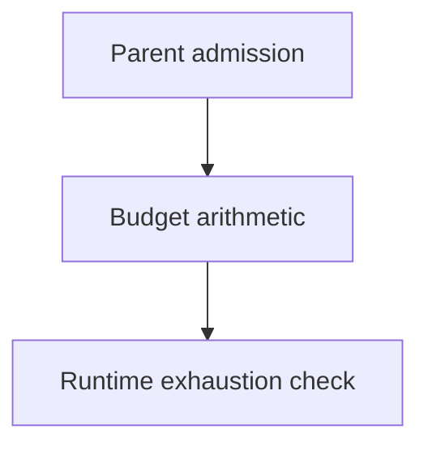

# Budget Arithmetic - as-is

## Purpose

Provide the smallest shared arithmetic seam for durable parent admission and
runtime budget exhaustion checks.

## Design

The component is organized around shared admission and exhaustion arithmetic.
It is one current implementation boundary within the readiness contract for a
future `core/modules/task-control/` family; no physical move or authority merge
is implied until a separate migration task is authorized.

**Lineage**: [as-is](../../as-is.md#design) / [Components](../as-is.md#design) / **Budget Arithmetic**

### Admission and exhaustion arithmetic

- Provide shared arithmetic for parent admission and runtime exhaustion checks.
- Leave allocations, approvals, extensions, and monetary enforcement to task
  records and the control plane.
- Preserve unknown provider observations as unavailable rather than zero.
