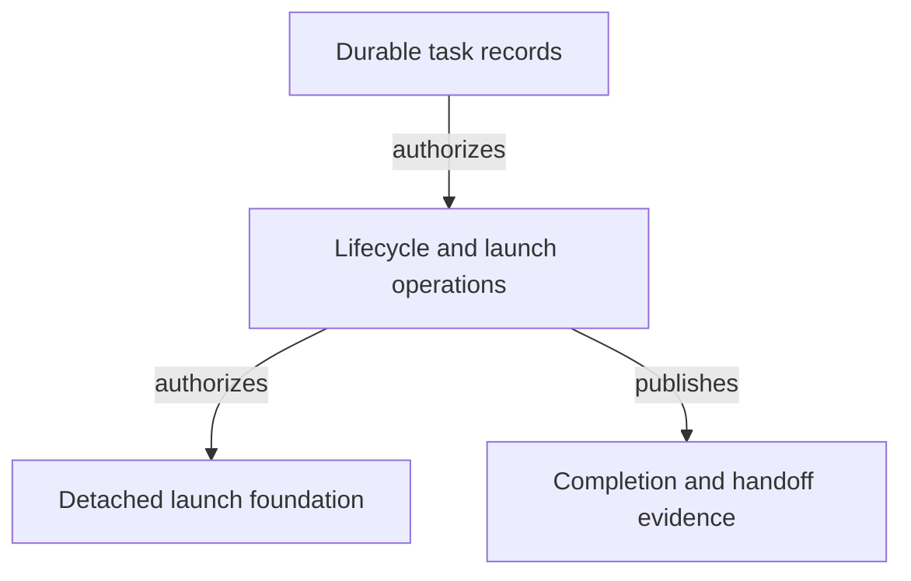

# Control Plane - as-is

## Purpose

Enforce host-neutral task lifecycle and launch authority from durable task
records without becoming a host-specific runtime or replacing record
authority.

## Design

The component owns dependency-free Bun/TypeScript operations for durable
record lifecycle, launch admission, approval boundaries, completion closure,
and the host-neutral control-plane CLI. It consumes task records and related
configuration while leaving host execution and runtime observation to their
own boundaries.

**Lineage**: [as-is](../../as-is.md#design) / [Components](../as-is.md#design) / **Control Plane**

### Durable lifecycle and launch authority

