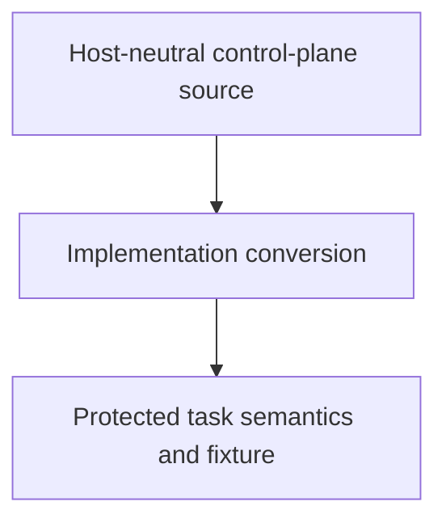

# Control Plane Implementation Conversion

## Purpose

Provide the first bounded child handoff for converting the initiative-1
host-neutral control-plane implementation from its currently reported Python
form to the repository-preferred Bun/TypeScript or Bun-compatible form without
changing authority, task-record semantics, or the protected historical fixture.

## Diagram

## Links

- `changelog.md` — concise completed-task history.
