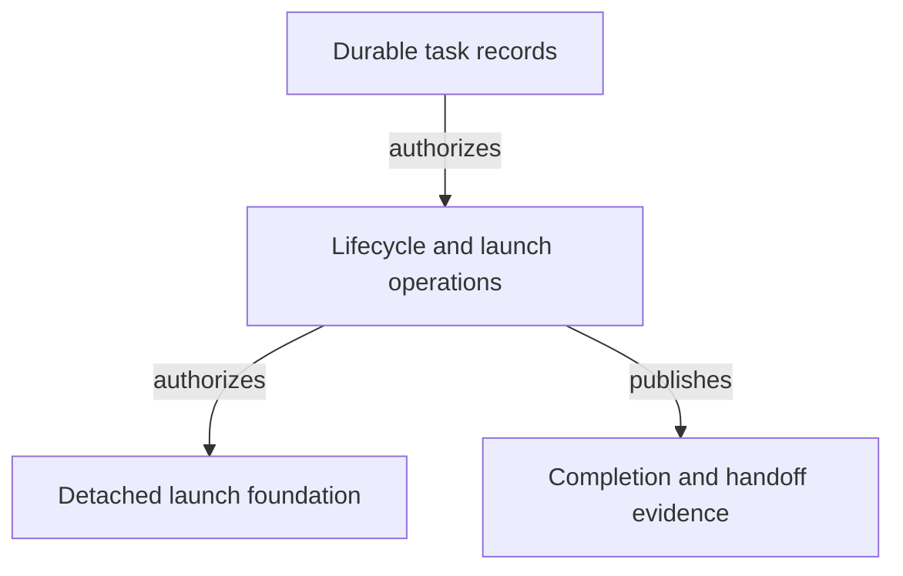

# Control Plane - as-is

## Purpose

Enforce host-neutral task lifecycle and launch authority from durable task
records without becoming a host-specific runtime or replacing record
authority.

## Design

The component owns dependency-free Bun/TypeScript operations for durable
record lifecycle, launch admission, approval boundaries, completion closure,
and the host-neutral control-plane CLI. It consumes task records and related
configuration while leaving host execution and runtime observation to their
own boundaries.

- Pre-render layout plan: use the repository's Markdown Mermaid surface without assuming fixed dimensions; arrange four visible nodes and three labeled edges as a compact top-to-bottom authority flow from durable records through lifecycle/admission operations to bounded launch and completion evidence. Rendered geometry remains untested because no local renderer is configured.

[as-is](../../as-is.md#design) / [Components](../as-is.md#design) / **Control Plane**

### Durable lifecycle and launch authority

