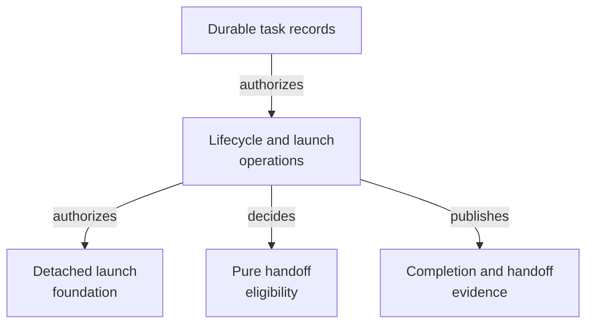

# Control Plane - as-is

This historical component record is retained for the control-plane implementation's migration history. The current implementation and focused tests are documented under [`core/modules/task-control/as-is.md`](../../core/modules/task-control/as-is.md); this record is not a current source catalog.

## Purpose

Enforce host-neutral task lifecycle and launch authority from durable task
records without becoming a host-specific runtime or replacing record
authority.

## Design

The component owns dependency-free Bun/TypeScript operations for durable
record lifecycle, launch admission, approval boundaries, completion closure,
completion/handoff eligibility, and the host-neutral control-plane CLI. It
consumes task records and related configuration while leaving host execution,
Git observation, process supervision, and runtime observation to their own
boundaries. Handoff eligibility is a pure decision function; adapters collect
facts and the control plane does not mutate records through that function. The
implementation moved to the task-control family; this record preserves the
historical component boundary and migration context.

**Lineage**: [as-is](../../as-is.md#design) / [Components](../as-is.md#design) / **Control Plane**

### Durable lifecycle and launch authority

- The pure handoff decision and focused tests now live in
  [`../../core/modules/task-control/handoff-eligibility.ts`](../../core/modules/task-control/handoff-eligibility.ts)
  and its adjacent test; this record retains the former ownership context.

