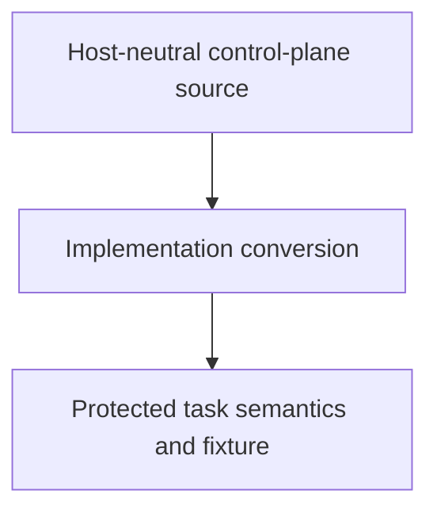

# Control Plane Implementation Conversion - as-is

## Purpose

Convert the initiative-1 host-neutral control-plane implementation from its
reported Python form to the repository-preferred Bun/TypeScript or compatible
form without changing authority, task-record semantics, or the protected
historical fixture.

## Design

The component is organized around the following relationships and flow.

Parent: [as-is](../../as-is.md#design)

