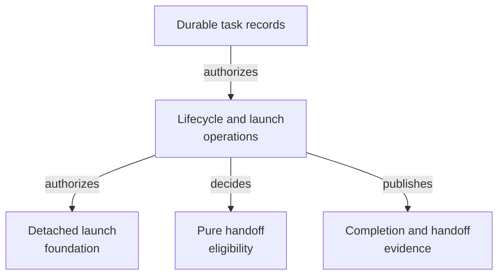

# Control Plane - as-is

## Purpose

Enforce host-neutral task lifecycle and launch authority from durable task
records without becoming a host-specific runtime or replacing record
authority.

## Design

The component owns dependency-free Bun/TypeScript operations for durable
record lifecycle, launch admission, approval boundaries, completion closure,
completion/handoff eligibility, and the host-neutral control-plane CLI. It
consumes task records and related configuration while leaving host execution,
Git observation, process supervision, and runtime observation to their own
boundaries. Handoff eligibility is a pure decision function; adapters collect
facts and the control plane does not mutate records through that function.

**Lineage**: [as-is](../../as-is.md#design) / [Components](../as-is.md#design) / **Control Plane**

### Durable lifecycle and launch authority

- [`handoff-eligibility.ts`](handoff-eligibility.ts) provides the pure,
  fail-closed handoff decision over adapter-collected durable, descendant,
  commit, and integration facts.
- [`handoff-eligibility.test.ts`](handoff-eligibility.test.ts) covers complete
  facts and each completion-gate blocker family.

