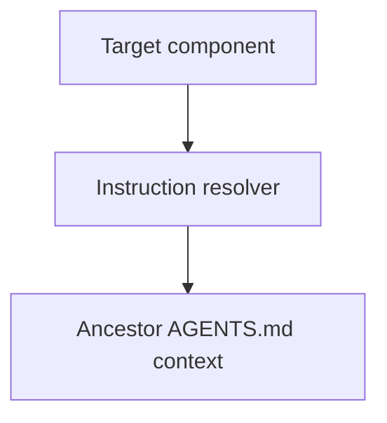

# Instruction Context

## Purpose

Resolve the applicable repository `AGENTS.md` instruction files for a target
component without treating the component working directory as a security
sandbox or exposing unrelated repository content.

## Diagram

## Design

The resolver accepts an authorized project root and logical target directory.
The launcher derives the project root from the launching client's current
working directory; the target directory remains the worker's execution scope.
It reads only `AGENTS.md` files on the root-to-target directory chain, in
ancestor-first order, and returns each file with its repository-relative path
and source scope. Missing files are normal. Escaping targets and symlink escapes
are rejected. This component does not resolve `as-is.md`, `as-is.json`, task
records, or arbitrary links.

## Links

- [`resolver.ts`](resolver.ts) — bounded instruction-file resolution.
- [`resolver.test.ts`](resolver.test.ts) — deterministic boundary tests.
