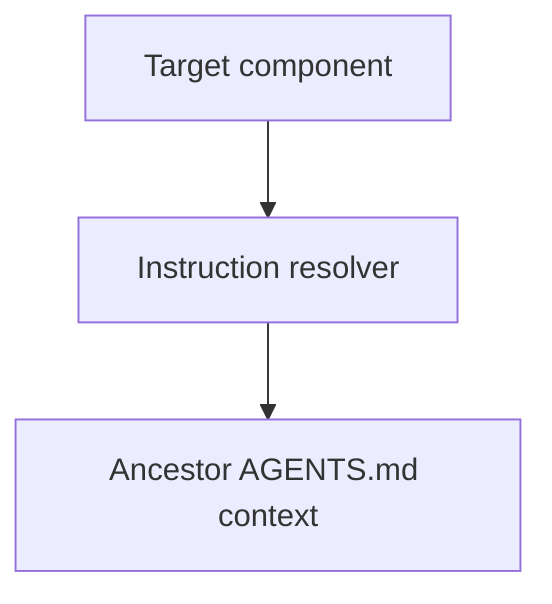

# Instruction Context - as-is

## Purpose

Resolve the applicable repository `AGENTS.md` instruction files for a target
component without treating the component working directory as a security
sandbox or exposing unrelated repository content.

## Design

The component is organized around bounded ancestor instruction resolution.

- Pre-render layout plan: use the repository's Markdown Mermaid surface without assuming fixed dimensions; arrange three visible nodes and two labeled edges as a compact top-to-bottom resolution flow. Rendered geometry remains untested because no local renderer is configured.

[as-is](../../as-is.md#design) / [Components](../as-is.md#design) / **Instruction Context**

### Ancestor instruction resolution

- Resolve only `AGENTS.md` files on the authorized root-to-target chain.
- Return ancestor-first content with repository-relative source scope.
- Treat missing instruction files as normal.
- Reject escaping targets and symlink escapes.
- Do not resolve `as-is.md`, `as-is.json`, task records, or arbitrary links.