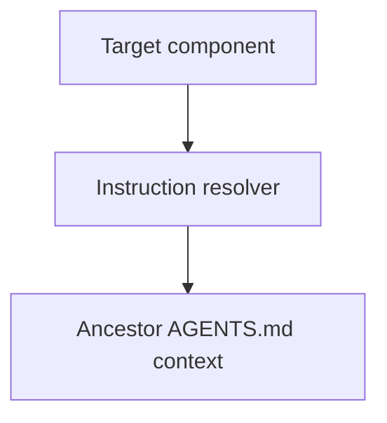

# Instruction Context - as-is

## Purpose

Resolve the applicable repository `AGENTS.md` instruction files for a target
component without treating the component working directory as a security
sandbox or exposing unrelated repository content.

## Design

The component is organized around the following relationships and flow.

Parent: [as-is](../../as-is.md#design)

- Resolve only `AGENTS.md` files on the authorized root-to-target chain.
- Return ancestor-first content with repository-relative source scope.
- Treat missing instruction files as normal.
- Reject escaping targets and symlink escapes.
- Do not resolve `as-is.md`, `as-is.json`, task records, or arbitrary links.

## Links

- [`resolver.ts`](resolver.ts) — bounded instruction-file resolution.
- [`resolver.test.ts`](resolver.test.ts) — deterministic boundary tests.
