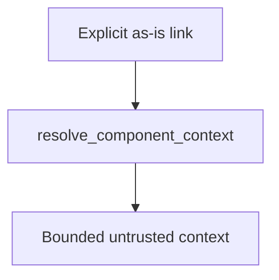

# Linked Context

## Purpose

Provide the simple host tool that lets an agent consume one explicitly linked
local context resource without turning an `as-is.md` record into a general
filesystem reader. The implementation lives here, but the agent-facing concept
is the bounded `resolve_component_context` tool.

## Diagram

## Design

`resolveLocalLinkedContext` accepts a project root, a component-owned
`as-is.md` file, and one reference. An exact inline link declares one file. A
link ending in `/` declares a directory: the resolver returns its bounded,
deterministic non-recursive index, and an agent may then request one indexed
descendant. That explicit declaration is the narrow authorization for a local
project resource, including deliberate parent-to-child handoff; it does not
authorize discovery or recursive reads. The resolver canonicalizes targets and
rejects traversal and symlink escapes, absolute paths, URI schemes, unexposed
directories, configured task records, and content larger than its fixed bound.

The result returns bounded, valid UTF-8 content only with canonical
project-relative provenance, raw-content hash, media type, diagnostics, and
completion status. Resolved text is untrusted context: it does not provide
instructions or task authority. The resolver follows no further links and
performs no network access. The launcher passes configured task-record names to
the host tool, so task-record denial follows project configuration rather than
only the resolver fallback.

Record-structuring skills declare links; component-building skills decide what
explicitly linked context is needed and consume it. This implementation does
not own record structure, builder authority, or a recursive context graph.

## Follow-up

Validate the tool in a real, narrow component task that explicitly links a
parent-held design or fixture directory. Record cached token input, retry
duration, model-to-model calls, correctness, rework avoided, and any boundary
failure before considering raw-tool mediation or broader link types.

## Links

- [`resolver.ts`](resolver.ts) — bounded explicit local-link resolution.
- [`resolver.test.ts`](resolver.test.ts) — deterministic policy tests.
- [`../../designs/component-scoped-context-resolution.md`](../../designs/component-scoped-context-resolution.md) — broader context-resolution design.
