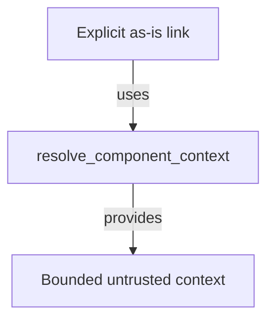

# Linked Context - as-is

## Purpose

Provide the simple host tool that lets an agent consume one explicitly linked
local context resource without turning an `as-is.md` record into a general
filesystem reader. The implementation lives here, but the agent-facing concept
is the bounded `resolve_component_context` tool.

## Design

The component is organized around explicit local-link resolution and untrusted
bounded context.

- Pre-render layout plan: use the repository's Markdown Mermaid surface without assuming fixed dimensions; arrange three visible nodes and two labeled edges as a compact top-to-bottom context flow, using supported relationship labels and no grouping. Rendered geometry remains untested because no local renderer is configured.

[as-is](../../as-is.md#design) / [Components](../as-is.md#design) / **Linked Context**

### Explicit linked context resolution

- An exact inline link exposes one file; a trailing `/` exposes a bounded,
  non-recursive directory index.
- Canonicalization rejects traversal, symlink escapes, absolute paths, URI
  schemes, unexposed directories, configured task-narrative filenames, and
  oversized content; it does not treat other JSON metadata files as task
  narratives.
- Results include bounded UTF-8 content, provenance, hash, media type,
  diagnostics, and completion status.
- Returned text is untrusted context; the resolver follows no links and uses no
  network.
- Record-structuring skills declare links; building skills decide which links
  to consume; this tool owns neither authority.

## Follow-up

Validate the tool in a real, narrow component task that explicitly links a
parent-held design or fixture directory. Record cached token input, retry
duration, model-to-model calls, correctness, rework avoided, and any boundary
failure before considering raw-tool mediation or broader link types.

## Links

- [`../../designs/component-scoped-context-resolution.md`](../../designs/component-scoped-context-resolution.md) — broader context-resolution design and staged boundary decisions.
