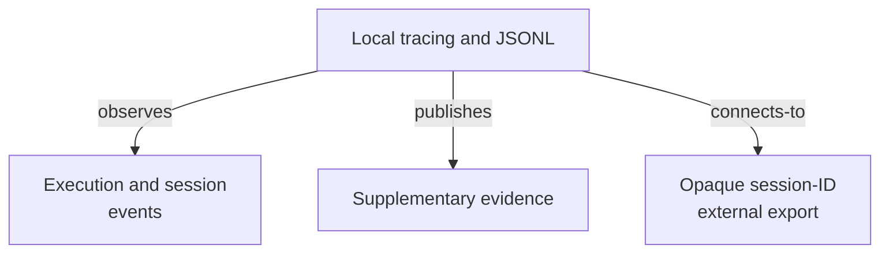

# Observability - as-is

## Purpose

Provide supplementary execution telemetry and bounded trace evidence without
becoming task, job, validation, recovery, or completion authority.

## Design

The component is organized around supplementary telemetry and opaque external
correlation. Bounded local session inspection is a separate read-only host
surface; this component does not hold task, job, validation, recovery, or
completion authority.

**Lineage**: [as-is](../../as-is.md#design) / [Components](../as-is.md#design) / **Observability**

### Supplementary telemetry and query boundaries

- Use repository tracer configuration and a local JSONL sink, with optional
  backend-compatible export.
- Keep trace records supplementary and append-only within configured retention
  and size limits; local JSONL remains bounded diagnostic evidence rather than
  task or audit authority.
- Keep trace content under configured retention and failure controls.
- Local Pi session inspection remains a separate read-only exact-ID host
  surface; this component supplies opaque session correlation rather than the
  query implementation.
- Send external sinks only opaque session IDs, never local session content or
  store references.
- Own tracing implementation and observability backlog items; bounded query
  support remains staged outside this component's tracer boundary.
- Do not let trace failures, malformed events, unavailable sinks, or size
  limits change durable task decisions.
- Evaluate budget extensions from task records and bounded evidence, never from
  trace events alone.
- Capture delegation lifecycle, worker outcomes, supervisor phases, handoffs,
  and opaque session correlation; never export session payloads.

## Links

- [`tracer.ts`](tracer.ts) — stable tracing implementation boundary whose bounded event and sink behavior is indispensable to understand the component.
- [`tracing-design.md`](tracing-design.md) — broader tracing design and staged
  rollout boundaries.
