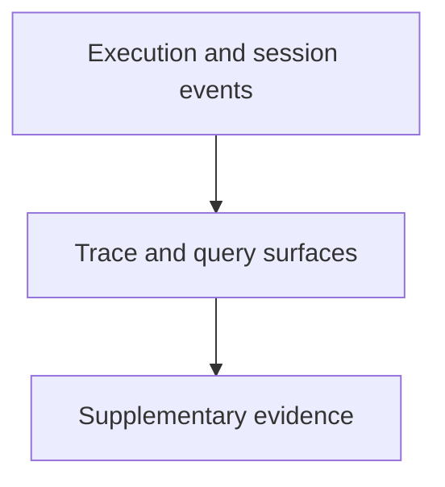

# Observability - as-is

## Purpose

Provide supplementary execution telemetry and trace query support without becoming task, job, validation, recovery, or completion authority.

## Design

The component is organized around the following relationships and flow.

[as-is](../../as-is.md#design) / [Components](../as-is.md#design) / **Observability**

- Use repository tracer configuration and a local JSONL sink, with optional
  backend-compatible export.
- Keep trace content under configured retention and failure controls.
- Expose readable local Pi sessions only through a read-only exact-ID query
  surface.
- Send external sinks only opaque session IDs, never local session content or
  store references.

## Design

- Own tracing implementation, trace queries, and observability backlog items.
- Keep trace records supplementary and append-only within configured retention
  limits; preserve historical JSONL as audit evidence.
- Do not let trace failures, malformed events, unavailable sinks, or size
  limits change durable task decisions.
- Evaluate budget extensions from task records and bounded evidence, never from
  trace events alone.
- Capture delegation lifecycle, worker outcomes, supervisor phases, handoffs,
  and opaque session correlation; never export session payloads.

## Links

- [`tracer.ts`](tracer.ts) — tracer implementation.
- [`tracer.test.ts`](tracer.test.ts) — focused tracer checks.
- [`tracing-design.md`](tracing-design.md) — broader tracing design and staged
  rollout boundaries.
