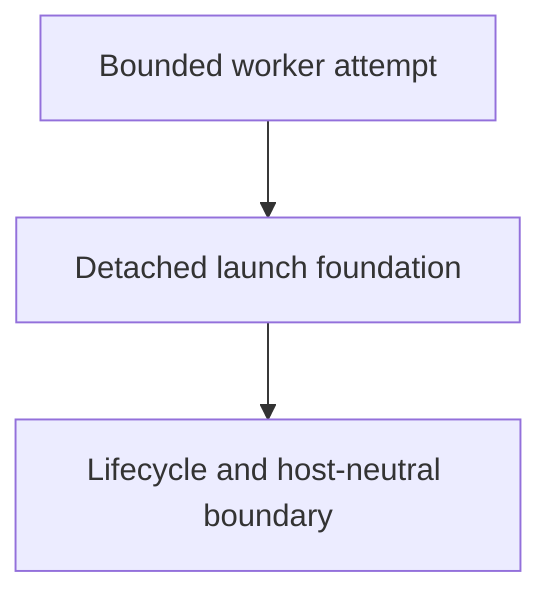

# Subprocess Execution Foundation

## Purpose

Own the cross-cutting, host-neutral launch foundation that submits a bounded
worker attempt without making the submitting as-is/OpenCode/orchestrator turn
wait for worker completion.

## Design

The component is organized around the following relationships and flow.

- Submit a bounded worker attempt through a detached process-group foundation.
- Preserve the non-blocking launch and lifecycle boundary for the submitting
  agent.
- Implement only the supervisor portion of the shared task-record and
  host-neutral execution contracts.
- Historical investigation found synchronous nested delegation and blind
  waiting increased elapsed time; host capability and attribution limitations
  remain residual risks.

## Links
