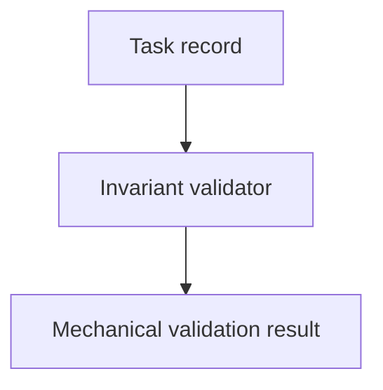

# Task-Record Validator

## Purpose

Make the Increment 2 task-record invariants mechanically checkable without
host-specific runtime enforcement.

## Diagram

## Links

- `backlog.md` — planning index for this component's open work.

## Changelog

- Validation ownership remains with this component; no new implementation was
  added.
