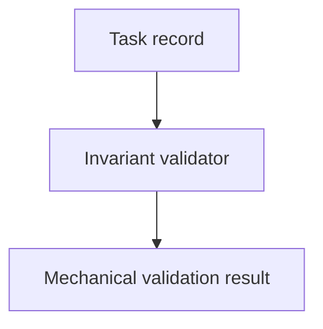

# Task-Record Validator - as-is

## Purpose

Make task-record invariants mechanically checkable without host-specific
runtime enforcement.

## Design

The component is organized around mechanical task-record invariant checks.

**Lineage**: [as-is](../../as-is.md#design) / [Components](../as-is.md#design) / **Task-Record Validator**

### Task-record invariant validation

- Validate task-record invariants independently of host-specific runtime
  enforcement.
- Keep validation ownership here without becoming task authority or runtime
  enforcement.
