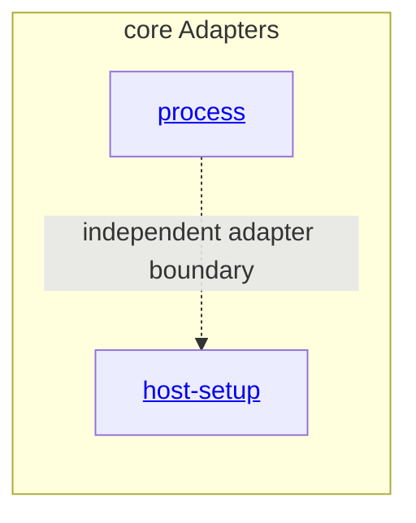

# core Adapters - as-is

## Purpose

Organize approved host- or transport-specific implementations that map core contracts to execution surfaces without becoming a second task authority.

## Components

| Component | Purpose |
| --- | --- |
| [Process](process/as-is.md#design) | Adapt bounded process-group execution and observation behind the host-neutral execution boundary. |
| [Host setup](host-setup/as-is.md#design) | Adapt persisted-client detection and canonical-resource setup without owning host-integration approval or target-project state. |

## Design

**Lineage**: [as-is](../../as-is.md#design) / [core](../as-is.md#design) / **core Adapters**

### Adapter hierarchy

The adapter hierarchy is the immediate-child structural map.

Adapters are added only when a concrete host or transport boundary is established. The process and host-setup adapters are approved concrete families. Pi session adapters remain separately bounded work.

## Links

- [`../../designs/core-modules-tools-and-skills.md`](../../designs/core-modules-tools-and-skills.md) — staged adapter direction.
