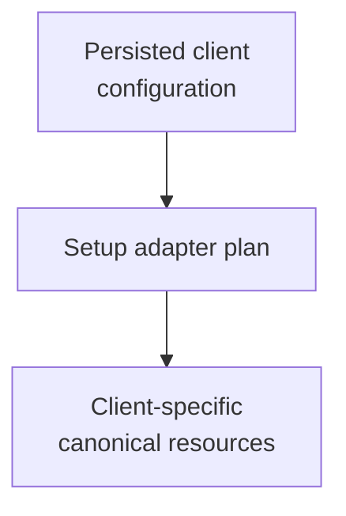

# host-setup - as-is

## Purpose

Provide the deterministic host-setup adapter that detects persisted client
configuration and exposes the bundle's canonical skills and agents to that client without copying resources or discovering them from unrelated locations. This adapter owns setup mechanics only; host-integration remains the planning and approval boundary for future installed-host manifests, projection, and target-write policy.

## Design

The component is organized around deterministic client detection and
canonical-resource wiring.

**Lineage**: [as-is](../../../as-is.md#design) / [core](../../as-is.md#design) / [core Adapters](../as-is.md#design) / **host-setup**

### Deterministic client setup

- `setup.ts` is the executable boundary for deterministic client setup.
- `skills/` and `agents/` at the bundle root are the canonical resource
  folders.
- Each selected client receives an explicit adapter plan without copying
  canonical resources or overwriting unrelated targets.
- Existing configuration and relative links are preserved and validated.
- Detection uses persisted files and folders; automation may supply an explicit
  client root.
- This adapter does not own an approved host manifest, target-project consent,
  browser or environment discovery, or broad host-integration policy.

## Links

- [`setup.ts`](setup.ts) — detection, wiring, and JSON-safe configuration update as the stable executable setup boundary.
- [`../../../host-integration/as-is.md#design`](../../../host-integration/as-is.md#design) — future installed-host integration approval boundary; it does not own this adapter's implementation.
