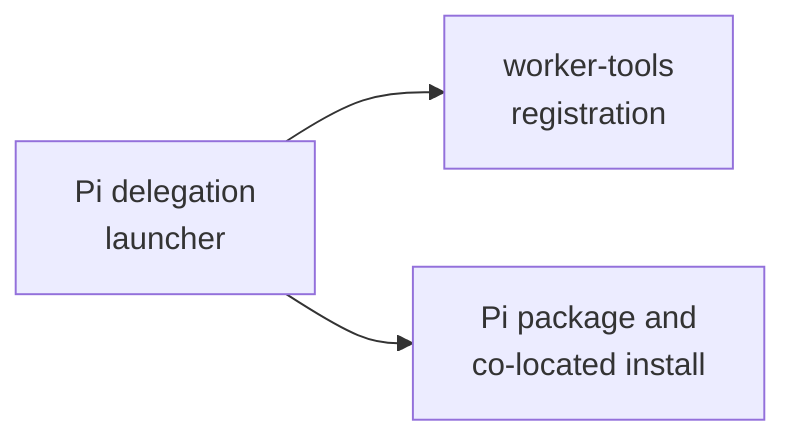

# Pi adapter - as-is

## Purpose
Adapt bounded Pi subprocess delegation behind the launcher contract while keeping task-record, Git, worktree, and completion authority with their owning components.

## Design

This runtime home keeps the governed delegation launcher at `scripts/spawn-pi-subagent.ts`, the worker-tools registration boundary under `extensions/`, and the Pi package plus co-located `node_modules` under one independent adapter boundary. Pi resolution prefers Bun for JavaScript entries and retains the tested fallback contract; the adapter consumes the process boundary without becoming a second task authority.

**Lineage**: [as-is](../../../as-is.md#design) / [core](../../as-is.md#design) / [core Adapters](../as-is.md#design) / **Pi adapter**

### Governed Pi delegation

This home is the F5/A4 runtime-only provenance retained when the narrative skill retired. It was re-homed before the structuring pass at commit `1f9c25e`; the move preserved the launcher, registration boundary, package manifest, lockfile, and installed dependencies together.

## Links

- [`scripts/spawn-pi-subagent.ts`](scripts/spawn-pi-subagent.ts) — governed bounded delegation launcher.
- [`extensions/worker-tools.ts`](extensions/worker-tools.ts) — package-owned worker-tools registration boundary.
- [`package.json`](package.json) — co-located Pi package and dependency contract.
