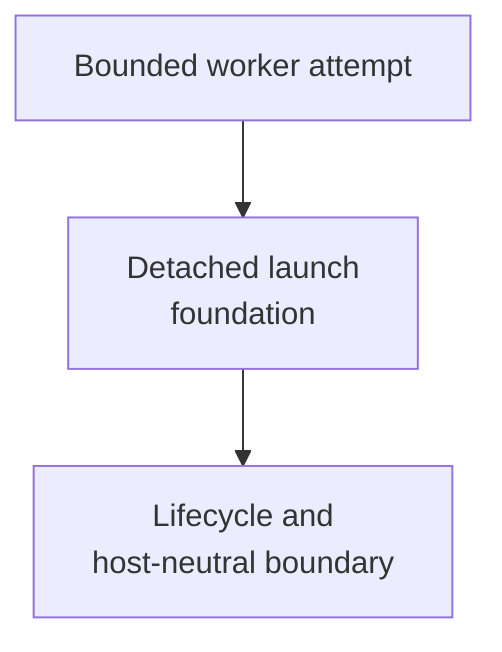

# process adapter - as-is

## Purpose

Own the cross-cutting, host-neutral launch foundation that submits a bounded
worker attempt without making the submitting as-is/OpenCode/orchestrator turn
wait for worker completion.

## Design

The adapter is organized around detached launch and lifecycle boundaries for
bounded worker attempts. The Pi launcher consumes the shared mechanical process
boundary without transferring task-record, Git, worktree, or handoff authority
into this adapter; this is an adapter relationship, not a second task authority.

**Lineage**: [as-is](../../../as-is.md#design) / [core](../../as-is.md#design) / [core Adapters](../as-is.md#design) / **process adapter**

### Detached bounded worker launch

- Submit a bounded worker attempt through a detached process-group foundation.
- Preserve the non-blocking launch and lifecycle boundary for the submitting
  agent.
- Implement only the supervisor portion of the shared task-record and
  host-neutral execution contracts.
- Historical investigation found synchronous nested delegation and blind
  waiting increased elapsed time; host capability and attribution limitations
  remain residual risks.
- The shared launcher seam is mechanically tested by the launcher's provider-free
  behavioral suite; the foundation's own provider-free suite remains the
  lifecycle and durable-record regression anchor.
## Links

- [`supervisor.ts`](supervisor.ts) — host-neutral detached lifecycle implementation.
- [`supervisor.test.ts`](supervisor.test.ts) — provider-free lifecycle and durable-record behavioral tests.
- [`bounded-process-supervisor.ts`](bounded-process-supervisor.ts) — launcher adapter's shared mechanical process boundary.
