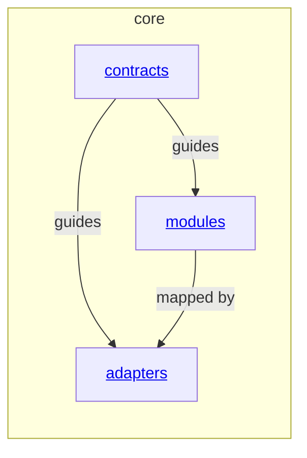

# core - as-is

## Purpose

Organize host-neutral deterministic implementation families and their focused module boundaries without becoming a host adapter, agent role, skill, or target-project integration.

## Components

| Component | Purpose |
| --- | --- |
| [Modules](modules/as-is.md#design) | Organize host-neutral deterministic functionality families. |
| [Adapters](adapters/as-is.md#design) | Map approved core contracts to host or transport execution surfaces. |
| [Contracts](contracts/as-is.md#design) | Collect normative cross-component contracts without becoming an implementation or task authority. |

## Design

**Lineage**: [as-is](../as-is.md#design) / **core**

### Core module hierarchy

The `core` area contains approved host-neutral deterministic implementation families. It is not an agent-facing tool registry, host projection surface, setup replacement, or target-project authority. Only separately approved families receive a documented child component. Physical placement does not merge distinct security, provenance, lifecycle, or authority boundaries.

## Relationships

- `core` provides host-neutral deterministic functionality and normative contracts to skills, task flows, and adapters through focused boundaries.
- `contracts` provides normative document entry points; it does not provide executable APIs or absorb implementation ownership.
- Host adapters and agent-facing tools remain separate categories; their creation and placement require independent ownership evidence.

## Links

- [`../designs/core-modules-tools-and-skills.md`](../designs/core-modules-tools-and-skills.md) — approved vocabulary and staged migration direction.
- [`contracts/index.md`](contracts/index.md) — normative contract collection.
- [`contracts/architecture-vocabulary.md#component-boundary`](contracts/architecture-vocabulary.md#component-boundary) — shared component boundary meaning.
