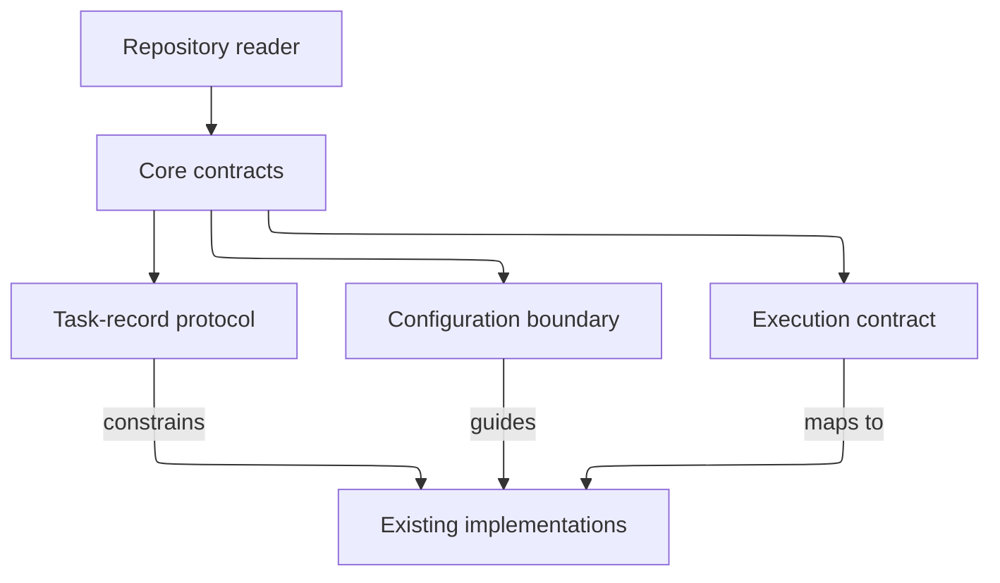

# Core Contracts - as-is

## Purpose

Provide a discoverable collection for normative, cross-component contract documents while keeping implementation, task authority, host mapping, and reusable procedure ownership with their existing components.

## Design

**Lineage**: [as-is](../../as-is.md#design) / [core](../as-is.md#design) / **Core Contracts**

### Contract collection context

The collection is a structural home for normative documents, not a merged runtime authority. The task-control implementation owns task transitions and task-record interpretation; context resolution owns generic resolution; observability owns tracing semantics; process and Pi adapters own host mappings. The contract documents describe those boundaries without replacing them. Benchmark plans, generated benchmark runs, copied dependencies, and disposable runtime state are unrelated and remain outside this component.

## Relationships

- Core contracts provides shared normative context to modules, adapters, skills, and roles.
- Existing implementation owners validate and interpret their own contracts; document placement does not transfer that authority.
- The collection is separate from benchmarking, generated runtime state, package dependencies, and host projections.

## Links

- [index.md](index.md) — grouped contract entry point.
- [component-task-record-protocol.md](component-task-record-protocol.md) — task-only protocol.
- [configuration.md](configuration.md) — generic configuration-data boundary and consumer ownership.
- [execution-contract.md](execution-contract.md) — host-neutral execution lifecycle contract.
- [architecture-vocabulary.md](architecture-vocabulary.md) — shared architecture terms and relationship labels.
- [Core](../as-is.md#design) — parent boundary.
