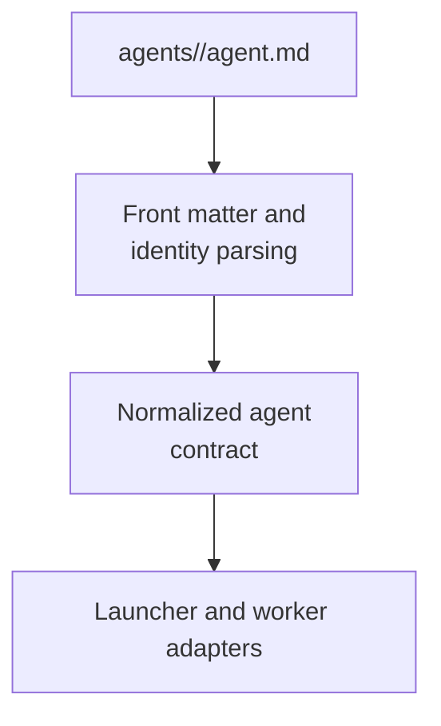

# agent-resolution - as-is

## Purpose

Provide one host-neutral deterministic functionality for resolving canonical agent role contracts, front matter, declared tools, and stable identity without owning Pi sessions, tool registration, process spawning, task admission, or expert safety policy.

## Design

**Lineage**: [as-is](../../../as-is.md#design) / [core](../../as-is.md#design) / [core Modules](../as-is.md#design) / **agent-resolution**

### Canonical role resolution

- `agent-resolution.ts` validates canonical role names, parses agent front matter, normalizes declared tools, and derives stable identities.
- Resolution is read-only and fails closed for missing roles, malformed front matter, empty declarations, unsupported tools, and path-like role selectors.
- Consumers retain authority over admission, model and thinking resolution, Pi sessions, process lifetime, task records, and safety profiles.
- Focused tests preserve caller-independent role lookup and declared-tool behavior.

## Relationships

- The spawning launcher and Pi worker adapter consume this functionality.
- Agent Markdown remains the canonical role contract; this module does not own agent records or skill definitions.
- Host adapters may map the normalized contract, but this module remains host-neutral.

## Links

- [`agent-resolution.ts`](agent-resolution.ts) — canonical parsing and resolution implementation.
- [`../../../designs/core-modules-tools-and-skills.md`](../../../designs/core-modules-tools-and-skills.md) — staged module direction.
- [`../../../skills/spawning-subagents/as-is.md`](../../../skills/spawning-subagents/as-is.md) — launcher ownership and consumer context (baseline `spawning-pi-subagents` skill record retired at F6; launcher runtime remains at `skills/spawning-pi-subagents/scripts/`).
