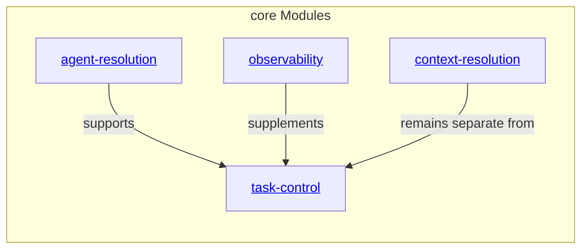

# core Modules - as-is

## Purpose

Organize approved host-neutral deterministic functionality families under `core` while preserving each family's focused APIs, tests, authority, and security boundaries.

## Components

| Component | Purpose |
| --- | --- |
| [Context Resolution](context-resolution/as-is.md#design) | Resolve configuration, instructions, and explicitly linked local context through distinct focused APIs. |
| [Task Control](task-control/as-is.md#design) | Coordinate durable task lifecycle, budget arithmetic, mechanical validation, and pure handoff eligibility through distinct focused APIs. |
| [Agent Resolution](agent-resolution/as-is.md#design) | Resolve canonical role contracts and declared tools without owning admission or sessions. |
| [Observability](observability/as-is.md#design) | Provide supplementary telemetry and bounded trace evidence without task authority. |

## Design

**Lineage**: [as-is](../../as-is.md#design) / [core](../as-is.md#design) / **core Modules**

### Module-family hierarchy

The `modules` area groups deterministic functionality by supported responsibility and lifecycle. It does not authorize host registration, agent-facing tool admission, task transitions, or target-project writes. Each family retains focused APIs and tests. A shared family name does not imply shared trust semantics or a merged implementation.

## Relationships

- `modules` provides deterministic functionality to host-neutral consumers through explicit APIs.
- Consumer and adapter ownership remains outside this structural grouping unless a separate component record establishes otherwise.

## Links

- [`../../designs/core-modules-tools-and-skills.md`](../../designs/core-modules-tools-and-skills.md) — staged module-family migration direction.
- [`../../core/contracts/architecture-vocabulary.md#structural-containment`](../../core/contracts/architecture-vocabulary.md#structural-containment) — documented parent and child boundaries.
