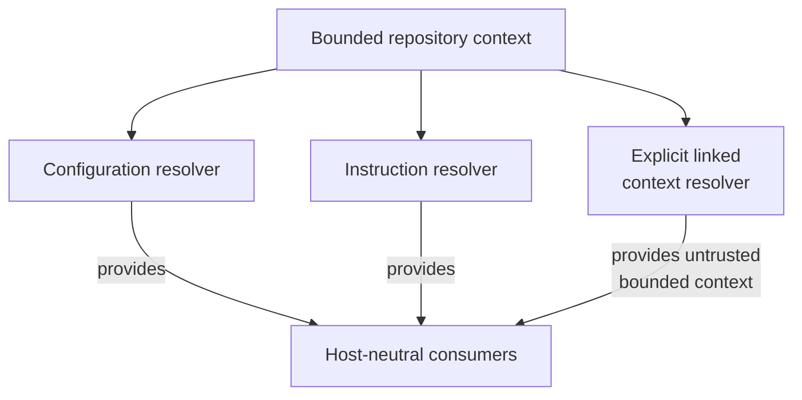

# context-resolution - as-is

## Purpose

Provide host-neutral, deterministic resolution of configuration, applicable ancestor instructions, and explicitly linked local context through focused APIs that preserve their distinct security, provenance, and authority boundaries.

## Purpose

| API | Purpose |
| --- | --- |
| Configuration API | Resolve cascading configuration while isolating local task data. |
| Instruction API | Resolve bounded ancestor instruction context. |
| Linked-context API | Resolve explicitly linked bounded local context as untrusted data. |

This component contains three focused implementation partitions rather than separately documented child components: configuration resolution, instruction resolution, and linked-context resolution. Their shared family location does not merge their trust or authority semantics.

## Design

The family is a host-neutral implementation boundary. It provides generic read-only context and configuration-data resolution; it does not own consumer namespaces or defaults and does not authorize task transitions, delegation, tool admission, setup, projection, host behavior, or target-project writes.

**Lineage**: [as-is](../../../as-is.md#design) / [core](../../as-is.md#design) / [core Modules](../as-is.md#design) / **context-resolution**

### Focused resolution APIs

- [`configuration-resolver.ts`](configuration-resolver.ts) cascades only `configuration` from root to target, preserves local task isolation, and reports provenance and diagnostics for malformed or unsafe data.
- [`instruction-resolver.ts`](instruction-resolver.ts) resolves only applicable ancestor `AGENTS.md` files in bounded order and rejects traversal or symlink escapes.
- [`linked-context-resolver.ts`](linked-context-resolver.ts) follows explicitly exposed local links only, bounds files and directories, preserves provenance and hashes, rejects unsafe/task/child-boundary references, and treats returned content as untrusted.
- The focused tests beside each API preserve the prior behavior and security boundaries.

## Relationships

- `context-resolution` provides read-only functionality to task control, launchers, worker tools, and other bounded consumers.
- Consumers use resolved information but do not gain authority over the resolver's source boundaries or task state.
- Host adapters may map these APIs later; this component remains host-neutral.

## Links

- [`../../../designs/component-scoped-context-resolution.md`](../../../designs/component-scoped-context-resolution.md) — staged context-resolution security and provenance design.
- [`../../../designs/core-modules-tools-and-skills.md`](../../../designs/core-modules-tools-and-skills.md) — migration contract and module-family direction.
- [`../../../core/contracts/architecture-vocabulary.md#owner-and-authority`](../../../core/contracts/architecture-vocabulary.md#owner-and-authority) — ownership and authority terms.
