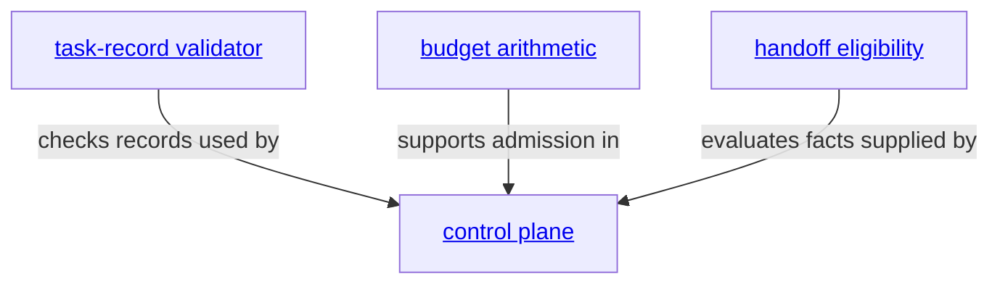

# task-control - as-is

## Purpose

Provide one documented host-neutral deterministic task-control family while preserving distinct task-transition, budget-arithmetic, validation, and handoff-eligibility boundaries.

## Design

**Lineage**: [as-is](../../../as-is.md#design) / [core](../../as-is.md#design) / [core Modules](../as-is.md#design) / **task-control**

### Task-control family

The shared family is a structural home, not a merged authority. The control-plane API is the only task-transition owner; budget arithmetic remains policy-light; the validator is read-only and mechanically independent; and handoff eligibility is pure and fail-closed. Host execution, Git observation, process supervision, telemetry, setup, projection, target state, and agent delegation remain outside this family.

## Relationships

- The control plane consumes context-resolution functionality and authorizes bounded host-neutral execution without owning host execution. It is the durable authority for task status, checkpoints, questions, approvals, cancellation, completion, descendant closure, and launch-budget admission; the current process supervisor maps execution observations around that authority without becoming a second task-control owner. A future execution-contract module, if justified by the readiness inventory and fixtures, must consume rather than replace these task-control boundaries.
- Budget arithmetic is consumed by the control plane, subprocess foundation, launcher, and Pi worker adapter while task records remain authoritative.
- The validator is invoked by repository validation and remains independent of control-plane mutation.
- Handoff eligibility is consumed by the launcher after host adapters collect immutable facts.
- The Python validator reference remains at [`../../../validation-fixtures/task-record-validator-reference/task_record_validator.py`](../../../validation-fixtures/task-record-validator-reference/task_record_validator.py) as non-runtime compatibility evidence until a separately authorized retirement decision.

## Links

- [`../../../designs/core-modules-tools-and-skills.md#phase-9c--task-control-readiness-and-completed-migration`](../../../designs/core-modules-tools-and-skills.md#phase-9c--task-control-readiness-and-completed-migration) — completed migration contract and evidence.
- [`../../../docs/component-task-record-protocol.md`](../../../docs/component-task-record-protocol.md) — task-record authority and lifecycle protocol.
