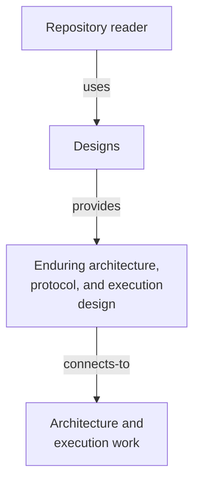

# Designs - as-is

## Purpose
Provide a discoverable component for enduring architecture, protocol, and
execution design documents.

## Design

**Lineage**: [as-is](../as-is.md#design) / **Designs**

### Design-document discovery context

This component has no independently documented child components. The design
artifacts in this directory are ordinary documents rather than child
`as-is.md` components, so no container diagram is included.

## Links
- [model-simplicity-guidance.md](model-simplicity-guidance.md) — guidance for model-assisted coding to
  prefer simple central ownership over duplicated local solutions. Its open
  implementation item is recorded in the root [`backlog.md`](../backlog.md).
- [core-modules-tools-and-skills.md](core-modules-tools-and-skills.md) — phased handoff for separating core modules, agent-facing tools, skills, roles, adapters, component tasks, and subagent-first implementation.
- [aspirational-architecture-handoff.md](aspirational-architecture-handoff.md) — current-to-future boundary, ownership, sequencing, and non-authorizations for the remaining aspirational architecture items.
- [component-scoped-context-resolution.md](component-scoped-context-resolution.md) — component-building execution model that minimizes ambient context while preserving project-tool behavior; implemented by [`core/modules/context-resolution`](../core/modules/context-resolution/as-is.md).

Pruned designs (implemented or superseded programs, removed 2026-09-04) remain recoverable from git history: the three agentic-development-system plan documents via the cutover commit `c9c73e0`, and the remaining nine via the pushed history up to `9a77e37`.
