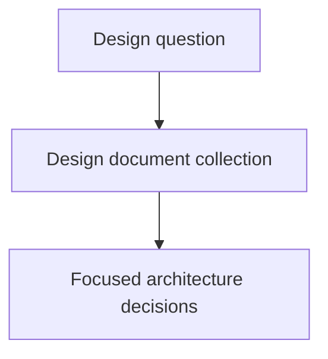

# Designs

## Purpose
Provide a discoverable component for enduring architecture, protocol, and
execution design documents.

## Diagram

## Links
- `execution-accounting-design.md` — execution accounting design.
- `orchestration-design.md` — orchestration design.
- `independent-delegation.md` — independent delegation design.
- `model-simplicity-guidance.md` — guidance for model-assisted coding to
  prefer simple central ownership over duplicated local solutions. Its open
  implementation item is recorded in the root [`backlog.md`](../backlog.md).

## Changelog

- 2026-08-02: added `model-simplicity-guidance.md`; its bounded implementation
  item is recorded and linked in the root `backlog.md`.
- 2026-08-02: merged the completed execution-accounting design task into this
  design-component record; the design remains under `designs/` until its
  implementation is authorized.
- 2026-07-30: resolved independent delegation's budget holder as the per-child
  detached supervisor; retained child self-limiting for unobservable provider
  cost.

## Accounting Design Task History

The completed execution-accounting design task was previously recorded at
`execution-accounting-design/as-is.md`. Its task-specific acceptance and
validation evidence is preserved here as historical component context; the
permanent design remains authoritative at
`execution-accounting-design.md`.

### Purpose

Define durable accounting identity, runtime JobId diagnostic handling, resource
attribution, parent/child ownership, retry/recovery reconciliation, and the
fixture matrix required before implementation.

### Acceptance and evidence

- Defined `component-path/task-revision/attempt` as durable observation identity
  and removed runtime JobId authority from current task context.
- Defined private supervisor JobId-map persistence, restart reconciliation,
  expiry, component-path status, and diagnostic-only JobId behavior.
- Defined cost, wall-clock, build/failure, parent/child, retry/recovery, and
  full-invocation versus worker-subtree ownership.
- Preserved the OpenCode adapter/generic supervisor separation and retired
  systemd lineage without modifying runtime implementation.
- Recorded design fixtures for two attempts, retry/recovery, unavailable money,
  measured time, parent/child delegation, build outcomes, overlapping
  attribution boundaries, and JobId-map restart.
- Validation passed the task-record validator, focused supervisor and
  control-plane tests, reference checks, and `git diff --check`. Historical
  measured values remained source-labelled; unavailable values were not
  converted to zero.

The task was design-only. Future implementation must create a new bounded task
under the responsible component and must not infer implementation completion
from this historical design record.
