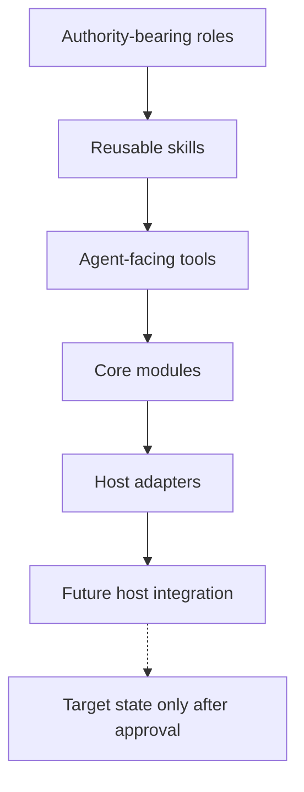

# Aspirational Architecture Handoff

## Purpose

Record the remaining aspirational architecture boundaries after the approved transitional migration and complete dissolution of `components/`. This document is a planning handoff, not authorization to create target directories, change runtime behavior, project resources, or implement every proposed item.

## Current Baseline

The implemented structure is:

```text
agents/                         Authority-bearing roles.
skills/                         Reusable procedures and capability compositions.
tools/                          Bounded agent-facing implementations.
core/modules/                   Approved host-neutral functionality families.
core/adapters/                  Approved host- or transport-specific adapters.
host-integration/               Planning and approval context for future host integration.
validation-fixtures/            Retained compatibility and behavioral evidence.
.pi/                            Projected Pi registration surface, not canonical source.
```

The completed module and adapter families are `context-resolution`, `task-control`, `agent-resolution`, `observability`, `process`, and `host-setup`; the completed tool families are `agent`, `context`, and `evidence`. The `components/` container has been removed. The absence of a target directory below is evidence that its work remains future, not a request to create it speculatively.

### Current-to-future boundary



The flow communicates composition and mapping boundaries, not an implementation sequence or authorization to write target state.

## Aspirational Items

| Item | Proposed owner | Bounded responsibility | Sequence and readiness gate | Recovery boundary | Explicit non-authorizations |
| --- | --- | --- | --- | --- | --- |
| Execution contract | Future `core/modules/execution-contract/`, coordinated by the root design and current process/launcher owners | Define normalized launch, observe, question, cancel, and recover concepts plus execution request/observation shapes and durable-versus-host observation boundaries. | Measure the remaining overlap between the launcher, process adapter, task-control evidence, and `docs/execution-contract.md`; define the smallest stable contract; prove provider-free request/observation and failure/recovery fixtures before relocation or consolidation. | Preserve the current launcher, process adapter, and task-record paths until consumer and behavior checks pass; if contract extraction is interrupted, restore the prior API/reference state rather than leaving split lifecycle ownership. | No broad abstraction, second task authority, process-policy takeover, runtime rewrite, or assumption that the existing document alone proves implementation ownership. |
| Pi adapter | Future `core/adapters/pi/`, after an explicit readiness task | Own Pi session construction, subprocess invocation, model/session details, and Pi registration as a host adapter of approved core contracts. | Depends on the execution-contract boundary and package/extension loading evidence; inventory `.pi/extensions/`, skill-owned extensions, Pi versioning, trust, loading, compatibility, and rollback before any move. | Retain `.pi/extensions/` and package-owned loading as the recovery path until explicit adapter-loading and compatibility tests pass; revert a partial move without deleting the working registration surface. | No immediate creation of `core/adapters/pi/`, ambient extension discovery, hidden repository-relative imports, provider-policy changes, or transfer of task/completion authority. |
| Task-facing tools | Future `tools/task/`, if focused task operations are shown to be a real agent-facing sibling family | Expose bounded status or control observations and explicitly authorized operations while keeping task transitions in `core/modules/task-control/`. | Revalidate tool consumers and role declarations after task-control evidence; define admission, output bounds, mutation routing, and denied/unavailable cases before grouping or registration. | Keep current tool registration and task-control callers intact until focused tool tests pass; on failed extraction, remove only the new registration/path changes and restore the prior bounded surface. | No task authority in a tool, implicit transition, replacement of the control plane, or speculative directory created for one operation. |
| Setup replacement | `skills/as-is-setup/` procedure with `core/adapters/host-setup/` implementation | Separately evaluate and, when authorized, replace the setup procedure with a bounded command/script that preserves discovery, collision safety, idempotence, reviewable writes, and component approval. | Select the existing setup backlog scope; define command ownership, supported targets, write allowlist, recovery, and focused tests before implementation; use host-integration context for cross-host approval rather than moving setup authority. | Retain the current skill and adapter as the rollback path until dry-run, collision, idempotence, and recovery tests pass; any target effects require separate approval and recoverable evidence. | No setup replacement bundled into architecture regrouping, target-machine writes, projection policy, browser capability, or deletion of the current setup evidence. |
| Installed host integration | `host-integration/` | Own the future approved resource manifest, supported-host matrix, adapter contract, target-write allowlist, capability prerequisites, collision/recovery policy, and cross-host validation. | Add a bounded host-integration backlog item with explicit user approval; consume setup evidence and capability inventories; prove manifest conformance and unsupported-host behavior before projection. | Keep integration planning-only until an approved manifest and write allowlist exist; preserve target state and record collision/recovery evidence for every authorized projection, with no implicit rollback authority. | No installation, projection, target writes, host registration, or canonical-resource transfer from this planning handoff. |
| Shared browser capability | Host-integration capability boundary, with an agent-facing consumer only after ownership evidence | Define a reusable local browser input/result contract for Mermaid, rendered Markdown, DOM, screenshot, or accessibility consumers where multiple consumers justify one owner. | Establish the owner, browser/bundle discovery, version, security/network policy, isolation, cancellation, timeout, resource limits, and unsupported behavior; then prove at least the justified shared consumer set. | Treat the current renderer as the preserved fallback; require bounded process cleanup and cancellation evidence, and disable only the new consumer path if capability startup or teardown validation fails. | No browser installation, new generic component, Mermaid lifecycle duplication, target effect, or claim that the current Mermaid renderer is the final shared owner. |
| Environment capability inventory | Host-integration capability boundary with a future bounded agent-facing tool owner to be selected | Report terminal-visible commands, packages, extensions, renderers, and host capabilities with bounded identity, version, provenance, availability, and safe failure results. | Define command-resolution and `PATH` provenance, probe limits, secret exclusions, active-versus-declared tool semantics, and unavailable states; focused fixtures must cover present, missing, incompatible, aliased, and non-executable entries. | Keep the inventory read-only and disposable; if a probe or parser fails, return a bounded unavailable result and preserve declarations, configuration, and runtime checks as the recovery authorities. | No installation, activation, admission, authorization, arbitrary command output, secret exposure, second configuration authority, or assumption that one shell represents every host. |
| Package-owned Pi extension boundary | `skills/spawning-pi-subagents/` package boundary, with any host-services implementation separately owned | Preserve the reusable generic worker-registration library and static repository-owned adapter while deciding whether a separately distributed host-services API is justified. | Keep the current Option A boundary unless standalone operation is explicitly selected; require package version, dependency, trust, loading, compatibility, security, rollback, and self-containment evidence for any broader package change. | Preserve the current package export and static repository adapter until a replacement loads and registers successfully in focused fixtures; revert package and adapter changes together if loading, trust, or compatibility evidence fails. | No independent-package claim, hidden dynamic or repository-relative host import, removal of the static `.pi/` adapter, or bundling of host-services design into an unrelated migration. |
| Standalone package worker host | `skills/spawning-pi-subagents/` backlog item `standalone-package-worker-host`, with a future host-services distribution owner if selected | Provide independently versioned host services for role, configuration, context, budget, tracing, and evidence semantics only if independent installed-package operation has sufficient value. | Remains lower-preference and open; select only after defining the host-services API, distribution, trust, compatibility, security, release, and rollback boundaries and after its package-extension dependency is available. | Keep the current repository-owned worker path authoritative; require a versioned compatibility and rollback plan before any separate distribution, and abandon only the candidate package artifacts if self-containment fails. | No claim that the current Pi `ExtensionAPI` factory is sufficient, no premature package split, and no changes to current worker semantics. |
| Broader tools/modules regrouping | Root-owned planning item `root:organize-tools-and-modules-by-capability` after prerequisites | Inventory tools, extensions, dependencies, binaries, package entry points, modules, adapters, consumers, authority, and recovery risk; propose only evidence-backed ownership-preserving moves. | Depends on the browser and environment capability decisions where applicable; approve the inventory and canonical grouping before any history-preserving relocation or behavior change. | Preserve the pre-move inventory and current paths until each family has its own consumer and regression evidence; revert only the scoped history-preserving move if integration or recovery checks fail. | No broad move, generic capability bucket, host-required-name breakage, compatibility removal, or use of static resemblance to authorize restructuring. |

## Sequencing

1. Reconcile and, where needed, select bounded readiness work for the execution contract and host-integration boundary rather than creating speculative directories.
2. Define the environment capability inventory and shared browser ownership only when their multiple-consumer value and host boundaries are evidenced.
3. Reassess the Pi adapter and package-owned extension boundary against the execution contract, current launcher behavior, Pi dependency contract, and host-services requirements.
4. Select task-facing tool extraction only after task-control consumers, admission, mutation routing, and output bounds are explicit.
5. Evaluate setup replacement independently from the preceding architecture work.
6. Perform any broader tools/modules regrouping last, using the completed ownership inventory and separate history-preserving migration tasks.

Each selected item requires its own bounded task, task-start commit, readiness or behavioral evidence, durable record updates, expert review where applicable, completion commit, and cleanup. A planning dependency does not authorize its dependent implementation.

## Ownership And Recovery

`as-is.md` records remain the durable architecture context, backlogs remain planning indexes, `as-is.json` remains machine configuration and active task authority when a task is selected, and configured task narratives remain transient human evidence. Core modules remain host-neutral; adapters remain host-specific; tools remain bounded and agent-facing; skills remain procedures; roles retain selection, delegation, mutation, recovery, and completion authority.

A future relocation must begin with a committed inventory of consumers, ownership, compatibility, behavioral evidence, durable-record impact, and recovery paths. Preserve history with tracked-path moves, update proven references atomically, retain a reversible commit boundary, and classify dynamic, generated, projected, package, CLI, and external consumers rather than inferring that static search is complete.

## Links

- [`core-modules-tools-and-skills.md`](core-modules-tools-and-skills.md) — staged architecture direction and completed migration evidence.
- [`../host-integration/as-is.md#design`](../host-integration/as-is.md#design) — future installed-host boundary and approval context.
- [`../backlog.md`](../backlog.md) — root planning items and exact aspirational follow-ups.
- [`../skills/spawning-pi-subagents/backlog.md`](../skills/spawning-pi-subagents/backlog.md) — package-host and launcher follow-ups.
