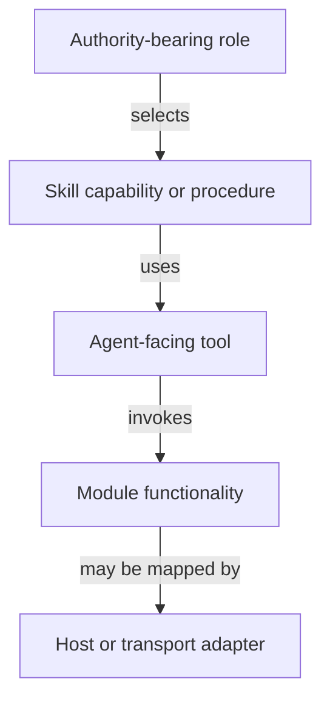

# Core Modules, Tools, Skills, And Subagent-First Migration

## Purpose

This handoff records the aligned direction for structuring the repository as a collection of reusable agent-building tools. It is a planning document, not authorization to move files, change runtime behavior, or replace existing host integrations. Each implementation phase requires its own bounded task, behavioral-test evidence, affected durable-record updates, acceptance evidence, scoped commit, and post-commit compaction before the next phase begins.

## Vocabulary

| Term | Meaning |
| --- | --- |
| Functionality | A deterministic operation provided by code. |
| Module | A reusable implementation package that provides deterministic functionalities. |
| Capability | An agent-facing ability or outcome defined by a skill; it may use modules and tools. |
| Tool | An agent-callable code bundle that exposes or applies module functionality or another bounded capability. |
| Skill | A reusable capability definition, procedure, capability composition, or capability interface. |
| Role | An authority-bearing agent contract that selects paths, makes dynamic decisions, and may delegate or request advice. |
| Adapter | A host- or transport-specific implementation or mapping of a core contract, module, or tool. |
| Component | A durable repository directory with a canonical `as-is.md` record describing its purpose, design, relationships, boundary, and navigation. |
| Scope | The resources an execution may inspect or modify. |
| Task | One bounded execution instance with a scope, record, constraints, and completion policy. |
| Ad hoc task | A bounded task that is not governed by the component-building completion flow and may keep its task record outside VCS. |

The relationship is: modules provide functionalities; tools expose functionality to agents; skills define or compose capabilities; and roles decide whether and how to apply those capabilities. Capability is not a required filesystem artifact and should not be confused with deterministic functionality.

## Repository shape

The intended top-level separation is:

```text
agents/
    Authority-bearing agent roles.

skills/
    Reusable agent capabilities, procedures, and compositions.

tools/
    Agent-callable code bundles.

core/
    modules/
        Deterministic functionality providers.

    adapters/
        Host- or transport-specific implementations.
```

No separate `workflows/` directory is planned. A workflow is the runtime result of a role selecting and applying skills and tools. Roles retain dynamic workflow selection; skills describe bounded available paths and contracts; tools provide callable operations; task policy constrains the resulting execution.

The current `components/` directory is an implementation and documentation arrangement, not the final vocabulary for deterministic modules. The target direction is to place implementation modules under `core/modules/` while preserving the repository meaning of Component for a directory with a canonical `as-is.md`. A physical move is a later phase, not part of this handoff. Any component-building activity, including restructuring work performed within a component boundary, must review and update the relevant durable `as-is.md` record(s) when purpose, design, relationships, boundaries, ownership, or linked artifacts change; those updates are part of the same scoped handoff rather than optional documentation cleanup.

## Task model

Component-building remains a skill. It covers governed work that targets a component and may begin from a component backlog item. It selects or creates the task, consumes component context, performs implementation, may delegate bounded descendants, validates the result, records a changelog, and produces the required scoped VCS handoff and parent integration evidence.

Ad hoc tasks cover bounded experiments, quick cleanup, and other work that does not need the component-building flow. They may be initiated without a backlog item, use a private task record outside VCS, and produce a report, experiment result, cleanup result, or other bounded artifact. They do not require component `as-is.md` context-building rules or a changelog. An ad hoc task must still declare its scope and must not silently bypass ownership when it modifies a component.

The shared overlap is provided by reusable modules and focused skills rather than a generic task-profile framework. Do not introduce a separate task-profile abstraction unless concrete ad hoc use demonstrates a need. Universal task safety remains applicable where relevant: bounded scope, explicit constraints, recoverable progress, evidence-based completion, and no completion inference from process exit alone.

## Capability composition



Component-building is a skill-level capability bundle rather than a core module:

```text
component-builder role
    selects component-building skill
        composes context assembly, task lifecycle, verification, delegation, and handoff procedures
            uses context, task-control, agent-resolution, execution, and evidence tools
                invokes core module functionality through host adapters
```

A skill may be used without a tool when the role performs the procedure through its ordinary agent capabilities. A skill must not silently grant role authority, select an agent, authorize a task transition, or delegate without the role and task policy permitting it.

## Core module families

### Context resolution

A context-resolution module family should replace the narrow implication of the current `as-is-data` name. It is general-purpose and may be used by task control, launchers, tools, and other flows.

```text
core/modules/context-resolution/
    configuration and task-data resolution
    instruction resolution
    linked-context resolution
```

The current three implementations have distinct security and provenance rules and should initially remain focused APIs within one module family rather than being collapsed into one broad resolver or split into many independently documented areas. Configuration resolution must remain usable outside component-building.

### Task control

```text
core/modules/task-control/
    durable task lifecycle and admission
    budget arithmetic
    task-record validation
    handoff eligibility
```

The family may be physically grouped, but its boundaries remain distinct: mutation authority is not validation, pure arithmetic is not policy, and handoff evaluation is not host observation. The task-record validator must be ported from Python to Bun/TypeScript while remaining mechanically independent of the mutating control-plane implementation. The pure handoff eligibility functionality currently under the launcher should move conceptually into task control.

### Agent resolution

One agent-resolution module is sufficient:

```text
core/modules/agent-resolution/
    canonical role lookup
    agent contract parsing
    declared tool parsing
    model and thinking resolution
    normalized agent execution definition
```

It should not own Pi session construction, tool registration, process spawning, task admission, or expert safety policy. The module is justified by duplicated logic in the subprocess launcher and Pi worker-tools extension; further subdivision is premature until independent consumers or lifecycles appear.

### Observability

```text
core/modules/observability/
    supplementary trace emission
    session-reference policy
    bounded local trace storage
```

Observability remains supplementary and must not authorize task transitions, replace task records, infer completion, or block execution when telemetry fails. Trace and session query operations are agent-facing tools; evidence interpretation remains a skill and role concern.

### Execution contract

```text
core/modules/execution-contract/
    normalized launch, observe, question, cancel, and recover concepts
    execution request and observation shapes
    durable versus host-observation boundaries
```

The current subprocess foundation and Pi launcher contain overlapping implementation logic for process lifetime, budgets, tracing, worktrees, checkpoints, and handoff evidence. The contract should become the stable core boundary, while host-specific process and Pi behavior moves behind adapters in later phases.

## Adapter families

Adapters are the primary new top-level category besides core modules:

```text
core/adapters/
    pi/
        in-process agent sessions
        Pi subprocess invocation
        Pi tool registration

    process/
        detached process supervisor

    host-setup/
        canonical resource projection and client wiring
```

The current `components/as-is-setup` and `skills/as-is-setup` are deliberately out of scope for this migration. A separate backlog item intends to replace the setup skill with a command or script; that work should reconcile setup ownership and adapter placement without being bundled here.

The process supervisor may implement a host-neutral execution contract while still being a process-host adapter in implementation terms. It owns process groups, timers, signals, and cleanup; it must not become a second task authority. The Pi adapter owns Pi invocation, model/session details, and Pi registration; it must not redefine task or completion semantics.

## Agent-facing tools

The current Pi worker-tools extension combines several tool families and should eventually be decomposed into separately testable tools with a thin Pi registration adapter:

```text
tools/
    context/
        resolve-linked-context

    agent/
        call-subagent

    evidence/
        query-traces
        analyze-sessions

    task/
        task status and control operations
```

The exact directory names remain subject to naming validation in the relevant implementation task. Tool extraction must preserve capability declarations, fail-closed admission, bounded output, authority boundaries, and host-specific registration behavior.

## Subagent-first migration phases

The phases are ordered so that later work can be performed by isolated subagents using the earlier foundations. Each phase is a separate task and scoped commit. After each commit, the durable task record is compacted into the owning changelog and the next phase starts from the committed state. No phase may silently combine unrelated relocation, behavior changes, or cleanup.

### Phase 0 — Commit this planning handoff

**Scope:** Create this design handoff, link it from the Designs record, and add the implementation umbrella and phase dependencies to the appropriate backlog without changing runtime behavior.

**Acceptance:** Terminology, ownership boundaries, task distinction, proposed module and adapter families, subagent-first ordering, setup exception, and phase gates are recorded; links and Markdown checks pass; the handoff is committed as one scoped documentation change; the root task is compacted.

**Compaction:** Retain the design handoff and concise root changelog evidence; remove the transient root task record after the scoped commit.

### Phase 1 — Stabilize subagent contract and role resolution

**Owner:** The launcher/subagent execution component and its parent integration boundary.

**Scope:** Extract or define one normalized agent-resolution functionality and one stable subagent execution request/handle/observation boundary from the current launcher and Pi worker-tools implementation. Preserve current role declarations, model/thinking resolution, capability admission, caller metadata, and expert read-only safety behavior.

**Acceptance:** A deterministic provider-free test proves canonical role resolution, declared-tool handling, explicit model/thinking resolution, unsupported capability rejection, and expert safety caps. The execution request identifies scope, record, role, budget, and return condition without making runtime handles authoritative. Existing launcher tests and the affected agent/skill behavioral tests remain passing; the relevant agent and skill `as-is.md` records are updated if the contract or relationships change.

**Isolation value:** Later phase agents can be launched through a stable role and execution contract without depending on duplicated prompt parsing or caller-session behavior.

### Phase 2 — Stabilize detached execution and observation

**Owner:** The subprocess execution foundation and its parent integration boundary.

**Scope:** Reconcile the overlap between the Pi launcher supervisor path and `subprocess-execution-foundation`. Establish one owner for detached process groups, wall-clock enforcement, worktree preservation, cancellation signals, lifecycle observation, and cleanup. Keep task records authoritative and telemetry supplementary.

**Acceptance:** Provider-free fixtures prove launch returns before worker completion where detach is requested, the supervisor owns the worker process group and wall-clock stop, logs and lifecycle observations are retained, cancellation and cleanup are bounded, preserved worktrees remain recoverable, and process exit cannot create completion. The existing launcher and supervisor tests, plus affected agent/skill behavioral tests, pass or are updated with equivalent evidence; relevant durable records are kept current.

**Isolation value:** Later component-building and ad hoc-task agents can use an isolated detached execution foundation with explicit recovery evidence.

### Phase 3 — Stabilize agent-facing subagent tools

**Owner:** The Pi adapter/tool-registration boundary.

**Scope:** Separate `call_subagent`, linked-context resolution, trace queries, and session analysis from the combined worker-tools extension while preserving role-declared admission and bounded output. Keep the Pi registration layer thin and host-specific.

**Acceptance:** Each tool has focused deterministic tests for valid, denied, unavailable, bounded, and privacy-sensitive cases; tool registration reflects the declared role contract; no tool grants task authority or silently substitutes a role; in-process and subprocess paths report source-labelled observations. Affected agent and skill behavioral tests remain passing, and relevant durable records describe changed tool relationships or boundaries.

**Isolation value:** Subsequent phase agents can request bounded advice, context, or evidence through stable tools without modifying launcher internals.

### Phase 4 — Port and consolidate task-control functionality

**Owner:** The task-control component and its parent integration boundary.

**Scope:** Port the task-record validator to Bun/TypeScript; extract shared parsing/model functionality where justified; move handoff eligibility out of launcher-owned scripts; preserve independent validation and durable control-plane authority. Do not broaden the task protocol for ad hoc work yet.

**Acceptance:** Bun validator parity tests cover valid records, weakened constraints, budget exhaustion, descendant closure, and malformed data; control-plane tests remain passing; handoff evaluation is pure and independently tested; no second task authority is introduced; focused build, test, whitespace, and affected agent/skill behavioral checks pass. Relevant task-control, agent, skill, and component records are updated when their ownership or relationships change.

**Isolation value:** Later component-building subagents can rely on one deterministic task-control and validation surface.

### Phase 5 — Consolidate context functionality and context skill usage

**Owner:** Context modules and context-building skill.

**Scope:** Reorganize configuration/data, instruction, and linked-context functionality under the context-resolution family without changing their security boundaries. Make configuration resolution explicitly reusable by tools, task control, launchers, and non-component flows. Clarify the context-building skill as the agent-facing composition procedure.

**Acceptance:** Existing resolver tests pass; provenance, diagnostics, traversal, symlink, task-record, and size boundaries remain intact; launcher and worker tools consume the stable context APIs; component-building uses explicit linked context rather than ambient discovery; affected agent and skill behavioral tests pass; no unrelated record or setup behavior changes. Relevant durable records are updated for changed context ownership or links.

### Phase 6 — Align component-building skill and role

**Owner:** `component-builder` role and `building-components` skill.

**Scope:** Make component-building the complete governed component task flow: backlog selection, component context, task lifecycle, optional descendant delegation, validation, changelog, scoped VCS handoff, and parent integration. Replace duplicated role procedure with focused skills where this reduces the prompt without transferring authority into skills.

**Acceptance:** A harmless isolated component fixture proves context handoff, subagent use, descendant boundaries, budget forwarding, validation gates, changelog completion, scoped commit, and parent integration evidence. Failed, cancelled, unavailable, and budget-stopped descendants remain recoverable. Existing `component-builder` and `building-components` behavioral tests remain passing, and every component-building activity updates the affected durable `as-is.md` record(s) when their purpose, design, boundary, relationships, or links change.

### Phase 7 — Add or validate ad hoc task usage

**Owner:** The applicable agent and task-execution skill boundary, only if concrete use demonstrates a need.

**Scope:** Exercise a bounded experiment or cleanup task outside component context rules using a private task record and result handoff. Reuse the stabilized subagent, tool, task-control, context, and execution foundations without creating a generic task-profile framework.

**Acceptance:** The ad hoc task declares scope, uses only needed context, records recoverable progress, produces its defined result without a changelog, and cannot silently overwrite component authority. If existing skills suffice, record that no new abstraction is justified.

### Phase 8 — Reconcile core layout and names

**Owner:** Root design and affected component owners.

**Scope:** After the preceding behavior and ownership evidence exists, move implementation modules under `core/modules/`, adapters under `core/adapters/`, and tools under `tools/` only where the approved target grouping is supported. Rename only concepts whose current names materially misstate their responsibility.

**Acceptance:** Every moved item has one owner, consumer map, compatibility/reference update, recovery assessment, and focused validation; affected agent and skill behavioral tests are the regression anchor and remain passing; every affected component, agent, and skill `as-is.md` record is reconciled with the new ownership, links, and relationships; no unrelated host setup change is bundled; history-preserving moves and scoped commits are used.

### Phase 9 — Replace setup skill with command/script

**Owner:** The existing setup component/backlog item.

**Scope:** Separately implement and validate the planned command/script replacement for `as-is-setup`. Reconcile the setup skill, component implementation, host adapters, projections, collision behavior, and discovery validation only within that authorized task.

**Acceptance:** The setup command/script has a reviewable plan, bounded writes, idempotent and collision-safe behavior, focused tests, and explicit host discovery evidence. No setup changes are included in the earlier module/tool migration phases.

## Phase gates and compaction

Every phase task must identify its exact scope, changed-artifact expectation, acceptance conditions, budget, recovery checkpoint, and whether descendants are authorized. Behavioral tests of affected agents and skills are the primary regression and validation anchor throughout the restructuring: run the relevant existing tests before and after each behavior-affecting extraction, adapter change, or move, and add or update focused behavioral coverage when the current tests do not exercise the preserved contract. A phase is not complete because a subagent exits successfully; it is complete only after behavioral evidence, durable validation, relevant `as-is.md` updates, and handoff evidence satisfy the phase acceptance conditions.

The parent phase task owns integration and compaction. A child commit remains pending parent integration until the parent reviews the durable evidence, integrates the scoped result at the nearest common ancestor when required, and verifies caller ancestry. No-change or same-worktree assistance requires an explicit no-separate-integration disposition.

After each phase commit, retain the phase result in the owning changelog, remove the completed transient task record, inspect the clean/unrelated worktree state, and start the next phase from the committed baseline. Failed or blocked phases retain their task record and recovery evidence and do not authorize later phases.

## Explicitly out of scope for this handoff

- No file relocation or broad directory rename.
- No runtime behavior change.
- No generic task-profile framework.
- No immediate setup-skill replacement.
- No change to the current concurrency limit.
- No new host integration component.
- No automatic ad hoc-task authority to modify components.
- No claim that the current launcher and subprocess foundation already satisfy the target split.
- No restructuring phase may treat behavioral tests as optional or substitute static checks when an affected agent or skill test exists.
- No component-building or restructuring handoff may omit relevant durable `as-is.md` updates when component purpose, design, relationships, boundaries, ownership, or links change.

## Phase 9A — Context-resolution migration readiness

This readiness phase creates a migration contract only. It does not create `core/`, move or rename files, change imports, alter runtime behavior, update setup or projections, or authorize target-machine writes.

### Current bounded inventory

| Current owner | Implementation and focused tests | Responsibility and authority boundary | Direct consumers and classification |
| --- | --- | --- | --- |
| `core/modules/context-resolution` | [`configuration-resolver.ts`](../core/modules/context-resolution/configuration-resolver.ts), [`configuration-resolver.test.ts`](../core/modules/context-resolution/configuration-resolver.test.ts) | Root-to-target `configuration` cascade with provenance and diagnostics; local `task` isolation; strict JSON and repository/symlink boundaries. Read-only preparation functionality with no task-transition or delegation authority. | [`core/modules/task-control/control-plane.ts`](../core/modules/task-control/control-plane.ts) reads task-data/parser helpers (direct); [`components/subprocess-execution-foundation/supervisor.ts`](../components/subprocess-execution-foundation/supervisor.ts) reads parser functionality (direct); [`skills/managing-as-is-document/scripts/orient.ts`](../skills/managing-as-is-document/scripts/orient.ts) reads task-narrative helpers (direct); [`skills/spawning-pi-subagents/scripts/spawn-pi-subagent.ts`](../skills/spawning-pi-subagents/scripts/spawn-pi-subagent.ts) resolves configuration and task context (direct); [`.pi/extensions/worker-tools.ts`](../.pi/extensions/worker-tools.ts) resolves worker configuration (direct). |
| `core/modules/context-resolution` | [`instruction-resolver.ts`](../core/modules/context-resolution/instruction-resolver.ts), [`instruction-resolver.test.ts`](../core/modules/context-resolution/instruction-resolver.test.ts) | Root-to-target ancestor `AGENTS.md` resolution in bounded order; missing files are normal; traversal and symlink escapes are rejected. Read-only instruction context with no authority to interpret, mutate, or delegate. | [`skills/spawning-pi-subagents/scripts/spawn-pi-subagent.ts`](../skills/spawning-pi-subagents/scripts/spawn-pi-subagent.ts) is the proven direct consumer; other host-loaded or dynamic consumers are not established by this inventory and require revalidation during migration. |
| `core/modules/context-resolution` | [`linked-context-resolver.ts`](../core/modules/context-resolution/linked-context-resolver.ts), [`linked-context-resolver.test.ts`](../core/modules/context-resolution/linked-context-resolver.test.ts) | Explicit local links only; bounded files/directories; canonical path, task-record, child-boundary, traversal, symlink, URI, UTF-8, size, provenance, hash, and untrusted-content protections. The resolver and exposed tool do not grant authority. | [`.pi/extensions/worker-tools.ts`](../.pi/extensions/worker-tools.ts) exposes the bounded `resolve_component_context` tool (host registration/exposure compatibility consumer); [`agents/component-builder/live-behavioral.test.ts`](../agents/component-builder/live-behavioral.test.ts) exercises linked-context behavior through the agent surface (behavioral/indirect); additional runtime consumers are not established and require revalidation. |

### Proposed family and migration contract

Naming review supports `context-resolution` as the narrow family name. The first physical migration should create one documented module family with focused APIs rather than three independently documented child components or a broad merged resolver:

```text
core/
    modules/
        context-resolution/
            as-is.md
            configuration-resolver.ts
            instruction-resolver.ts
            linked-context-resolver.ts
```

The concrete filenames were selected for this migration as `configuration-resolver.ts`, `instruction-resolver.ts`, and `linked-context-resolver.ts`; no compatibility aliases were required because the proven consumers are repository-local and were updated atomically. The family remains host-neutral and retains the three security-distinct API partitions; shared naming does not merge their trust, provenance, containment, or local-task rules.

### Required physical migration sequence

1. Re-inventory the committed baseline and run the naming procedure for the destination and concrete API filenames.
2. Use tracked-path-preserving renames or equivalent history-preserving moves, keeping focused tests beside or explicitly linked to the migrated functionality according to the approved component shape.
3. Update all proven imports and references atomically; search again for old paths and classify any dynamic, generated, projected, or external consumers instead of assuming the static search is complete. Add a compatibility alias only if a then-current consumer requires it and record its removal boundary.
4. Run the three focused resolver suites, direct-consumer tests, affected launcher/worker-tool behavioral suites, and the repository's content, task-record, syntax, JSON, and whitespace checks.
5. Update affected durable component, agent, skill, and architecture records in the same scoped handoff when ownership, links, or paths change. Preserve host-neutral semantics and do not transfer task, delegation, setup, projection, or target-write authority.

Phase 9B completed this sequence for the context-resolution family; the destination remains the documented `core/modules/context-resolution` component. Phase 9C now executes the separately approved task-control family move. The former context-resolution `components/` implementation records were retired after their source/test paths moved and references were updated. The root `components` map no longer lists those former children, while `core` and `core/modules` provide the new parent/child navigation.

### Recovery and residual risk

The migration must remain reversible through one scoped commit: retain current paths until references and behavior checks pass, keep a pre-move inventory, and restore the prior paths/references or revert the single migration commit if interrupted. A future migration task must account for any failed or partial move in its task record before retrying. Current evidence does not prove every generated, dynamically loaded, projected, or external consumer, and no host, browser, environment, or target behavior is validated by this readiness contract.

## Phase 9C — Task-control migration readiness

This readiness phase establishes the contract for a future physical task-control migration. It does not create `core/modules/task-control/`, move or rename source or test files, change imports, alter task-record schema or runtime behavior, replace the Python reference, or change setup, projection, host, browser, environment, target-machine, tool, or adapter surfaces.

### Current bounded inventory

| Current owner | Implementation and focused tests | Responsibility and authority boundary | Direct consumers and classification |
| --- | --- | --- | --- |
| `core/modules/task-control` | [`control-plane.ts`](../core/modules/task-control/control-plane.ts), [`control-plane.test.ts`](../core/modules/task-control/control-plane.test.ts) | Host-neutral durable task lifecycle, record mutation, launch admission, approval/question/cancellation checkpoints, atomic persistence, and control-plane CLI operations. It owns task-transition authority but not host process, session, network, Git, telemetry, or target-project state. | [`skills/managing-as-is-document/scripts/orient.ts`](../skills/managing-as-is-document/scripts/orient.ts) reads snapshots (direct); [`components/subprocess-execution-foundation/supervisor.ts`](../components/subprocess-execution-foundation/supervisor.ts) uses record operations (direct); launcher and host callers may invoke the CLI and require dynamic/entry-point revalidation. |
| `core/modules/task-control` | [`budget.ts`](../core/modules/task-control/budget.ts), [`budget.test.ts`](../core/modules/task-control/budget.test.ts) | Policy-light arithmetic for remaining allocation, exhaustion, admission, continuation limits, and bounded launch budgets. It does not own allocation, approval, task mutation, host observations, or a second budget store; unavailable observations remain unavailable. | [`core/modules/task-control/control-plane.ts`](../core/modules/task-control/control-plane.ts), [`components/subprocess-execution-foundation/supervisor.ts`](../components/subprocess-execution-foundation/supervisor.ts), [`skills/spawning-pi-subagents/scripts/spawn-pi-subagent.ts`](../skills/spawning-pi-subagents/scripts/spawn-pi-subagent.ts), and [`.pi/extensions/worker-tools.ts`](../.pi/extensions/worker-tools.ts) import focused arithmetic directly. |
| `core/modules/task-control` | [`task-record-validator.ts`](../core/modules/task-control/task-record-validator.ts), [`task-record-validator.test.ts`](../core/modules/task-control/task-record-validator.test.ts), and [`components/task-record-validator/task_record_validator.py`](../components/task-record-validator/task_record_validator.py) as the retained transition/reference implementation | Read-only mechanical validation of JSON task metadata, configured Markdown narrative shape, constraints, policy, budgets, and descendant closure. It never mutates records, admits launches, interprets host state, or grants completion authority. The Python implementation remains reference evidence, not a second runtime authority. | Repository validation commands and focused Bun/Python tests invoke the validator directly; README and external entry points require revalidation before Python retirement. |
| `core/modules/task-control` | [`handoff-eligibility.ts`](../core/modules/task-control/handoff-eligibility.ts), [`handoff-eligibility.test.ts`](../core/modules/task-control/handoff-eligibility.test.ts) | Pure fail-closed evaluation of adapter-collected durable, descendant, commit-scope, integration, and caller-ancestry facts. It decides eligibility only from supplied immutable facts and does not collect observations, mutate records, integrate commits, or authorize task transitions. | [`skills/spawning-pi-subagents/scripts/spawn-pi-subagent.ts`](../skills/spawning-pi-subagents/scripts/spawn-pi-subagent.ts) imports and applies the decision (direct); launcher callers remain observational adapters. |

The inventory confirms one task-control responsibility family with four distinct boundaries: mutation authority, policy-light arithmetic, read-only invariant validation, and pure handoff evaluation. Shared task-record concepts do not merge their authority, trust, observation, or lifecycle rules.

### Selected family shape and migration contract

The smallest supported target is one documented family with focused APIs and tests:

```text
core/
    modules/
        task-control/
            as-is.md
            control-plane.ts
            control-plane.test.ts
            budget.ts
            budget.test.ts
            task-record-validator.ts
            task-record-validator.test.ts
            handoff-eligibility.ts
            handoff-eligibility.test.ts
```

The target family is a structural home, not a new authority. The control-plane API remains the only task-transition owner; budget arithmetic remains policy-light; the validator remains read-only and mechanically independent; handoff eligibility remains pure and fail-closed. The existing Python validator reference remains outside the target runtime family until a separately authorized reference-retirement decision. Concrete target filenames must be rechecked with `naming-software-concepts` immediately before a physical move; no compatibility alias is justified by the current repository-local consumer inventory, but that conclusion must be revalidated against dynamic, generated, projected, CLI, and external entry points.

### Required physical migration sequence

1. Re-inventory the committed baseline, run the naming procedure for the target family and filenames, and inspect Git-tracked, generated, projected, package, CLI, and test entry points.
2. Preserve the four focused API boundaries and move only the approved TypeScript implementations and tests with history-preserving tracked paths; retain the Python validator reference until its replacement or retirement is separately evidenced.
3. Update proven repository-local imports, scripts, documentation links, component maps, and test paths atomically. Classify dynamic, generated, projected, package, CLI, and external consumers rather than assuming a static search is complete; add a compatibility alias only if a current consumer requires one.
4. Run focused control-plane, budget, validator, handoff, supervisor, launcher, worker-tool, orientation, and affected agent/skill behavioral suites. Run task-record, content/navigation, syntax, JSON, reference, and whitespace checks; compare source-labelled unavailable observations and fail-closed blockers before and after the move.
5. Reconcile the `core`, `core/modules`, task-control, components, launcher, supervisor, skill, agent, and architecture records in the same scoped handoff when ownership, links, or paths change. Retain recovery evidence and do not transfer setup, projection, host, target-write, or agent-delegation authority.

### Recovery and residual risk

The physical migration must remain reversible through one scoped commit: retain the pre-move inventory, use tracked-path-preserving moves, update references atomically, and restore the prior paths or revert the migration commit if interrupted. A partial move leaves its task record non-terminal until all references and focused behavior checks are reconciled. Current evidence does not prove every generated, dynamically loaded, projected, package, CLI, or external consumer, and this readiness contract does not validate provider, host, browser, environment, setup, target, or installation behavior.

The readiness contract selects one documented `core/modules/task-control/` family rather than four child components because the four APIs share the durable task-record domain, migration lifecycle, focused validation gate, and nearest common ownership while retaining explicit authority boundaries. Further physical migration requires a separate selected task from this contract.

## Open implementation decisions

- Select the precise module and tool directory names through the naming procedure immediately before each bounded rename or extraction task.
- Decide the smallest stable execution-contract API after Phase 1 and Phase 2 evidence; do not design a broad abstraction before the current overlap is measured.
- Decide whether an ad hoc task needs a dedicated skill only after Phase 7 exercises a real bounded use case.

## Validation and residual risk

This document records architecture and sequencing intent; it does not prove the proposed grouping, API boundaries, or host behavior. Current evidence shows duplicated subagent resolution and execution logic, direct launcher use of budget/observability/context functionality, Pi worker-tools composition, and existing behavioral tests for agent and skill contracts. Provider behavior, cross-host compatibility, migration cost, and the final physical layout remain unvalidated until their respective phases; behavioral tests are the primary preservation evidence but cannot alone prove provider or host compatibility.
