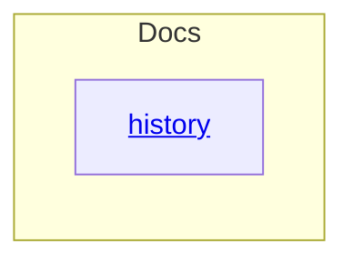

# Docs - as-is

## Purpose
Organize durable repository documentation that is neither a current design proposal, an agent-facing procedure, nor an implementation component, starting with the constructed history of the repository's agentic development system realization.

## Components

| Component | Purpose |
| --- | --- |
| [History](history/as-is.md#design) | Preserve the constructed history of the agentic development system realization and its branch landscape. |

## Design

**Lineage**: [as-is](../as-is.md#design) / **Docs**

### Documentation container map

This container holds narrative and reference documents that persist after their
subjects finish, in contrast to `drafts/` (bounded proposals pending authority), `designs/` (enduring forward-looking design documents), and the changelogs owned by individual components. The documents here describe what happened; they do not grant authority, own live state, or replace the records of the components they mention. Documents in this component are ordinary artifacts rather than child `as-is.md` components unless a distinct child component is later warranted.

## Links

- [`history/agentic-development-system-construction-history.md`](history/agentic-development-system-construction-history.md) — constructed history of the agentic development system realization, covering the source adoption branch, allied and abandoned branches, benchmark rounds, and the cutover.