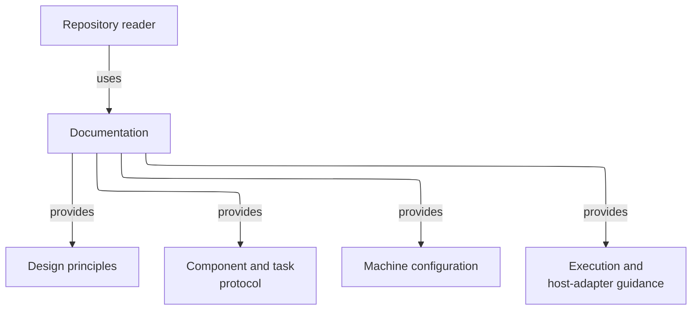

# Documentation - as-is

## Purpose

Provide the repository's normative human documentation for design principles, configuration, component task records, execution behavior, and host adapters.

## Design

Documentation is an ordinary document collection rather than a set of independently owned child components. Each document owns its subject while this record provides the collection's navigation and architectural context.

**Lineage**: [as-is](../as-is.md#design) / **Documentation**

### Normative documentation context

The collection separates broad principles, durable component/task protocol, machine configuration, host-neutral execution, and host-specific adapter guidance. It is read-only context for implementation and does not replace component records or task authority.

## Links

- [`design-principles.md`](design-principles.md) — repository-wide authority and design principles.
- [`architecture-vocabulary.md#scope-and-authority`](architecture-vocabulary.md#scope-and-authority) — shared current-system architecture definitions and authority boundary.
- [`component-task-record-protocol.md`](component-task-record-protocol.md) — durable component and transient task-record protocol.
- [`configuration.md`](configuration.md) — machine-configuration structure.
- [`execution-contract.md`](execution-contract.md) — host-neutral lifecycle and execution boundary.
- [`opencode-adapter.md`](opencode-adapter.md) — OpenCode host adapter guidance.
