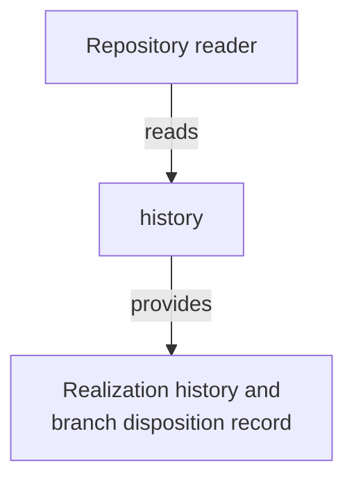

# History - as-is

## Purpose
Own the constructed history of the repository's agentic development system realization: the phases, benchmark rounds, branch landscape, and cutover that produced the current live workflow, preserved as durable narrative evidence for later readers.

## Design

**Lineage**: [as-is](../../as-is.md#design) / [Docs](../as-is.md#design) / **History**

### Construction history boundary

This component is retrospective. Its single artifact records what happened on the source adoption branch `implementing-composable-skills` and the allied, abandoned, or snapshot branches that surround it, with commit, tag, and branch citations. It does not restate live architecture (owned by the component records), re-authorize anything (owned by the root record and `core/contracts/`), or replace the changelogs that individual components own (durable per-component history). Recoverable dropped content remains reachable through the evidence tags `adoption-evidence-f9-confirm` and `adoption-evidence-full`, which this record cites rather than duplicates.

## Links

- [`agentic-development-system-construction-history.md`](agentic-development-system-construction-history.md) — the constructed realization history: seed, adapter exploration, draft and pilot phases, benchmark rounds 2-5 and the head-to-head cutover benchmarks, adoption families F0-F9, hardening, and the single-commit cutover onto master.