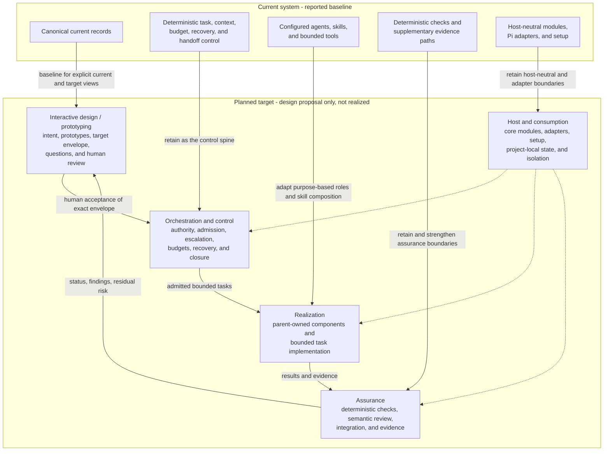
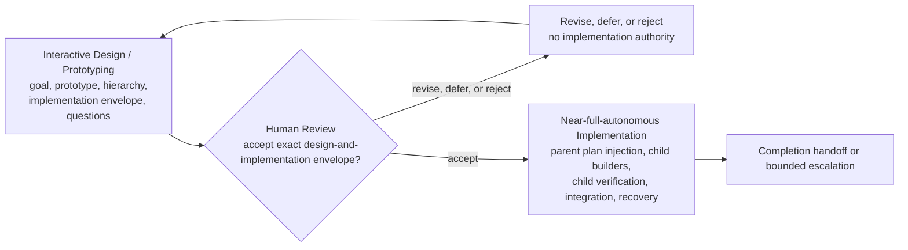
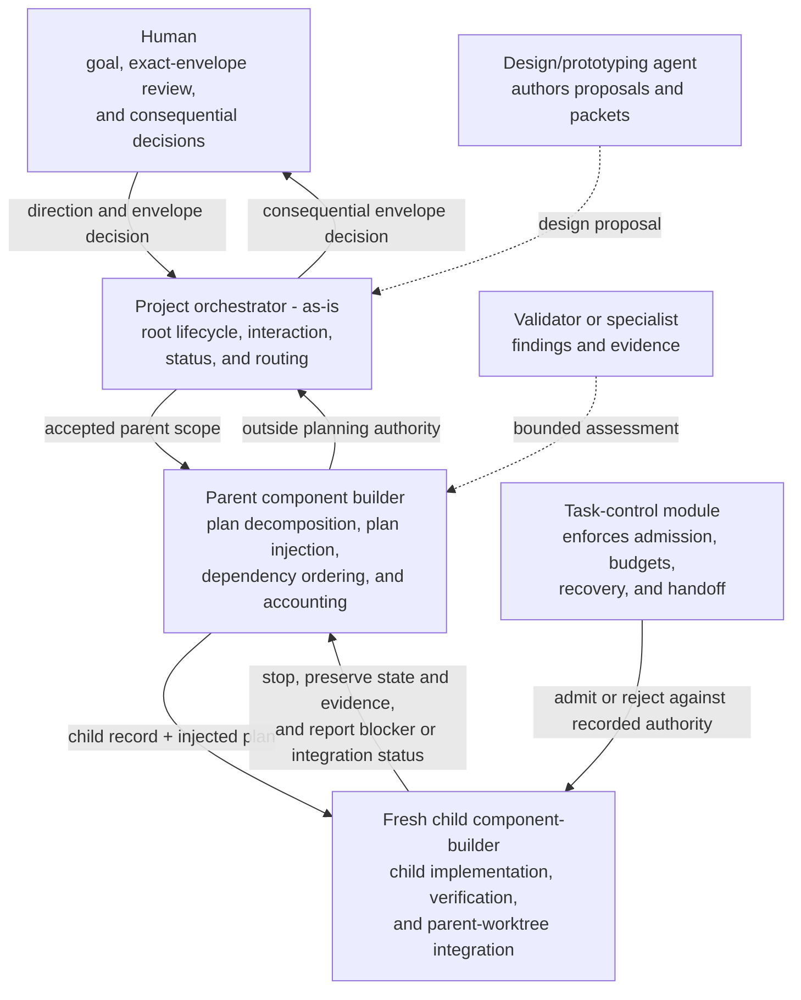
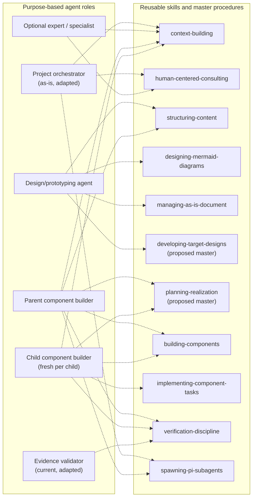
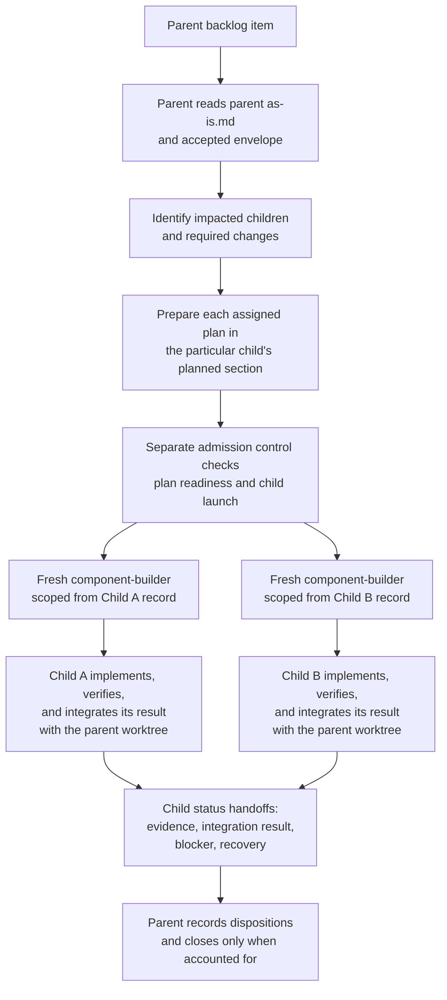

# Agentic Development System — High-Level Target Design Proposal

Purpose: Describe the proposed human-facing design, authority boundaries, and implementation envelope for the agentic-development-system rearchitecture.

**Reader guidance:** Technical names improve precision and traceability, but the human-facing agent must explain them when they matter. In this proposal, a component's `as-is.md` is its current-design anchor; a literal link is an actual Markdown link to a related file; a bounded task is one defined piece of work with a clear outcome and stopping point; a parent-level admission control is a mechanical readiness check, not a human approval or semantic review; and a nearest common ancestor is the closest parent component shared by the affected components.

## Contents

- [1. Executive orientation](#1-executive-orientation)
- [2. Provenance, status, and limitations](#2-provenance-status-and-limitations)
  - [Observations](#observations)
  - [Assumptions used in this proposal](#assumptions-used-in-this-proposal)
  - [Limitation](#limitation)
- [3. Current system versus planned target](#3-current-system-versus-planned-target)
- [4. Proposed target architecture](#4-proposed-target-architecture)
  - [Human-readable system view](#41-human-readable-system-view)
  - [Architectural planes](#42-architectural-planes)
  - [Component hierarchy and realization ownership](#43-component-hierarchy-and-realization-ownership)
- [5. Human-facing design and representation](#5-human-facing-design-and-representation)
  - [Proposed design package](#51-proposed-design-package)
  - [Workflow benchmark and evaluation](#workflow-benchmark-and-evaluation--advisory-not-authority)
  - [Required human-facing views](#52-required-human-facing-views)
  - [Human status and interaction needs](#53-human-status-and-interaction-needs)
- [6. Lifecycle and control points](#6-lifecycle-and-control-points)
- [7. Authority, orchestration, and escalation](#7-authority-orchestration-and-escalation)
  - [Authority model](#71-authority-model)
  - [Escalation](#72-escalation)
- [8. Proposed agent disposition](#8-proposed-agent-disposition)
- [9. Proposed skill disposition](#9-proposed-skill-disposition)
  - [Current catalog](#91-current-catalog)
  - [Proposed introductions](#92-proposed-introductions)
  - [Proposed compositions](#93-proposed-compositions)
  - [Planned deprecations, replacements, and drops](#94-planned-deprecations-replacements-and-drops)
- [10. Target workflows](#10-target-workflows)
  - [Design and alignment workflow](#101-design-and-alignment-workflow)
  - [Workflow-family disposition](#102-workflow-family-disposition)
  - [Implementation packet and task workflow](#103-implementation-packet-and-task-workflow)
  - [Parent/child implementation and integration](#104-parentchild-implementation-and-integration)
  - [Unresolved-question workflow](#105-unresolved-question-workflow)
  - [Failure and recovery workflow](#106-failure-and-recovery-workflow)
- [11. Tools, capabilities, context, and boundaries](#11-tools-capabilities-context-and-boundaries)
  - [Tool model](#111-tool-model)
  - [Context model](#112-context-model)
  - [Retained deterministic and host boundaries](#113-retained-deterministic-and-host-boundaries)
- [12. Installation and consumption](#12-installation-and-consumption)
- [13. First proof and setup-inclusive evaluation](#13-first-proof-and-setup-inclusive-evaluation)
- [14. Migration and recovery strategy](#14-migration-and-recovery-strategy)
- [15. Risks and mitigations](#15-risks-and-mitigations)
- [16. Non-goals](#16-non-goals)
- [17. Decisions requiring the user](#17-decisions-requiring-the-user)
- [18. Unresolved design questions](#18-unresolved-design-questions)
- [19. Provisional contract questions for target roles](#19-provisional-contract-questions-for-target-roles)
- [20. Recommended next design action](#20-recommended-next-design-action)

## 1. Executive orientation

**Recommendation:** Evolve the existing system through a staged heavy refactor rather than assuming either continuity or a rewrite. Retain the deterministic task-control, context, delegation, validation, setup, and evidence foundations; redesign the human-facing design lifecycle, agent responsibilities, skill composition, model routing, and current-versus-planned representation around them.

The proposed target has five cooperating planes:

1. **Human intent and design** — goals, prototypes, approved target designs, feedback, issues, and decisions.
2. **Orchestration and control** — authority-bearing agents, task admission, escalation, budgets, and recovery.
3. **Realization** — parent-owned bounded component work and authorized task implementation.
4. **Assurance** — deterministic checks, semantic review, evidence, and supplementary observability.
5. **Host and consumption** — canonical agent/skill resources, host adapters, project-local state, compatibility, setup, and provider isolation.

The target lifecycle is intentionally simple:

```text
Interactive Design / Prototyping Phase → Human Review → Near-full-autonomous Implementation
```

During Interactive Design / Prototyping, the design owner and human may iterate on goals, prototypes, component hierarchy, detailed implementation instructions, acceptance, protected inputs, and unresolved-question dispositions. Human Review decides whether the exact design-and-implementation envelope is accepted, revised, deferred, or rejected. After acceptance, implementation proceeds near-autonomously inside that envelope through deterministic task admission, parent planning, fresh child-scoped component-builders, child-level verification, child integration, recovery, and escalation controls.

The human-facing design must clearly state what is presented to each child component-builder: a detailed, bounded implementation packet intended to be followed substantially blindly. The child need not rediscover the architecture or negotiate requirements, but it must preserve safety boundaries and stop rather than invent an answer when the packet is contradictory, incomplete, or outside its authority. Human-facing explanations may use precise names and technical terms, but terms needed to understand a decision, risk, limitation, or next action must be explained in ordinary language or given a concise plain-language gloss.

Implementation remains unauthorized until the human accepts one exact, frozen design-and-implementation envelope and the responsible orchestrator admits a task within that envelope. This is a design proposal only. It does not adopt contracts, retire current artifacts, create tasks, or authorize implementation.

---

## 2. Provenance, status, and limitations

### Observations

- The named current records describe a working system with seven configured agent roles, seventeen reusable skills, deterministic host-neutral modules, Pi-facing adapters, and bounded tools.
- Current `as-is.md` records are the current-architecture authority. Existing design drafts, review reports, and model assignments are planning evidence only.
- The current records explicitly separate agents, skills, tools, deterministic modules, adapters, task authority, and supplementary telemetry.
- The composable-skills draft proposes useful composition direction but explicitly does not authorize wholesale skill replacement.
- **Artifact disposition:** The composable-skills draft is retained as non-authoritative design input and provenance. Its composition principles are selectively incorporated, but its proposed catalog is not adopted and wholesale capability creation or skill replacement is rejected as a mandate. It is not a target contract or an artifact scheduled for removal by this design.
- The named context does not contain an implementation-level consumer inventory, migration trial, benchmark run, or proof of installed-package operation.

### Historical exercise provenance — non-normative

Earlier design exercises used named author and reviewer profiles, packet manifests, and bounded review rounds. Those records are retained only to explain how this proposal was developed. They do not define target roles, model selection, reviewer admission, lifecycle sequencing, approval criteria, task admission, or implementation authority. The target system neither requires nor evaluates alternate-model or alternate-family review. Historical reports remain evidence records outside the target-system contract.

### Assumptions used in this proposal

- The current `as-is.md` records are representative of the present architecture.
- The then-current user remains the decision holder for the exact design-and-implementation envelope.
- The first proof can be repository-local and credential-free.
- The active candidate branch can serve as the design and implementation recovery boundary, but does not provide process, network, credential, or security isolation.
- Purpose-based agent roles should remain separate from model identities.
- Existing tool implementations should be retained unless later evidence establishes a deficiency.

### Limitation

Only the named documents and relevant current `as-is.md` records were used. Implementation source, operational skill bodies, backlogs, changelogs, and live consumer behavior were not inspected. Therefore, detailed source-to-target removals, compatibility claims, and enforcement claims remain provisional.

---

# 3. Current system versus planned target

| Concern | Current implementation | Planned target |
| --- | --- | --- |
| Human entry point | `as-is` primarily routes requests and answers bounded questions. | `as-is` becomes the project-level human and orchestration front face while remaining non-implementing. Root lifecycle authority is explicit rather than inferred from routing. |
| Design lifecycle | Durable component records describe architecture; no complete target design lifecycle is established in the current catalog. | A simple three-phase lifecycle covers interactive design/prototyping, one human review decision, and near-full-autonomous implementation inside the accepted envelope. |
| Current/target state | Current records are canonical architecture context; draft proposals remain separate. | Every design representation explicitly labels **current**, **accepted target**, **relationship/migration**, and **realization status**. |
| Agent roster | Seven roles with some consultation and implementation overlap. | Purpose-based orchestrators, design/prototyping, task implementation, validation, and optional advisory roles; model assignments remain replaceable. |
| Skill organization | Seventeen operational skills, with some broad workflows and adjacent responsibilities. | Master-first composition over reusable capabilities, introduced incrementally rather than by replacing every skill at once. |
| Tool availability | Agents declare tools; launch admission validates and forwards them. | Tools are globally catalogued by the platform but admitted per agent, task, host profile, and risk. Skills declare capability needs but never grant tools. |
| Task control | Durable deterministic task state, budget, recovery, validation, and handoff eligibility already exist. | Retained as the control spine, extended only where design, implementation packets, parent/child integration, feedback, and migration states require explicit contracts. |
| Verification | Deterministic checks plus receiving-builder or expert review. | A separate parent-level admission control checks parent planning and child-plan readiness; each child verifies its own implementation and integration result. Optional independent assurance remains separately assigned rather than becoming parent verification. |
| Setup | Canonical resources can be wired to detected clients; independent installed-package operation is unproven. | First prove repository-local consumption and isolation; choose a distribution model only after setup-inclusive evaluation. |
| Recovery | Task records, child worktrees, checkpoints, and branch separation support recovery. | Preserve these mechanisms; add design-revision, plan-injection, child-integration, and closure checkpoints without building an unsupported rollback subsystem. |
| Future workloads | Software development is primary; content and general tasks are future concerns. | Stable goal/design/task/evidence extension points accommodate future workloads, but their workflows remain backlog scope. |

---

# 4. Proposed target architecture

## 4.1 Human-readable system view

The current baseline is shown separately from the planned target so that the diagram does not imply that the target architecture already exists.



## 4.2 Architectural planes

### A. Human intent and design plane

Owns human goals and feature intent, visual prototypes and structured design views, current-versus-target architecture, component hierarchy, implementation packets, decisions, assumptions, unresolved questions, feedback, and exact design revision identity and acceptance evidence. It does not authorize implementation without the human acceptance decision.

### B. Orchestration and control plane

Owns lifecycle phase transitions, agent admission and task authority, dependency and budget controls, escalation state, cancellation, retries, recovery, handoff, integration eligibility, and descendant closure. Probabilistic agents propose work; deterministic task control admits or rejects consequential transitions.

### C. Realization plane

Owns the parent bounded task, including parent-owned implementation, parent planning, child-plan preparation, fresh child-scoped component-builder execution, child-level verification, child integration into the parent worktree, and parent status accounting. Different agents may perform different subtasks without splitting the parent task-completion boundary. A child cannot redefine the accepted design, widen scope, edit sibling scope, or declare parent completion. A separate task-implementer role is not required for this parent/child flow; any future leaf role is a separate design decision.

### D. Assurance plane

Owns acceptance-to-evidence mapping, child-level deterministic checks, child-reported evidence, optional separately assigned assurance, residual-risk reporting, and bounded execution-evidence analysis. Parent planning does not become implementation verification. Telemetry remains supplementary and cannot become task or completion authority.

### E. Host and consumption plane

Owns host-neutral core modules, host-specific adapters, canonical role and skill resources, bounded tool registration, project-local configuration/records/state, version and compatibility concerns, and setup. Provider credentials remain environmental inputs and must not enter prompts, records, traces, or artifacts.

## 4.3 Component hierarchy and realization ownership

A parent component owns one bounded task within its accepted scope. The task may include parent-owned implementation and work required from impacted immediate children, even when different agents perform those subtasks. During planning, the parent reads its own `as-is.md` anchor and the accepted envelope to identify impacted children and required changes. The parent records each child assignment in that child's durable planned section or equivalent child-scoped planning artifact. Plan preparation is part of the parent task, not a separate flow, lifecycle phase, product task, or human approval. A separate parent-level admission control checks that planning and child assignments are complete, attributable to the accepted envelope, limited to impacted children, and ready for child admission. The parent planner performs no implementation verification and no child implementation verification occurs at the parent level.

Each impacted child is executed by a newly created `component-builder` instance scoped from that child’s own record. The child reads its record and assigned plan, implements only that plan within its component boundary, performs child-level verification, and integrates its own bounded result with the parent worktree through the admitted integration mechanism.

The parent does not inspect, semantically approve, revalidate, cherry-pick, or otherwise verify the child’s implementation result. It remains responsible for parent-owned implementation, plan decomposition, child-plan preparation, dependency ordering, and recording whether each planned child reached a terminal reported disposition. A child’s implementation evidence, child-level validation, integration evidence, blocker, and recovery state remain child-owned. Parent completion accounts for both parent-owned work and every admitted child disposition; agent multiplicity does not create a separate parent outcome.

A child returns a structured status handoff after its own implementation and integration attempt. The handoff identifies the child record and plan revision, changed artifacts or result identity, child-level validation evidence, integration evidence or blocker, deviations, unresolved questions, residual risks, and recovery next action. The handoff is evidence for parent lifecycle accounting; it is not a request for the parent to semantically review or integrate the child implementation.

A child integration mechanism must preserve scope and recovery: it may apply only the child’s assigned result to the parent worktree, must avoid unrelated modifications, must serialize or reject conflicting simultaneous integrations, and must preserve a recoverable checkpoint on failure. These safeguards control the integration operation; they do not create a parent semantic-verification role.

**Descendant closure** means that every admitted child is integrated, explicitly rejected, cancelled, or escalated with a recorded disposition; no unresolved blocking dependency, child-reported validation failure, or ownership conflict remains hidden beneath a parent planning-completion claim.

Work affecting more than one child is planned by the nearest common parent. That parent assigns the cross-child contract and injects a bounded plan into each affected child. It does not take over child implementation verification. If the cross-child contract changes an accepted component boundary, protected concern, acceptance condition, or authority allocation, the change returns to Interactive Design / Prototyping and, when material, Human Review.

**Current-state difference:** Current component-builder records assign receiving-builder integration and parent-side validation to the parent. The flow in this target section is a proposed target difference, not a claim about current behavior. Any realization would require separately accepted changes to role contracts, task-control/worktree controls, durable record structure, recovery rules, and behavioral validation.


---

# 5. Human-facing design and representation

## 5.1 Proposed design package

Every human-facing Markdown artifact should begin with a descriptive title followed immediately by a succinct `Purpose:` line. Technical names and jargon may be used when they improve precision or traceability, but terms needed to understand a decision, risk, limitation, or next action must be explained in ordinary language or given a concise plain-language gloss. Human-facing summaries lead with practical meaning, consequence, and next safe action; exact identifiers and deeper technical detail follow for traceability.

The normal human review unit is one revisioned `target-design.md`, containing the core design followed by appendices for component hierarchy and deltas, implementation packets, migration, setup and benchmark protocol, decision history, and unresolved questions. A minimal `review-manifest.md` identifies the exact revision and attachments but does not duplicate the design narrative. Separate files are used only where an independently owned canonical base record, machine-consumed artifact, or lifecycle boundary requires them; each attachment is frozen and referenced from the combined document. In this context, a component's `as-is.md` is the design-package anchor: the current record that identifies what the component is, what it owns, and where its related design material is found.

Current `as-is.md` records are the baseline and the canonical design-package anchor for their respective components. Every target change is classified as retained, adapted, introduced, deprecated, replaced, dropped, or deferred. An extension beyond current records must identify the unmet capability, owner, consumers, authority and tool implications, compatibility path, validation evidence, and migration or removal gate. Unjustified extensions remain deferred.

Each component's `as-is.md` establishes its current-state identity, purpose, boundary, authority, and applicable current links. Prototypes, target designs, references, plans, implementation packets, validation evidence, handoffs, migration records, and related artifacts must link to the applicable anchor and identify their relationship to it. A linked artifact may propose, plan, realize, validate, or explain change, but it does not replace or silently amend the anchor. Parent and cross-component artifacts link every affected component anchor and identify the nearest common ancestor that owns planning.

Each frozen revision should identify its revision and predecessor, exact file set or manifest, author, current-state baseline, accepted target envelope, assumptions, unresolved-question dispositions, human decision state, and whether it is a draft, human-reviewed design, accepted envelope, or superseded revision. Historical author/reviewer exercise provenance may be linked as context, but it is not a target-system requirement.

## 5.2 Required human-facing views

| View | Human question answered |
| --- | --- |
| One-page system map | What are the major parts and how do they cooperate? |
| Three-phase lifecycle view | How does interactive design become human acceptance and then near-autonomous implementation? |
| Authority and escalation ladder | Who can decide, authorize, implement, review, integrate, or escalate? |
| Current-versus-target map | What exists now, what is accepted, and what changes? |
| Component hierarchy and dependency view | Which parent owns each child, and how are cross-component results integrated? |
| Implementation-packet example | What detailed instructions does each child component-builder receive? |
| Unresolved-question view | Which questions are blocking, who decides them, and what work is stopped or allowed to continue? |
| Agent and skill disposition tables | What is retained, modified, introduced, replaced, deprecated, or dropped? |
| Setup and project-isolation view | What is installed globally, project-local, host-specific, or credential-bearing? |
| First-proof scorecard | How will current and candidate workflows be compared? |
| Migration map | How does each current consumer reach its target replacement safely? |
| Decision brief | What does the human need to decide, and what happens under each option? |

Mermaid is appropriate for architecture and lifecycle diagrams. UI mockups, rendered component views, tables, examples, and screenshots may be used when they communicate intent better. No user-interface implementation is implied.

### Workflow benchmark and evaluation — advisory, not authority

The benchmark discussion concerns the workflow, not reviewer or model selection. The proposed evaluation compares the pinned current workflow and the candidate workflow on the same controlled feature, using the same separately owned seed, setup conditions, primary model settings, budget, retry policy, deterministic checks, protected fixtures, rubric, and scorer. **No project-specific workflow benchmark has run.** This is a proposed evaluation protocol, not a target lifecycle gate or adoption result.

The benchmark should measure setup, correctness, scope discipline, human effort, agent operation, integration, evidence quality, design alignment, and recovery. Before execution, record the exact seed, pinned baseline revision, candidate revision, feature, settings, budget, retry policy, checks, protected inputs, rubric, scorer, safety-critical failures, thresholds, and advancement rule. A model or reviewer-selection experiment must be labelled separately; it must not be presented as evidence that one workflow is superior. Human approval remains required for the benchmark protocol and any advancement decision.

## 5.3 Human status and interaction needs

Without prescribing a UI, the system should make inspectable: current lifecycle phase; exact design/envelope revision; pending human decisions; active, blocked, and stopped bounded units; responsible orchestrator and receiving owner; task scope, budget, dependencies, and elapsed status; deterministic check results; integration and recovery state; differences from the accepted design; unresolved questions and their dispositions; cost and model usage; residual risks; and the next safe action.

Human feedback should be classified as editorial clarification, defect report, design-changing feedback, or new request. Design-changing feedback and new requests return to Interactive Design / Prototyping. They must not be appended silently to an active implementation task.

---

# 6. Lifecycle and control points

The target system has three phases and one human decision point. The phases are intentionally simple; task admission, parent planning, child-level verification, integration, and recovery are operational controls inside Near-full-autonomous Implementation, not additional human lifecycle gates.



### Interactive Design / Prototyping Phase

The design owner and human may interactively clarify goals, inspect current records, produce prototypes, define the parent/child component hierarchy, derive detailed implementation packets, identify dependencies, set acceptance and protected-input rules, classify risks, and record unresolved questions. During this planning work, changes to existing items begin with the affected `as-is.md` anchors and relevant files literally linked from them, rather than a project-wide scan by default. Optional advisory or specialist input may be used when justified, but alternate-model or alternate-family review is not a target-system requirement.

The phase ends when one exact, frozen design-and-implementation envelope is presented for Human Review. The envelope includes goals, accepted outcomes, component boundaries and parent ownership, parent plan-injection rules, child implementation packets or the method for deriving them, permitted capabilities, protected inputs, dependencies, acceptance, validation, recovery, escalation, and explicit non-goals.

### Human Review

The human reviews the exact frozen envelope and chooses one outcome: **accept**, **request revision**, **defer**, or **reject**. Human acceptance establishes the goals, component boundaries, authorized change envelope, protected inputs, acceptance conditions, validation expectations, escalation path, and stop conditions. It enables deterministic task admission within that envelope; it does not permit changes outside it.

A revised or materially changed envelope returns to Interactive Design / Prototyping. A deferred or rejected envelope has no implementation authority. Editorial clarification may update presentation without changing the accepted envelope, but it must remain traceable to that revision.

### Near-full-autonomous Implementation Phase

After acceptance, the project orchestrator and parent component builders operate near-autonomously within the accepted envelope. The parent owns one bounded task that may include parent-owned implementation and work required from impacted children. It reads its own `as-is.md` anchor, identifies impacted children, and prepares child-specific plans in their planned sections. Plan preparation is part of the parent task rather than a separate flow. A separate parent-level admission control checks planning and child-launch readiness. Fresh child-scoped `component-builder` instances then implement their assigned plans, perform child-level verification, and integrate their own results with the parent worktree through the admitted mechanism. Different agents may perform different subtasks without splitting the parent task-completion boundary. Deterministic task admission, budgets, protected controls, recovery, and escalation constrain model output. The human is not required for routine implementation choices already made by the envelope, but consequential deviations and blocked decisions return to the appropriate human decision holder.

Operational controls:

- **Parent plan injection:** The parent planner identifies impacted children and records each assigned plan. Before child launch, a separate parent-level verification control verifies that each assignment is derived from the accepted envelope, scoped to that child, attributable, complete, and recorded in the child’s planned section or equivalent artifact.
- **Child admission:** A fresh child-scoped component-builder may begin only when its own record, assigned plan, allowed scope, dependencies, budget, protected inputs, child-level validation, recovery, and parent-worktree integration mechanism are admitted.
- **Child verification and integration:** The child verifies its own implementation and integrates only its bounded result with the parent worktree through the admitted mechanism.
- **Parent closure accounting:** The parent records terminal child reports and unresolved blocking dependencies. It does not semantically verify, revalidate, cherry-pick, or approve the child’s implementation or integration result.


---

# 7. Authority, orchestration, and escalation

## 7.1 Authority model

| Actor or mechanism | Proposed authority | Explicit limits |
| --- | --- | --- |
| Human | Goal, feature intent, acceptance or revision of the exact design-and-implementation envelope, consequential exceptions, and decisions on blocking unresolved questions. | Does not need to perform routine implementation. |
| `as-is` project orchestrator | Root lifecycle coordination, human interaction, status synthesis, routing, and escalation. | Does not implement component work or infer human acceptance. |
| Design/prototyping agent | Produces prototypes, target designs, component hierarchies, and implementation packets within design scope. | Cannot accept its own envelope or authorize implementation. |
| Parent component builder / parent planner | Owns one bounded parent task, including parent implementation, identifying impacted children, preparing child-scoped plans, ordering planning dependencies, and recording child dispositions. | Performs no implementation verification; does not semantically review, validate, approve, cherry-pick, or integrate a separately owned child’s implementation. |
| Parent-level verification control | Checks impacted-child identification and plan injection after the parent planner records child plans and before child launch. | Does not verify child implementation or integration and does not grant implementation authority beyond the accepted envelope. |
| Child component builder | A fresh instance scoped from one child record; implements the injected plan, performs child-level verification, integrates its bounded result with the parent worktree using the admitted mechanism, and reports evidence or a blocker. | Cannot change the parent plan, sibling scope, accepted envelope, parent task state, or protected parent artifacts outside the admitted integration operation. |
| Evidence validator | Evaluates supplied evidence against acceptance. | No mutation, task admission, parent integration, or human acceptance authority. |
| Optional expert or specialist | Provides bounded advisory or externally required domain judgment when separately justified. | Not an alternate-model/family gate; does not gain authority merely by reviewing. |
| Skills | Provide reusable procedures and composition. | Never select, authorize, admit, launch, integrate, or complete work. |
| Tools | Provide bounded operations. | Never grant role, scope, or transition authority. |
| Task-control module | Owns deterministic task-state transitions, budget admission, checkpoints, cancellation, and handoff eligibility. | Does not implement, review semantics, or execute host operations. |
| Observability | Supplies bounded supplementary evidence. | Never defines task status, budget, recovery, or completion. |

The repository authority order remains applicable: fixed safety invariants → external and governance constraints → component policy → explicit human/project overrides → installed defaults.

## 7.2 Escalation

Escalation travels upward through callers:



Each caller should resolve an issue within authority, stop affected work when it cannot, preserve state and evidence, bubble a bounded question upward, and avoid forwarding irrelevant implementation detail. No automatic restart or retry should acquire new authority.

The child escalates a contradiction, blocked integration, protected-input conflict, validation failure, missing dependency, or scope change. The parent may resolve only a planning or dependency matter already determined by the accepted envelope. It does not replace child-level implementation verification with its own review.


---

# 8. Proposed agent disposition

Names are provisional and require naming review before adoption.

| Current agent | Proposed disposition | Planned responsibility | Migration note |
| --- | --- | --- | --- |
| `as-is` | **Modify** | Project-level human front face and root orchestrator: intent interpretation, status, lifecycle coordination, root escalation, and routing. | Its present “router only” boundary must be changed explicitly; it must remain non-implementing. |
| `component-builder` | **Retain and adapt** | Parent planner for its own component and fresh child-scoped builder for a particular child: plan injection, child-local implementation, child-local verification, bounded integration into the parent worktree, recovery, and status handoff. | This is a proposed target difference from current parent-side integration/validation; preserve current behavior until separately accepted and validated. |
| `evidence-validator` | **Retain and adapt** | Read-only acceptance-to-evidence review across implementation packets, implementations, and controlled checks. | Keep fixed safety profiles; broaden only through explicit code-owned checks. |
| `execution-advisor` | **Retain** | Bounded trace/session analysis, process improvement, and budget evidence. | Continue treating telemetry as supplementary. |
| `expert` | **Retain and compose** | Generic read-only advisory or specialist shell when a project separately requires it. | Not an alternate-model/family target gate. |
| `thinking-companion` | **Deprecate, then replace** | General consultation moves to the human-facing orchestrator and consulting skill; design facilitation moves to the design/prototyping role. | Remove only after direct consumers and behavior tests migrate. |
| `worker` | **Defer replacement decision** | The corrected target uses a fresh child-scoped `component-builder` for separately owned child work. A distinct task-implementer is not part of the corrected parent/child flow. | Do not replace the role solely to represent parent/child component work; preserve current behavior until a consumer-backed decision exists. |
| — | **Introduce** a design/prototyping agent | Produce interactive prototypes, target-design revisions, component hierarchies, implementation packets, alternatives, and decision briefs. | Separate authorship from human acceptance. |

Model assignments are replaceable implementation choices, not target role names or lifecycle stages. The target system does not require alternate-model or alternate-family review.

---

# 9. Proposed skill disposition

## 9.1 Current catalog

| Current skill | Disposition | Planned treatment |
| --- | --- | --- |
| `as-is-setup` | **Retain and adapt** | Setup/consumption master for project-local adoption, host checks, compatibility, and setup evidence. |
| `integrate-as-is-documentation` | **Compose, then deprecate standalone form** | Fold decomposition and record-adoption path into setup and design workflows after behavior parity is proven. |
| `managing-as-is-document` | **Modify substantially** | Support explicit current, accepted-target, design-relationship, revision, and realization semantics. |
| `context-building` | **Retain and adapt** | Add explicit decision question, stopping condition, provenance, and current-versus-target labels. |
| `exploring-execution-evidence` | **Retain** | Continue bounded read-only evidence analysis. |
| `designing-mermaid-diagrams` | **Retain and compose** | Remain the Mermaid-specific capability underneath broader design and prototype procedures. |
| `naming-software-concepts` | **Retain** | Apply to new roles, skills, records, and lifecycle terms before migration. |
| `implementing-component-tasks` | **Adapt; consider rename to `implementing-tasks`** | Preserve task authority and recovery while allowing project-specific completion and history policies. |
| `maintaining-components` | **Retain** | Continue evidence-based bounded maintenance. |
| `deterministic-skills` | **Retain** | Continue advising where deterministic behavior should replace repetition. |
| `managing-backlog` | **Retain and adapt** | Remain a planning index, clearly downstream of accepted design and separate from active task authority. |
| `spawning-pi-subagents` | **Retain and adapt** | Remain the canonical Pi delegation path; add accepted-envelope traceability and setup/compatibility evidence. |
| `structuring-content` | **Retain** | Shape design packages, component records, and human-facing representations. |
| `verification-discipline` | **Retain and strengthen** | Require acceptance-to-evidence matrices, negative cases, semantic review, and residual-risk classification. |
| `building-components` | **Retain and adapt** | Remain the component-builder’s master workflow, now consuming accepted envelopes and implementation packets. |
| `committing-completed-work` | **Adapt** | Preserve scoped durable handoff without making repository-specific commit conventions universal. |
| `human-centered-consulting` | **Retain and broaden composition** | Used by orchestrator, designer, optional expert, and decision presentations while preserving human authority. |

## 9.2 Proposed introductions

Introduce these only through bounded pilots with identified consumers:

| Proposed master skill | Purpose |
| --- | --- |
| `developing-target-designs` | Compose goal clarification, interactive prototypes, structured target-design revisions, implementation-envelope preparation, decision presentation, human-review recording, and design-change feedback. It supports human acceptance but does not determine or record it. |
| `making-changes` | Resolve component versus non-component scope, ownership, method, validation, and applicable history. |
| `planning-realization` | Derive detailed implementation packets from accepted design without changing that design. |

Candidate reusable capabilities include resolving scopes, identifying owners, drafting bounded content, choosing change methods, writing code, applying bounded edits, writing tests, running tests, recording evidence, presenting decisions, delegating bounded work, observing delegated work, locating history, and drafting history entries. Each needs an independent consumer, owner, tool requirements, compatibility route, and focused validation.

## 9.3 Proposed compositions

The following view shows representative agent-to-skill relationships. Dashed arrows mean that a role may use or compose a reusable procedure; they do not grant tools, scope, task admission, human acceptance, integration, or completion authority.



```text
developing-target-designs
  = context building
  → human consultation
  → interactive prototyping
  → structuring content
  → implementation-envelope preparation
  → human decision presentation
  → revision recording
```

```text
building-components
  = context building
  → parent plan injection or child plan intake
  → child-local implementation
  → child-level verification
  → child integration with parent worktree
  → status handoff
  → parent planning accounting
```

## 9.4 Planned deprecations, replacements, and drops

| Item | Planned treatment |
| --- | --- |
| Standalone documentation-integration workflow | Deprecate after setup/design compositions prove parity. |
| `thinking-companion` role | Replace with orchestrator consultation plus the design/prototyping agent. |
| `worker` role name and broad identity | Defer replacement; the corrected parent/child target uses fresh child-scoped `component-builder` instances. |
| Alternate-model or alternate-family review as a target control | Remove from target lifecycle and contract; historical exercise records remain non-normative provenance only. |
| Fixed model names as architecture roles | Drop from target architecture. Retain only as replaceable assignments where useful. |
| Skill-granted authority or tool access | Explicitly reject. |
| Path B as normal design lifecycle | Drop from the normal flow; retain only as an explicitly approved contingency. |
| Universal `master` working-branch assumption | Drop. A pinned `master` revision remains an evaluation baseline where applicable. |
| Universal two-commit cross-project lifecycle | Drop as a target-system invariant; retain where the consuming project’s contract requires it. |
| Wholesale replacement of all current skills | Reject absent consumer and migration evidence. |
| Current artifacts without migration evidence | Do not drop. |

---

# 10. Target workflows

## 10.1 Design and alignment workflow

1. Human supplies a goal, feature idea, feedback, or issue.
2. The project orchestrator identifies the responsible parent component and design scope.
3. The design/prototyping agent and human interactively clarify the goal, inspect the parent’s current `as-is.md`, identify impacted children, build prototypes or structured views, define parent ownership, and derive the implementation envelope. For changes to existing items, planning scans the affected anchors and relevant literal links, records discovered dependencies, and applies the stopping and expansion rules in Section 18.
4. The design owner records child-specific plans or enough exact detail to derive them, including outcomes, ordered instructions, scope, protected inputs, acceptance, validation, dependencies, recovery, escalation, and stop conditions.
5. The exact frozen design-and-implementation envelope is presented to the human.
6. The human accepts, requests revision, defers, or rejects that exact envelope.
7. Acceptance enters Near-full-autonomous Implementation. Revision, deferral, or rejection returns to design and gives no implementation authority.

No alternate-model or alternate-family review is required by this workflow. Optional advisory or specialist input may be used during Interactive Design / Prototyping when a project or external governance requires it, but it is not a generic target gate.

## 10.2 Workflow-family disposition

| Workflow family | Successor disposition |
| --- | --- |
| Interactive design and prototyping | **Introduce** the revisioned human-facing flow; the inspected current catalog does not establish one. |
| Human review of exact implementation envelope | **Introduce/formalize** as the single human lifecycle decision. |
| Parent planning and child plan preparation | **Retain and strengthen** current hierarchy with explicit anchor-linked child-plan preparation inside one parent bounded task and separate parent-level admission verification. |
| Child-scoped component implementation and integration | **Retain and strengthen** child ownership with child-level verification and scope-preserving integration into the parent worktree. |
| Task control, delegation, recovery, and bounded implementation | **Retain and adapt** the existing deterministic control spine and ownership boundaries. |
| Validation and evidence | **Retain and strengthen** through explicit child-level acceptance-to-evidence mapping. |
| Setup and consumption | **Retain and adapt**, with repository-local proof before broader distribution claims. |
| Alternate-model/family review loop | **Remove from target system; retain only as historical exercise provenance.** |
| Path B planning-branch lifecycle | **Drop as the normal path; retain only as an explicitly approved contingency.** |

## 10.3 Implementation packet and child task workflow

Each fresh child-scoped component-builder receives a detailed bounded implementation packet. The packet is intended to permit implementation substantially blindly with respect to broader design discovery: the child should be able to carry out the stated steps and validations without independently reconstructing architecture, selecting requirements, negotiating ownership, or exploring unrelated repository context.

“Substantially blindly” never removes task authority or safety boundaries. The child must still read applicable instructions, preserve protected inputs, obey tool and scope restrictions, perform child-level validation, report evidence honestly, and stop on a contradiction, missing dependency, prohibited access, failed required validation, or condition outside the packet.

Every packet contains:

1. immutable task identifier and accepted design/envelope revision;
2. parent component, particular child component, parent planner, and escalation recipient;
3. one bounded outcome and explicit non-goals;
4. affected child component, allowed paths/interfaces, and prohibited paths/interfaces;
5. ordered implementation instructions and required dependency assumptions;
6. permitted tools/capabilities and prohibited external, credential, or destructive actions;
7. protected inputs, fixtures, baselines, validators, secrets, authority-bearing records, and parent-worktree integration target;
8. exact acceptance conditions and child-level validation instructions;
9. required implementation and integration evidence;
10. budget, recovery/checkpoint expectations, cancellation conditions, and conflict handling; and
11. explicit stop conditions.

The child may make only local discretionary choices necessary to execute unambiguous instructions and preserve stated constraints. It must not resolve a design ambiguity by invention, relax acceptance, substitute a dependency or validation method, reinterpret a protected input as editable, modify sibling scope, or convert an unresolved question into a requirement.

A parent-level verification and admission control checks that the child packet is within the accepted envelope, the child record and planned section are present, the named child builder is available, dependencies and protected controls are present, and deterministic task control has admitted the child. Child-level validation and integration are performed and reported by the child.

## 10.4 Parent planning, child implementation, and child integration

When a parent backlog item is planned, the parent component builder reads the parent’s `as-is.md` anchor and accepted envelope to identify each impacted immediate child and the required change. For each impacted child, the parent writes a bounded assigned plan into that child’s planned section or equivalent child-scoped planning artifact, linked to the parent task, accepted-envelope revision, parent anchor, and child anchor. This child-plan preparation is part of the parent’s one bounded task. A separate parent-level admission control checks readiness before child launch: each assignment identifies its source parent plan, child scope, intended outcome, dependencies, protected inputs, acceptance conditions, validation, recovery, escalation route, and allowed integration mechanism.

Each impacted child is handled by a newly created `component-builder` instance scoped to that particular child from the child’s own record. The child reads its own record and injected plan; parent or sibling context is not ambient authority. The child implements only its assigned plan, performs specified child-level validation, and integrates only its assigned result with the parent worktree through the admitted, scope-preserving integration mechanism.

The child must preserve its component scope and protected inputs, perform and record child-level validation before claiming a successful integration, integrate only its own bounded result without overwriting unrelated parent or sibling work, stop and escalate conflicts or out-of-scope requirements, and return a structured report of plan revision, changed result, validation, integration evidence or blocker, residual risks, unresolved questions, and recovery next action.

The parent planner must identify impacted children, prepare child-specific plans, coordinate planning dependencies and safe integration ordering, preserve child reports, and record terminal, blocked, cancelled, or escalated child disposition as part of the parent’s one bounded task, which also includes any parent-owned implementation. A separate parent-level admission control checks plan readiness. The parent planner does not verify, semantically review, validate, revalidate, cherry-pick, or approve the child’s implementation or integration result.

For work affecting multiple children, the nearest common parent owns planning of the cross-child contract and injects a bounded plan into each affected child. It does not take over child implementation verification. A requirement that changes an accepted component boundary, protected concern, acceptance condition, or authority allocation returns to Interactive Design / Prototyping and, when material, Human Review.



In this diagram, “parent-level admission control” means checking impacted-child identification, anchor-linked plan readiness, and child launch conditions before child execution; it is not performed by the parent planner. “Child verifies” means verification of that child’s implementation and integration result. No arrow represents parent semantic verification or parent integration of a child implementation.

## 10.5 Unresolved-question workflow

Every unresolved question is recorded with its question, affected design/task revision, owner, dependencies, deadline or decision point where relevant, proposed options if known, and status: **resolved**, **non-blocking**, or **blocking**.

A question is **blocking** when its answer could change task scope, component ownership, interface behavior, protected inputs, authority, acceptance, validation, budget, risk classification, recovery, or the parent/child integration mechanism. The affected child task and dependent descendants stop at the safe checkpoint; unrelated siblings may continue only when the parent records that they are independent.

The parent planner may resolve a question only when the answer is already determined by the accepted envelope and does not alter a protected concern. Otherwise it escalates through its caller to the human decision holder. The parent planner records the escalation and does not silently choose an answer.

A **non-blocking** question may remain open only when the accepted envelope explicitly permits the stated default and the question cannot alter acceptance, safety, authority, another component’s contract, or integration scope. It remains visible in the child handoff and parent planning accounting.

An unresolved blocking question prevents affected child closure and prevents the parent from claiming its planned work is fully accounted for. Escalation, deferral, cancellation, or an accepted design revision supplies its disposition; retry alone does not create an answer or new authority.

## 10.6 Failure and recovery workflow

- Preserve partial work in the child record and isolated worktree.
- Report failed, blocked, budget-exhausted, conflict, or recovery-candidate states explicitly.
- Do not infer completion from process exit, model output, telemetry, or a child commit.
- Do not restart or retry automatically without caller or human authority.
- Do not silently widen scope to obtain a missing dependency.
- Preserve prior design, parent-plan, child-plan, and implementation-packet revisions when producing successors.
- Preserve child integration checkpoints and evidence; a failed integration remains a child-owned recoverable blocker.
- Escalate persistent correctness failures, integration conflicts, or architectural contradictions.


---

# 11. Tools, capabilities, context, and boundaries

## 11.1 Tool model

Interpret “globally available tools” as a globally discoverable platform catalog, not universal runtime permission. Agents declare or are admitted to capability classes; tasks may narrow them; hosts may impose stronger profiles; skills identify capability requirements but cannot grant, register, or widen tools; missing or denied capabilities fail closed before work starts.

## 11.2 Context model

For the first slice, use separate worktrees and working directories, provide only the implementation packet, applicable instructions, accepted design, and named dependencies, ask children not to explore unrelated context, require them to stop on a missing dependency, and treat reported reads as evidence rather than proof of isolation.

| Risk | Boundary |
| --- | --- |
| Low | Separate worktree/CWD plus packet-guided context discipline. |
| Medium | Read auditing, protected fixtures, and stronger independent validation. |
| High or security-sensitive | Enforced filesystem/network/credential boundary or explicit human decision. |

## 11.3 Retained deterministic and host boundaries

Retain task-control, context resolution, agent resolution, supplementary observability, bounded process supervision, host setup, and agent/context/evidence tools. Modify these only to support accepted contracts or demonstrated consumers. Do not merge them merely because they participate in the same workflow.

---

# 12. Installation and consumption

| Layer | Planned ownership |
| --- | --- |
| Canonical reusable resources | Versioned bundle of agents, skills, and host adapters. |
| Project design and task records | Consuming project, not global package state. |
| Project policy and overrides | Project-local configuration. |
| Provider credentials | Environment or host secret mechanism only. |
| Runtime sessions and traces | Host-local bounded state with explicit retention. |
| Tool implementations | Platform or bundle implementation, admitted per agent/task. |
| Compatibility and upgrades | Versioned resource and adapter contract with migration evidence. |

The first proof claims only repository-local setup, deterministic detection and wiring, no overwrite of unrelated configuration, separate project-local state, candidate and baseline operation in different directories, and no credential or external-effect requirement. It does not claim independent package installation, untrusted-project operation, network/filesystem sandboxing, upgrade/downgrade support, multi-project production isolation, uninstall correctness, or provider portability.

---

# 13. First proof and setup-inclusive evaluation

Use a separately owned mock project seed and one simple feature that requires setup, component or scope resolution, a small human-facing design, one bounded code change, focused tests, deterministic validation, implementation review, integration, and status reporting.

Create from the same seed one baseline consumer using a pinned `master` revision and one candidate consumer using the active candidate revision, in separate directories and worktrees, with identical feature request, model settings, budget, retry policy, deterministic checks, protected fixture, rubric, validators, and scorer outside worker write scope.

Measure setup, correctness, scope discipline, human effort, agent operation, integration, evidence, design alignment, and recovery. **No project-specific workflow benchmark has run.** Pre-register the exact seed, revisions, feature, settings, budget, retry policy, checks, protected inputs, rubric, scorer, safety-critical failures, thresholds, and advancement rule before execution. Workflow comparison is distinct from any model-selection or reviewer-selection experiment.

---

# 14. Migration and recovery strategy

1. **Baseline and inventory:** Freeze current and candidate revisions; identify current consumers for every agent, skill, adapter, and tool.
2. **Approve target envelope:** Complete the interactive design package, human review, decision log, and migration ledger without implementation.
3. **Pilot composition:** Add one master workflow and the smallest supporting reusable capabilities while retaining existing skill paths.
4. **Run setup-inclusive proof:** Compare baseline and candidate on the same mock project and feature.
5. **Migrate agent responsibilities:** Introduce the design role; adapt `as-is` and `component-builder`; retain legacy worker compatibility until a consumer-backed replacement decision exists.
6. **Migrate workflow consumers:** Move each proven consumer to the target composition with compatibility and behavioral tests.
7. **Broaden adoption:** Apply the candidate to additional representative software-development tasks.
8. **Retire superseded artifacts:** Deprecate or drop only when consumer inventory, replacement parity, recovery value, and migration evidence are complete.

For every source artifact, record source identity, current purpose and consumers, target identity/composition, disposition, compatibility mechanism, migration owner, dependencies, evidence required, recovery path, removal gate, and unresolved authority. Staged heavy refactoring is the default; a total rewrite remains available if controlled evidence shows lower total risk or cost while considering compatibility, migration, maintenance, safety, isolation, recoverability, correctness, setup, and benchmark results.

The active candidate branch and isolated worktrees preserve comparison and reversal boundaries. Prior design and implementation-packet revisions remain immutable evidence. Failed migration stages stop before retiring source behavior. No separate rollback subsystem is recommended without demonstrated need.

---

# 15. Risks and mitigations

| Risk | Mitigation |
| --- | --- |
| Current and accepted target designs become conflated | Explicit sections, revision identity, migration relationship, and realization status. |
| `as-is` becomes an overpowered universal agent | Limit it to root orchestration and human interaction; component and task authority remain delegated and recorded. |
| Skills become hidden authority or permission boundaries | Agent/task admission remains authoritative; skills only provide procedures and capability requirements. |
| Near-full autonomy silently widens scope | Provide detailed packets, protected inputs, explicit stop conditions, deterministic admission, and escalation. |
| Parent/child work is incomplete or conflicts | Define nearest-common-parent planning, child-scoped builders, structured handoffs, child integration, sibling boundaries, and descendant closure. |
| Unresolved questions silently become implementation assumptions | Classify questions, stop affected work for blocking questions, preserve non-blocking defaults, and escalate consequential decisions. |
| Over-splitting skills creates unusable ceremony | Require independent consumers and pilot evidence before extracting a capability. |
| A wholesale rewrite discards working safety boundaries | Preserve deterministic modules and adapters unless evidence justifies replacement. |
| Human review becomes a rubber stamp | Present visual views, implementation packets, explicit choices, residual risks, and exact envelope identity. |
| Passing tests creates false confidence | Require semantic review, negative cases, integration checks, and design traceability. |
| Telemetry becomes de facto authority | Keep task records and deterministic control authoritative. |
| Prompt-guided isolation is mistaken for enforcement | State limitations and use stronger boundaries for higher-risk work. |
| Setup works only in this repository | Include a separately owned mock consumer and setup in the first evaluation. |
| Migration silently removes consumers | Use a sole migration ledger and evidence-gated retirement. |
| Specialist concerns are treated as solved | Keep legal, security, financial, and operational requirements as explicit project or external-governance decisions. |

---

# 16. Non-goals

- Implementing this proposal.
- Designing a user interface.
- Authorizing a branch, task, commit, or release.
- Selecting a permanent distribution model.
- Claiming production-grade package installation or multi-project isolation.
- Implementing content-generation or general-task workflows in the first slice.
- Solving specialist legal, financial, security, privacy, or operational review with generic orchestration.
- Creating a universal workflow abstraction before multiple consumers demonstrate it.
- Replacing all current tools or skills.
- Treating model confidence, benchmark rank, process exit, or telemetry as completion authority.
- Enforcing filesystem or network isolation without a risk or evidence basis.
- Requiring every change to use a component task or update a changelog regardless of project policy.
- Requiring alternate-model or alternate-family review in the target system.
- Requiring `master` to be the working branch.

---

# 17. Human Review decision and explicit human exceptions

Human Review has one ordinary lifecycle decision: for the exact frozen design-and-implementation envelope, the human may **accept**, **request revision**, **defer**, or **reject**. Acceptance covers the envelope as a whole; it does not require the human to answer every design, contract, migration, setup, or evaluation-detail question individually.

The decision brief must identify only unresolved choices that materially change the accepted goal, component boundary, protected inputs, authority allocation, acceptance conditions, risk posture, or permitted external effect. Each such choice states the available options, recommended disposition, consequence of each option, and whether acceptance is blocked.

The following are human decisions only when unresolved and consequential:

| Decision area | Human decision needed only if unresolved or consequential |
| --- | --- |
| Goal and accepted outcome | The outcome, non-goals, or success conditions materially differ. |
| Component ownership or boundary | The change alters which component owns work or crosses an accepted boundary. |
| Authority and protected controls | The proposal changes who may authorize, integrate, access protected inputs, or cause external effects. |
| Acceptance and risk | The proposal changes required evidence, safety posture, or permitted residual risk. |
| Blocking product or policy choice | No envelope-preserving default exists. |

Role names, skill extraction, record-field mechanics, benchmark mechanics, migration fields, and similar operational details are not separate human decisions unless their unresolved alternatives change one of the areas above. The human may still explicitly require a decision on any item; that is an exception to the ordinary minimal decision surface and must be recorded as such.

# 18. Author/open design questions and admission safeguards

**Plain-language orientation:** These are planning safeguards and work-preparation choices. They are not a list of technical questions for the human to answer one by one.

These are owned design or operational matters, not questions the human must answer one by one. Each entry presents the practical recommendation first, then its owner, affected transition, evidence, and next safe action. A matter is resolved, deferred under an explicit safe default, or blocked before the transition that depends on it.

| Practical matter | Recommended disposition | Owner and evidence | Blocking scope |
| --- | --- | --- | --- |
| What is the design package anchored to? | Each component's `as-is.md` is the canonical anchor for its current identity, purpose, boundary, authority, and current links. Prototypes, references, plans, packets, validation, handoffs, and migration records link to that anchor and identify their relationship; they do not silently replace it. | Design/record owner; verify literal anchor links and relationship labels. | Affected component planning/admission only. |
| How are child plans handled? | Child-plan preparation is part of one parent bounded task. The parent records child-specific plans in the relevant child sections, linked to the parent task, accepted-envelope revision, parent anchor, and child anchor. A separate parent-level admission control checks readiness; it does not review implementation. | Parent planner and record-contract owner; verify required links and bounded plan fields. | Affected child launch only. |
| Which children and related components are affected? | During planning, inspect the relevant `as-is.md` anchors and relevant files literally linked from them. Record all discovered affected components and dependencies. Do not make a project-wide scan the default. | Parent planner; verify bounded scan, dispositions, and stopping condition. | Affected parent task or child launch only. |
| What if planning finds an affected component outside the hierarchy? | During planning, create a backlog item in the nearest common ancestor's planning flow. Do not launch the component directly from the discovering child. Escalate if ownership or the accepted boundary is materially changed. | Nearest common ancestor; record component anchor, evidence, hierarchy gap, dependencies, and required decision. | Affected planning path only, unless the accepted envelope is changed. |
| How can a child add only its own result to the parent worktree? | Use a scope-preserving, recoverable mechanism that detects conflicts and serializes or rejects conflicting changes. | Task-control/host owner; integration and recovery evidence. | Affected child integration only. |
| Before replacing or removing an existing item, who still uses it? | Check the relevant anchors and relevant literal links during planning; record affected users and migration steps before admitting the change. | Migration owner; bounded consumer inventory and migration ledger. | Affected replacement, rename, deprecation, or removal only. |
| How do we keep automated work from touching the wrong things? | Classify task risk and state whether safeguards are prompt-guided, audited, or enforced. High-risk work needs enforced safeguards or an explicit human decision; prompts and worktrees alone are not complete isolation. | Risk/host owner; risk classification and control evidence. | Affected high-risk task only. |
| What can we promise about installation and upgrades? | Make only the repository-local claim demonstrated by setup-inclusive evidence. Defer promises about independent installation, upgrades, downgrades, uninstall, multi-project separation, or provider portability. | Setup/migration owner; setup, compatibility, and recovery evidence. | Affected distribution commitment only. |

### Planning scan and hierarchy rules

For a change to an existing item, planning begins with the affected component's `as-is.md` anchor and follows relevant files that are literally linked from that anchor. A literal link is an actual Markdown link, not a name that merely appears in prose. The scan may follow another literal link only when it is relevant to the bounded change and within the declared planning scope. The planner records each discovered dependency as affected, unaffected, or escalated, and stops when every in-scope linked record has a disposition and no newly inspected relevant record adds an uninspected in-scope link.

A project-wide scan is not the default and the bounded result is not proof that no other user exists. The planner expands the scan or records a blocker when the anchor is missing, stale, contradictory, or not authoritative; a relevant link is broken or ambiguous; a known user lies outside the anchor graph; the change affects a shared interface, setup path, invariant, or safety boundary; generated or dynamic users cannot be identified through links; recovery is unavailable; or ownership is absent from the hierarchy. Every expansion records its reason, added scope, stopping condition, and result.

If planning finds an affected component outside the declared hierarchy, the planner records its anchor and evidence, identifies the nearest common ancestor, and creates a backlog item in that ancestor's planning flow. It does not launch the component directly from the discovering child or silently assign it elsewhere. The nearest common ancestor resolves or escalates ownership and boundary questions, then continues the normal parent flow. If the finding changes the accepted boundary, authority, acceptance, protected concern, or other material envelope element, it returns to Interactive Design / Prototyping and, when material, Human Review. Backlog creation occurs during planning and does not authorize implementation.

An unresolved Section 18 matter returns to Human Review only when its answer changes the frozen envelope and cannot safely be deferred. Otherwise it remains a visible author or operational safeguard with a named owner, affected scope, evidence requirement, and next safe action.

# 19. Provisional contract map for target roles

These are provisional implementation contracts, not adopted contracts or requests for individual human answers. The main map states what should be true before a transition, who establishes it, what evidence closes it, and what remains deliberately provisional. Detailed field-level questions belong in linked implementation worksheets. If resolving an item changes the accepted envelope, it returns to Interactive Design / Prototyping and, where material, Human Review.

## 1. Design identity and change control

**Provisional baseline:** Use an immutable design/envelope revision and manifest; explicitly distinguish current, draft target, human-reviewed, accepted, superseded, and realized states; link attributable human acceptance to the exact revision; link component hierarchies and implementation packets to the relevant `as-is.md` anchors and accepted envelope; reopen Human Review for changes to goal, boundary, authority, protected input, acceptance, risk, or permitted external effect.

**Before transition:** The exact revision, file set, anchor relationships, decision state, and reopening rule are identifiable.

**Owner and evidence:** Design/record owner; manifest, literal anchor links, relationship labels, and decision evidence.

**Deliberately provisional:** Detailed record fields and storage mechanics.

**If not established:** Block envelope-dependent admission; do not infer acceptance from a draft or linked artifact.

## 2. Child realization within the parent bounded task

**Provisional baseline:** A parent owns one bounded task that may include parent implementation and impacted child work. During planning, it reads its own `as-is.md`, identifies affected children and related components through the relevant anchor-and-literal-link scope, and records child-specific plans. A separate parent-level admission control checks readiness. Fresh child-scoped `component-builder` instances read their own anchors and plans, implement, verify, integrate their own results, and report evidence. Different agents may perform subtasks without splitting parent completion.

**Before transition:** Parent and child anchors, parent task, accepted envelope, child plans, scopes, dependencies, protected inputs, validation, recovery, escalation, and integration mechanism are identifiable.

**Owner and evidence:** Parent planner, child builder, record owner, and task-control owner; parent accounting, child validation/integration evidence, and admission evidence.

**Deliberately provisional:** Exact field names, adapter mechanics, and integration implementation.

**If not established:** Block the affected child or parent task transition; preserve state and escalate rather than inventing a flow.

## 3. Operational safeguards and lifecycle evidence

**Provisional baseline:** Classify feedback; combine role, task, host, and project restrictions; fail closed when required capabilities are absent; map acceptance to deterministic, semantic, specialist, or human evidence; use compact escalation packets; identify evaluation inputs and protected fixtures; distinguish dependency, validation, safety, and infrastructure failures; and state whether protections are prompt-guided, audited, or enforced.

**Before transition:** The relevant risk, authority, evidence, recovery, and human-facing next action are identifiable.

**Owner and evidence:** Operational, validation, host, migration, and evaluation owners; task records, checks, protected-input evidence, setup evidence, and bounded reports.

**Deliberately provisional:** Detailed schemas, UI presentation, broad distribution support, and host enforcement not yet demonstrated.

**If not established:** Block only the affected transition or risk tier; return material envelope changes to Human Review.

# 20. Recommended next design action

Present this exact frozen design-and-implementation envelope for Human Review. The human may accept, request revision, defer, or reject it. Do not create tasks, request kick-off, or implement before that decision. Alternate-model or alternate-family review is not required by the target system.

If the human accepts the envelope, the project orchestrator should ask the parent component builder to read its own `as-is.md` anchor, identify impacted children through the relevant anchor-and-literal-link planning scope, and prepare child-specific plans in their planned sections as part of the parent’s one bounded task. A separate parent-level admission control checks plan readiness. A fresh child-scoped `component-builder` is then admitted from each particular child’s own record and receives the detailed implementation packet. The child implements substantially blindly within that packet, performs child-level verification, integrates only its assigned result into the parent worktree, and reports evidence, unresolved questions, and recovery state. The parent records child dispositions and plan-accounting status; it does not independently verify or integrate the child implementation.

A suitable first design/implementation envelope would define the current-versus-accepted-target record model, component hierarchy, child planned-section and implementation-packet schema, scope-preserving parent-worktree integration mechanism, and one repository-local mock feature. No implementation, artifact retirement, task creation, target-contract adoption, or release authorization is implied by this proposal.
