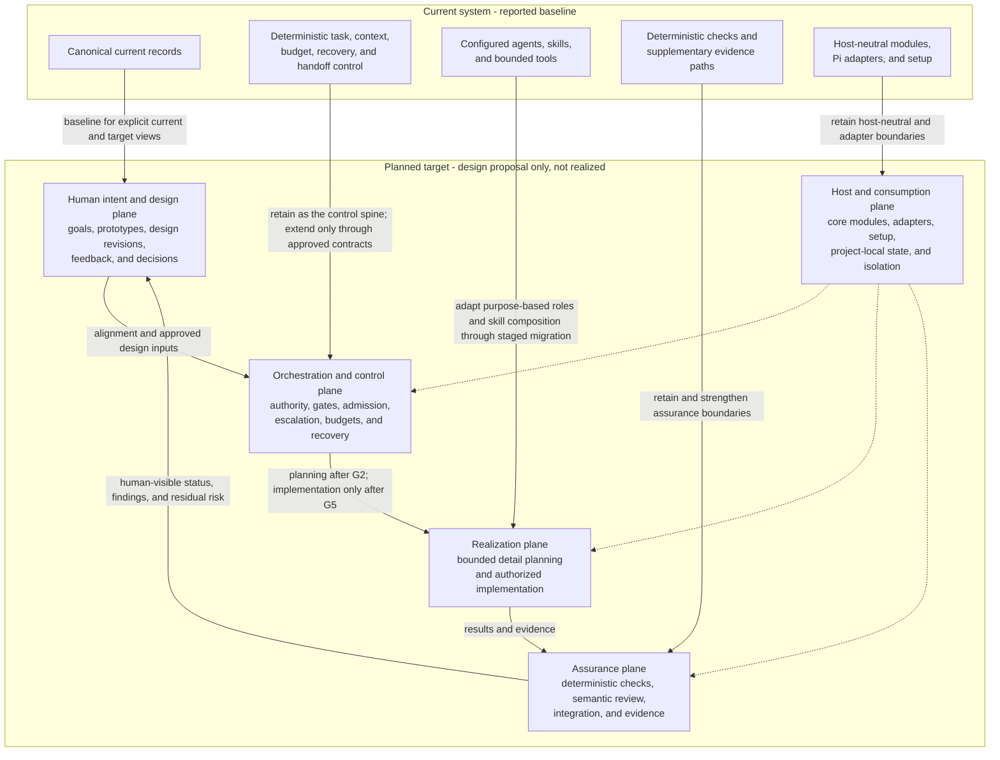
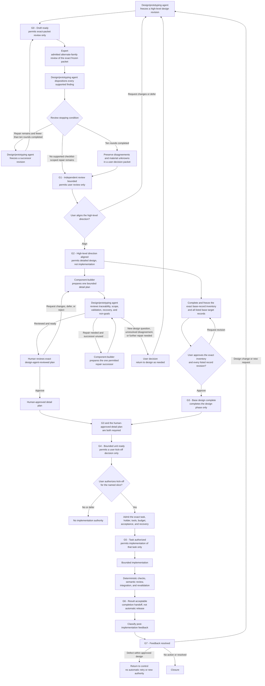
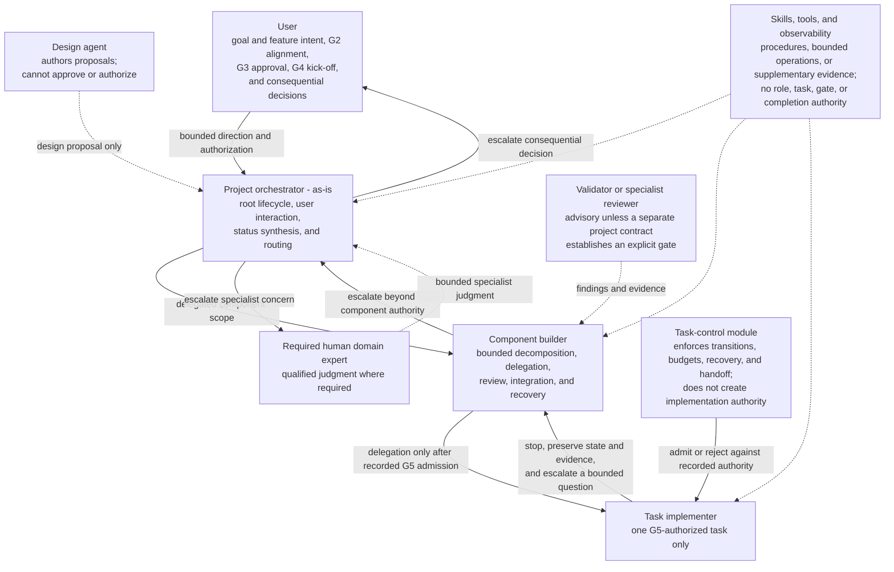
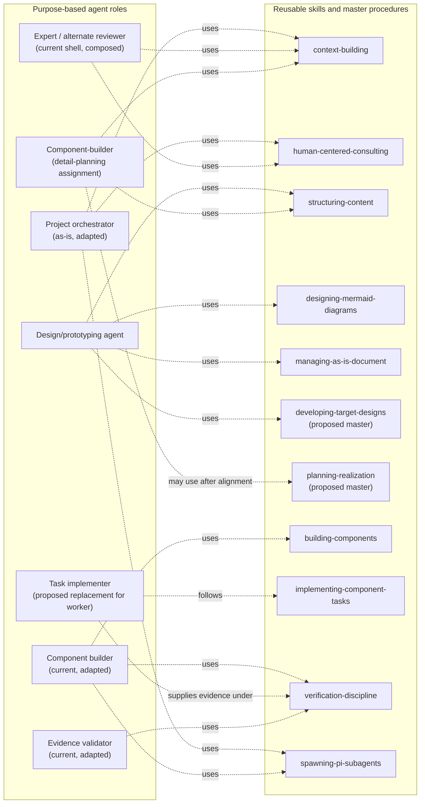

# Agentic Development System — High-Level Target Design Proposal

## Contents

- [1. Executive orientation](#1-executive-orientation)
- [2. Provenance, status, and limitations](#2-provenance-status-and-limitations)
  - [Observations](#observations)
  - [Assumptions used in this proposal](#assumptions-used-in-this-proposal)
  - [Limitation](#limitation)
- [3. Current system versus planned target](#3-current-system-versus-planned-target)
- [4. Proposed target architecture](#4-proposed-target-architecture)
  - [Human-readable system view](#41-human-readable-system-view)
  - [Architectural planes](#42-architectural-planes)
- [5. Human-facing design and representation](#5-human-facing-design-and-representation)
  - [Proposed design package](#51-proposed-design-package)
  - [Workflow benchmark and evaluation](#workflow-benchmark-and-evaluation--advisory-not-authority)
  - [Required human-facing views](#52-required-human-facing-views)
  - [Human status and interaction needs](#53-human-status-and-interaction-needs)
- [6. Design completion and approval gates](#6-design-completion-and-approval-gates)
  - [Recommended gate model](#61-recommended-gate-model)
  - [Current and planned state representation](#62-current-and-planned-state-representation)
- [7. Authority, orchestration, and escalation](#7-authority-orchestration-and-escalation)
  - [Authority model](#71-authority-model)
  - [Escalation](#72-escalation)
- [8. Proposed agent disposition](#8-proposed-agent-disposition)
- [9. Proposed skill disposition](#9-proposed-skill-disposition)
  - [Current catalog](#91-current-catalog)
  - [Proposed introductions](#92-proposed-introductions)
  - [Proposed compositions](#93-proposed-compositions)
  - [Planned deprecations, replacements, and drops](#94-planned-deprecations-replacements-and-drops)
- [10. Target workflows](#10-target-workflows)
  - [Design and alignment workflow](#101-design-and-alignment-workflow)
  - [Workflow-family disposition](#102-workflow-family-disposition)
  - [Detail-planning workflow](#103-detail-planning-workflow)
  - [Implementation workflow](#104-implementation-workflow)
  - [Failure and recovery workflow](#105-failure-and-recovery-workflow)
- [11. Tools, capabilities, context, and boundaries](#11-tools-capabilities-context-and-boundaries)
  - [Tool model](#111-tool-model)
  - [Context model](#112-context-model)
  - [Retained deterministic and host boundaries](#113-retained-deterministic-and-host-boundaries)
- [12. Installation and consumption](#12-installation-and-consumption)
  - [Planned boundary](#121-planned-boundary)
  - [First-slice setup claim](#122-first-slice-setup-claim)
- [13. First proof and setup-inclusive evaluation](#13-first-proof-and-setup-inclusive-evaluation)
  - [Proposed proof](#131-proposed-proof)
  - [Controlled comparison](#132-controlled-comparison)
  - [Measurements](#133-measurements)
  - [Recommended advancement rule](#134-recommended-advancement-rule)
- [14. Migration and recovery strategy](#14-migration-and-recovery-strategy)
  - [Staged migration](#141-staged-migration)
  - [Migration ledger fields](#142-migration-ledger-fields)
  - [Heavy-refactor versus rewrite escape](#143-heavy-refactor-versus-rewrite-escape)
  - [Recovery](#144-recovery)
- [15. Risks and mitigations](#15-risks-and-mitigations)
- [16. Non-goals](#16-non-goals)
- [17. Decisions requiring the user](#17-decisions-requiring-the-user)
- [18. Unresolved design questions](#18-unresolved-design-questions)
- [19. Provisional contract questions for target roles](#19-provisional-contract-questions-for-target-roles)
  - [Design and revision](#design-and-revision)
  - [Feedback and issues](#feedback-and-issues)
  - [Agent admission and tools](#agent-admission-and-tools)
  - [Task and delegation](#task-and-delegation)
  - [Validation and completion](#validation-and-completion)
  - [Escalation](#escalation)
  - [Setup and consumption](#setup-and-consumption)
  - [Migration](#migration)
  - [Evaluation](#evaluation)
  - [Risk and isolation](#risk-and-isolation)
- [20. Recommended next design action](#20-recommended-next-design-action)

## 1. Executive orientation

**Recommendation:** Evolve the existing system through a staged heavy refactor rather than assuming either continuity or a rewrite. Retain the deterministic task-control, context, delegation, validation, setup, and evidence foundations; redesign the human-facing design lifecycle, agent responsibilities, skill composition, model routing, and current-versus-planned representation around them.

The proposed target has five cooperating planes:

1. **Human intent and design** — goals, prototypes, approved target designs, feedback, issues, and decisions.
2. **Orchestration and control** — authority-bearing agents, deterministic gates, task admission, escalation, budgets, and recovery.
3. **Realization** — bounded component and task implementation.
4. **Assurance** — deterministic checks, semantic review, evidence, and supplementary observability.
5. **Host and consumption** — canonical agent/skill resources, host adapters, project-local state, compatibility, setup, and provider isolation.

Implementation would remain unauthorized until:

- the high-level design has been reviewed through the bounded design-author/alternate-reviewer loop;
- the user has aligned on that design direction;
- the complete set of required base target-design records is available and approved;
- the component-builder has produced an initial bounded detail plan;
- the design/prototyping agent has reviewed that exact plan;
- the user has reviewed and approved that exact design-agent-reviewed plan;
- the user has authorized the named first slice; and
- a separate bounded task has received execution authority.

This is a design proposal only. It does not adopt contracts, retire current artifacts, create tasks, or approve implementation.

---

## 2. Provenance, status, and limitations

### Observations

- The named current records describe a working system with seven configured agent roles, seventeen reusable skills, deterministic host-neutral modules, Pi-facing adapters, and bounded tools.
- The consolidated handoff is later than the brief’s older pending Terra–Sol cycle. It records readiness to produce a human-facing target design, not approval of that design or implementation.
- The handoff records user direction toward: design/prototyping agent authorship → bounded alternate-family expert review → user alignment → component-builder detail plans → design-agent review → user detail-plan review and kick-off decision.
- The current records explicitly separate agents, skills, tools, deterministic modules, adapters, task authority, and supplementary telemetry.
- The composable-skills draft proposes useful composition direction but explicitly does not authorize wholesale skill replacement.
- **Artifact disposition:** The composable-skills draft is retained as non-authoritative design input and provenance. Its composition principles are selectively incorporated, but its proposed catalog is not adopted and wholesale capability creation or skill replacement is rejected as a mandate. It is not a target contract or an artifact scheduled for removal by this design.
- The named context does not contain an implementation-level consumer inventory, migration trial, benchmark run, or proof of installed-package operation.

### Assumptions used in this proposal

- The current `as-is.md` records are representative of the present architecture.
- The then-current user remains the reviewer for the root target-design revision.
- The first proof can be repository-local and credential-free.
- The active candidate branch can serve as the design and implementation recovery boundary, but does not provide process, network, credential, or security isolation.
- Purpose-based agent roles should remain separate from model identities.
- Existing tool implementations should be retained unless later evidence establishes a deficiency.

### Limitation

Only the named documents and relevant current `as-is.md` records were used. Implementation source, operational skill bodies, backlogs, changelogs, referenced review reports, and live consumer behavior were not inspected. Therefore, detailed source-to-target removals and compatibility claims remain provisional.

---

# 3. Current system versus planned target

| Concern | Current implementation | Planned target |
| --- | --- | --- |
| Human entry point | `as-is` primarily routes requests and answers bounded questions. | `as-is` becomes the project-level human and orchestration front face while remaining non-implementing. Root lifecycle authority is explicit rather than inferred from routing. |
| Design lifecycle | Durable component records describe architecture; no complete target design lifecycle is established in the current catalog. | A revisioned design lifecycle covers goal, prototype, target design, feedback, user alignment, design completion, detail planning, implementation, and post-implementation feedback. |
| Current/target state | Current records are canonical architecture context; draft proposals remain separate. | Every design representation explicitly labels **current**, **approved target**, **relationship/migration**, and **realization status**. |
| Agent roster | Seven roles with some consultation and implementation overlap. | Purpose-based orchestrators, designer, implementer, validator, and advisory roles; model assignments remain replaceable. |
| Skill organization | Seventeen operational skills, with some broad workflows and adjacent responsibilities. | Master-first composition over reusable capabilities, introduced incrementally rather than by replacing every skill at once. |
| Tool availability | Agents declare tools; launch admission validates and forwards them. | Tools are globally catalogued by the platform but admitted per agent, task, host profile, and risk. Skills declare capability needs but never grant tools. |
| Model strategy | The design exercise used named model/profile assignments, but the inspected current architecture does not establish those labels as architectural roles. | Architectural roles are purpose-based. Model/provider assignments are replaceable, separately admitted selections rather than role identities; exercise-only assignments are recorded separately from target roles. |
| Task control | Durable deterministic task state, budget, recovery, validation, and handoff eligibility already exist. | Retained as the control spine, extended only where design, approval, feedback, and migration states require explicit contracts. |
| Verification | Deterministic checks plus receiving-builder or expert review. | Acceptance-to-evidence mapping is mandatory; semantic review and integration ownership are explicit for every implementation result. |
| Setup | Canonical resources can be wired to detected clients; independent installed-package operation is unproven. | First prove repository-local consumption and isolation; choose a distribution model only after setup-inclusive evaluation. |
| Recovery | Task records, child worktrees, checkpoints, and branch separation support recovery. | Preserve these mechanisms; add design-revision recovery and migration checkpoints, without building an unsupported rollback subsystem. |
| Future workloads | Software development is primary; content and general tasks are future concerns. | Stable goal/design/task/evidence extension points accommodate future workloads, but their workflows remain backlog scope. |

---

# 4. Proposed target architecture

## 4.1 Human-readable system view

The current baseline is shown separately from the planned target so that the diagram does not imply that the target architecture already exists.



## 4.2 Architectural planes

### A. Human intent and design plane

Owns:

- human goals and feature intent;
- visual prototypes and structured design views;
- current-versus-target architecture;
- decisions, assumptions, alternatives, and unresolved questions;
- user feedback and issue classification;
- exact design revision identity and approval evidence.

It does not authorize implementation by itself.

### B. Orchestration and control plane

Owns:

- lifecycle state transitions;
- agent admission and task authority;
- dependency and budget controls;
- approval and escalation state;
- cancellation, retries, and recovery;
- handoff and integration eligibility.

Probabilistic agents propose transitions; deterministic task control admits or rejects consequential transitions.

### C. Realization plane

Owns:

- bounded component planning and decomposition;
- one authorized implementation task at a time;
- scoped changes and tests;
- structured handoff to the receiving owner.

An implementation agent cannot redefine design, widen scope, integrate itself, or declare overall completion.

### D. Assurance plane

Owns:

- acceptance-to-evidence mapping;
- deterministic checks;
- semantic review;
- integration review and post-integration revalidation;
- residual-risk reporting;
- bounded execution-evidence analysis.

Telemetry remains supplementary and cannot become task or completion authority.

### E. Host and consumption plane

Owns:

- host-neutral core modules;
- host-specific adapters;
- canonical role and skill resources;
- bounded tool registration;
- project-local configuration, records, and state;
- version, compatibility, upgrade, and isolation concerns.

Provider credentials remain environmental inputs and must not enter prompts, records, traces, or artifacts.

---

# 5. Human-facing design and representation

## 5.1 Proposed design package

The normal human review unit is one revisioned `target-design.md`, containing the core design followed by appendices for component deltas, migration, setup and benchmark protocol, decision history, and unresolved questions. A minimal `review-manifest.md` identifies the exact reviewed revision and attachments but does not duplicate the design narrative. Separate files are used only where an independently owned canonical base record, machine-consumed artifact, or lifecycle boundary requires them; each such attachment is frozen and referenced from the combined document.

Current `as-is.md` records are the baseline. Every target change is classified as retained, adapted, introduced, deprecated, replaced, dropped, or deferred. An extension beyond current records must identify the unmet capability, owner, consumers, authority and tool implications, compatibility path, validation evidence, and migration or removal gate. Unjustified extensions remain deferred.

Each frozen revision should identify:

- revision and predecessor;
- exact file set or manifest;
- author and reviewers;
- current-state baseline;
- assumptions and unresolved decisions;
- accepted and rejected review findings;
- user alignment state;
- whether it is draft, aligned design, completed base design, or superseded.

## 5.2 Required human-facing views

| View | Human question answered |
| --- | --- |
| One-page system map | What are the major parts and how do they cooperate? |
| Lifecycle swimlane | When do humans, orchestrators, planners, implementers, and validators act? |
| Authority and escalation ladder | Who can decide, authorize, implement, review, integrate, or escalate? |
| Current-versus-target map | What exists now, what is proposed, and what changes? |
| Agent and skill disposition tables | What is retained, modified, introduced, replaced, deprecated, or dropped? |
| Design-state diagram | What is a draft, aligned design, completed base design, task, implementation, or evidence result? |
| Setup and project-isolation view | What is installed globally, project-local, host-specific, or credential-bearing? |
| First-proof scorecard | How will current and candidate workflows be compared? |
| Migration map | How does each current consumer reach its target replacement safely? |
| Decision brief | What does the user need to decide, and what happens under each option? |

Mermaid is appropriate for architecture and lifecycle diagrams. UI mockups, rendered component views, tables, examples, and screenshots may be used when they communicate intent better. No user-interface implementation is implied.

### Workflow benchmark and evaluation — advisory, not authority

The benchmark discussion concerns the workflow, not reviewer or model selection. The proposed evaluation compares the pinned current workflow and the candidate workflow on the same controlled feature, using the same separately owned seed, setup conditions, primary model settings, budget, retry policy, deterministic checks, protected fixtures, rubric, and scorer. **No project-specific workflow benchmark has run.** Sections 12–13 describe a proposed protocol, not results or adoption evidence.

The benchmark should measure setup, correctness, scope discipline, human effort, agent operation, integration, evidence quality, design alignment, and recovery. Before execution, record the exact seed, pinned baseline revision, candidate revision, feature, settings, budget, retry policy, checks, protected inputs, rubric, scorer, safety-critical failures, thresholds, and advancement rule. A model or reviewer-selection experiment must be labelled separately; it must not be presented as evidence that one workflow is superior. Human approval remains required for the benchmark protocol and any advancement decision.

## 5.3 Human status and interaction needs

Without prescribing a UI, the system should make these facts inspectable:

- current lifecycle stage;
- exact approved design revision;
- pending user decisions;
- active and blocked bounded units;
- responsible orchestrator and receiving owner;
- task scope, budget, dependencies, and elapsed status;
- deterministic check results;
- reviewer findings and unresolved disagreements;
- integration and recovery state;
- differences from approved design;
- cost and model usage;
- residual risks and proposed next safe action.

Human feedback should be classified as:

1. **Editorial clarification** — presentation changes without changing approved intent.
2. **Defect report** — implementation fails an existing approved requirement.
3. **Design-changing feedback** — changes user-visible behavior, accepted outcome, component boundary, authority, safety/privacy constraint, acceptance condition, or migration promise.
4. **New request** — separate candidate design or backlog concern.

Categories 3 and 4 return to design. They must not be appended silently to an active implementation task.

---

# 6. Design completion and approval gates

## 6.1 Recommended gate model

| Gate | Meaning | What it permits |
| --- | --- | --- |
| G0 — Draft ready | The design/prototyping agent has produced a frozen human-facing design revision. | Admitted alternate-family expert review of the exact frozen packet only. |
| G1 — Independent review bounded | An admitted alternate-family expert has assessed the exact frozen revision against its manifest’s fixed checklist, and the design/prototyping agent has dispositioned every supported finding. Either the latest counted review reports no supported checklist-scoped repair remaining, or ten counted rounds have completed and all unresolved disagreement has been preserved and packaged for user decision. | User review only; neither path approves the design. |
| G2 — High-level direction aligned | User accepts the major architecture, lifecycle, boundaries, and proposed dispositions. | Detailed design and planning; not implementation. |
| G3 — Base design complete | The then-current user has approved the exact frozen base-record inventory and the exact revision of every listed base record; those records are available, linked, current, and collectively describe the complete revised system. Derived leaves are outside G3 unless they trigger promotion by changing an approved concern. | Completion of the design phase. |
| G4 — Bounded unit ready | G3 has passed, the component-builder detail plan is complete and design-agent-reviewed, and the user has reviewed and approved that exact plan; it has owners, validation, recovery, and non-goals. | User kick-off decision for that unit. |
| G5 — Task authorized | Exact bounded task, holder, tools, budget, acceptance, and recovery are authorized. | Implementation of that task only. |
| G6 — Result acceptable | Deterministic checks, semantic review, integration, and revalidation pass. | Completion handoff; not automatic release. |
| G7 — Post-implementation feedback resolved | Feedback is accepted as defect, design change, new request, or no action. | Closure or return to design. |

### Recommendation

Treat G2 and G3 as separate. High-level alignment should authorize detailed design work, while **design completion** should retain the user’s stated meaning: the base design records needed for the complete revised system have been approved.



A **base target record** is an exact revisioned target `as-is.md` record listed in the frozen, then-current-user-approved G3 base-record inventory. The inventory’s records collectively represent the complete revised system at the architectural/component level, including purpose, boundaries, authority relationships, current-to-target relationship, and realization status. Base membership is determined by inventory membership, not directory depth or filename.

A **derived leaf record** is a traceable elaboration of one or more approved base records that does not change user-visible behavior, accepted outcomes, component boundaries, authority, safety/privacy constraints, approved acceptance conditions, or migration promises. If a proposed leaf changes any of those concerns, it must return to user review and, where appropriate, be promoted into a revised base inventory or base record.

G3 membership is resolved by the user before G3 is evaluated. Derived leaf records need not all receive direct human review; the design/prototyping agent or another accountable design owner may review them when they satisfy the preceding definition. Their traceability and delegated review evidence must be preserved.

## 6.2 Current and planned state representation

Recommended target record shape:

```text
Purpose

Current state
- implemented responsibilities and relationships
- current limitations

Approved target state
- target responsibilities and relationships
- target acceptance and constraints

Design relationship
- retained, modified, replaced, introduced, or removed behavior
- migration dependencies
- realization status

Links
```

Until this record contract is explicitly approved, use a frozen target-design package linked from current records rather than editing current records in a way that could imply implementation already exists.

The normal target lifecycle should use Path A: approved target design drives realization. Path B—building design artifacts on a separate planning branch and merging them only after implementation—should not be the ordinary flow. If agents cannot reliably separate current and planned state, stop and repair the representation rather than silently switching authority models.

---

# 7. Authority, orchestration, and escalation

## 7.1 Authority model

| Actor or mechanism | Proposed authority | Explicit limits |
| --- | --- | --- |
| User | Goal, feature intent, high-level design alignment, base-design approval, exceptions, kick-off, and consequential unresolved decisions. | Does not need to perform routine implementation. |
| `as-is` project orchestrator | Own root lifecycle coordination, user interaction, root escalation, status synthesis, and routing. | Does not implement component work or infer approval. |
| Design agent | Produces prototypes and target designs within authorized design scope. | Cannot approve its own design or authorize implementation. |
| Component builder | Orchestrates one component, decomposes approved work, delegates, reviews, integrates, and escalates. | Cannot edit separately owned children or redefine approved root design silently. |
| Task implementer | Performs one bounded authorized task and returns evidence. | No delegation, approval, integration, commits, architecture changes, credentials, or external actions unless separately admitted. |
| Evidence validator | Evaluates supplied evidence against acceptance. | Advisory; no mutation, completion, or task authority. |
| Expert or specialist reviewer | Challenges architecture, design, implementation, or domain risk. | Advisory unless a separate project contract gives a specialist an explicit gate. |
| Skills | Provide reusable procedures and composition. | Never select, authorize, admit, launch, integrate, or complete work. |
| Tools | Provide bounded operations. | Never grant role, scope, or transition authority. |
| Task-control module | Owns deterministic task-state transitions, budget admission, checkpoints, cancellation, and handoff eligibility. | Does not implement, review semantics, or execute host operations. |
| Observability | Supplies bounded supplementary evidence. | Never defines task status, budget, recovery, or completion. |

The repository authority order remains applicable: fixed safety invariants → external and governance constraints → component policy → explicit user/project overrides → installed defaults.

## 7.2 Escalation

Escalation travels upward through callers:



Each caller should:

1. resolve the issue if it falls within its authority;
2. stop the affected work if it does not;
3. preserve state and evidence;
4. bubble a bounded question upward;
5. avoid forwarding irrelevant implementation detail.

Escalate when:

- approved requirements conflict or are incomplete;
- a component or authority boundary must change;
- a protected input or credential would be needed;
- deterministic checks repeatedly fail without a bounded local cause;
- the task requires wider scope;
- risk classification increases;
- budget or retry allowance is exhausted;
- reviewer disagreement remains after the permitted repair cycle;
- recovery cannot preserve work safely;
- a legal, security, financial, operational, or other specialist concern requires qualified judgment.

No automatic restart or retry should acquire new authority. A caller or user must authorize the next attempt.

---

# 8. Proposed agent disposition

Names are provisional and require naming review before adoption.

| Current agent | Proposed disposition | Planned responsibility | Migration note |
| --- | --- | --- | --- |
| `as-is` | **Modify** | Project-level human front face and root orchestrator: intent interpretation, status, design gates, root escalation, and routing. | Its present “router only” boundary must be changed explicitly; it must remain non-implementing. |
| `component-builder` | **Retain and adapt** | Component-level orchestrator, detail decomposition, delegation, semantic review, child integration, and recovery. | Preserve current child ownership and integration rules; add traceability to approved target design. |
| `evidence-validator` | **Retain and adapt** | Read-only acceptance-to-evidence review across plans, implementations, and controlled checks. | Keep fixed safety profiles; broaden only through explicit code-owned checks, never arbitrary execution. |
| `execution-advisor` | **Retain** | Bounded trace/session analysis, process improvement, and budget evidence. | Continue treating telemetry as supplementary. |
| `expert` | **Retain and compose** | Generic read-only reviewer shell for architecture, alternate-family challenge, and future specialist profiles. | An admitted alternate-review or design-review profile may use this contract when identity, tool admission, and suitability are verified. |
| `thinking-companion` | **Deprecate, then replace** | Its general consultation responsibility moves to the human-facing orchestrator plus the consulting skill; design facilitation moves to a new design role. | Remove only after all direct consumers and behavior tests migrate. |
| `worker` | **Replace** with provisionally named `task-implementer` | One bounded implementation task, tests, checks, and structured evidence report. | Preserve the existing no-delegation/no-integration boundary; provide a compatibility alias during migration. |
| — | **Introduce** a design/prototyping agent | Produce visual prototypes, target-design revisions, alternatives, and decision briefs. | Separate authorship from approval. A model/profile may initially fill the role, but the role must not be named after its model. |

### Model assignment

### Exercise assignment mapping — non-target

The following mappings are labels for this design exercise only, not target agent names or authority grants:

- Sol profile → design/prototyping-agent assignment for high-level design authorship and design review in this exercise.
- Kimi profile → independently admitted expert alternate-review assignment in this exercise.
- Terra profile → component-builder assignment for bounded detail planning in this exercise.
- Luna profile → task-implementer assignment only if a separately authorized implementation exercise occurs.

Exact model identity, family provenance, read-only admission, and suitability remain separately verified concerns. Model routing should consider capability, task risk, ambiguity, observed quality, cost, and latency—not token cost alone.
- No silent reviewer substitution should occur.
- Model routing should consider capability, task risk, ambiguity, observed quality, cost, and latency—not token cost alone.

---

# 9. Proposed skill disposition

## 9.1 Current catalog

| Current skill | Disposition | Planned treatment |
| --- | --- | --- |
| `as-is-setup` | **Retain and adapt** | Become the setup/consumption master for project-local adoption, host checks, compatibility, and setup evidence. |
| `integrate-as-is-documentation` | **Compose, then deprecate standalone form** | Fold its decomposition and record-adoption path into setup and design workflows after behavior parity is proven. |
| `managing-as-is-document` | **Modify substantially** | Support explicit current, approved-target, design-relationship, revision, and realization semantics. |
| `context-building` | **Retain and adapt** | Add explicit decision question, stopping condition, provenance, and current-versus-target labels. |
| `exploring-execution-evidence` | **Retain** | Continue as bounded read-only evidence analysis. |
| `designing-mermaid-diagrams` | **Retain and compose** | Remain the Mermaid-specific capability underneath broader human-facing design and prototype procedures. |
| `naming-software-concepts` | **Retain** | Apply to new roles, skills, records, and lifecycle terms before migration. |
| `implementing-component-tasks` | **Adapt; consider rename to `implementing-tasks`** | Preserve task authority and recovery while allowing project-specific completion and history policies. |
| `maintaining-components` | **Retain** | Continue evidence-based bounded maintenance. |
| `deterministic-skills` | **Retain** | Continue advising where deterministic behavior should replace repetition; do not turn generative design into mechanical policy without evidence. |
| `managing-backlog` | **Retain and adapt** | Remain a planning index, clearly downstream of approved design and separate from active task authority. |
| `spawning-pi-subagents` | **Retain and adapt** | Remain the canonical Pi delegation path; add target-design traceability and setup/compatibility evidence. |
| `structuring-content` | **Retain** | Shape design packages, component records, and human-facing representations. |
| `verification-discipline` | **Retain and strengthen** | Require acceptance-to-evidence matrices, negative cases, semantic review, and residual-risk classification. |
| `building-components` | **Retain and adapt** | Remain the component-builder’s master workflow, now consuming approved target design and bounded detail chunks. |
| `committing-completed-work` | **Adapt** | Preserve scoped durable handoff, but do not make the repository’s two-commit convention a universal cross-project requirement. |
| `human-centered-consulting` | **Retain and broaden composition** | Used by the orchestrator, designer, expert, and decision presentations while preserving human authority. |

## 9.2 Proposed introductions

Introduce these only through bounded pilots with identified consumers:

### New master skills

| Proposed master skill | Purpose |
| --- | --- |
| `developing-target-designs` | Compose goal clarification, prototypes, structured target-design revisions, bounded review preparation, decision presentation, alignment recording, and design-change feedback. It supports human alignment but does not determine or record approval without human decision evidence. |
| `making-changes` | Resolve component versus non-component scope, ownership, method, validation, and applicable history. |
| `planning-realization` | Derive one bounded implementation-ready detail chunk from approved design without changing that design. |

### Candidate reusable capabilities

- resolving scopes;
- identifying owners;
- drafting bounded content;
- choosing change methods;
- writing code;
- applying bounded edits;
- writing tests;
- running tests;
- recording evidence;
- presenting decisions;
- delegating bounded work;
- observing delegated work;
- locating applicable history;
- drafting history entries;
- designing non-Mermaid prototypes or visual artifacts.

These should not be created merely to reproduce the composable-skills draft. Each needs an independent consumer, clear owner, tool requirements, compatibility route, and focused validation.

## 9.3 Proposed compositions

The following view shows representative agent-to-skill relationships. Dashed arrows mean that a role may use or compose a reusable procedure; they do not grant tools, scope, task admission, approval, integration, or completion authority.



```text
developing-target-designs
  = context building
  → human consultation
  → structuring content
  → prototype/diagram design
  → decision presentation
  → review and alignment recording
```

```text
building-components
  = context building
  → scope and owner resolution
  → planning realization
  → implementing tasks
  → bounded delegation
  → verification
  → integration
  → durable completion handoff
```

```text
making-changes
  = scope resolution
  → owner identification
  → method selection
  → code or bounded edit
  → tests
  → validation
  → applicable history
```

## 9.4 Planned deprecations, replacements, and drops

| Item | Planned treatment |
| --- | --- |
| Standalone documentation-integration workflow | Deprecate after setup/design compositions prove parity. |
| `thinking-companion` role | Replace with orchestrator consultation plus the design/prototyping agent. |
| `worker` role name and broad identity | Replace with purpose-specific task implementer; preserve compatibility temporarily. |
| Fixed model names as architecture roles | Drop from the target architecture. Retain only as replaceable assignments. |
| Skill-granted authority or tool access | Explicitly reject. |
| Path B as normal design lifecycle | Drop from the normal flow; retain only as an explicitly approved contingency. |
| Universal `master` working-branch assumption | Drop. A pinned `master` revision remains an evaluation baseline where applicable. |
| Universal two-commit cross-project lifecycle | Drop as a target-system invariant; retain where the consuming project’s contract requires it. |
| Wholesale replacement of all current skills | Reject absent consumer and migration evidence. |
| Current artifacts without migration evidence | Do not drop. |

---

# 10. Target workflows

## 10.1 Design and alignment workflow

1. Human supplies a goal, feature idea, feedback, or issue.
2. The project orchestrator identifies the responsible design scope.
3. The design/prototyping agent creates a frozen high-level design revision with visual and structured views.
4. Before a review counts, an admitted alternate-family expert must have recorded model/provider identity, family-provenance basis, suitability basis, exact packet attachment, and effective read-only admission. Unavailable backend attestation remains explicitly unavailable.
5. The admitted expert reviews that exact revision read-only against the fixed acceptance checklist and review scope in that revision’s review manifest. The review cannot silently enlarge that scope.
6. The design/prototyping agent dispositions every supported finding as accept, reject, or narrow with rationale and creates a successor revision when needed. The design/prototyping agent does not approve its own design.
7. A counted round is one admitted review of one exact frozen packet followed by complete design/prototyping-agent disposition of every supported finding. Repeat for at most ten counted rounds.
8. Stop early only when the latest counted review reports no supported checklist-scoped repair remaining. Preferences and non-blocking unknowns remain visible without blocking early exit.
9. At the tenth round, no eleventh round is implied. The design/prototyping agent must preserve accepted repairs, rejected and narrowed findings, unresolved disagreements, and material unknowns in a user-decision packet. Reaching the bound does not imply checklist passage or design approval.
10. User aligns, requests changes, or defers. Alignment permits detailed design; it does not authorize implementation.
11. The then-current user approves the exact G3 base-record inventory and the required base target records are completed, linked, current, and approved.
12. The design phase is then marked complete.

## 10.2 Workflow-family disposition

This compact table is high-level and non-exhaustive; it is not a consumer inventory. Consumer-specific retention, migration, compatibility, and removal evidence remain the migration ledger’s responsibility.

| Workflow family | Successor disposition |
| --- | --- |
| Human design and alignment lifecycle | **Introduce** the complete revisioned flow; the inspected current catalog does not establish one. |
| Bounded detail planning | **Introduce/formalize** approved-design-derived chunks after G2, without implementation authority. |
| Task control, delegation, recovery, and bounded implementation | **Retain and adapt** the existing deterministic control spine and ownership boundaries. |
| Validation, evidence, semantic review, and integration | **Retain and strengthen** through explicit acceptance-to-evidence mapping and receiving-owner integration. |
| Setup and consumption | **Retain and adapt**, with repository-local proof before broader distribution claims. |
| Documentation integration standalone workflow | **Compose, then deprecate** only after replacement parity and consumer migration evidence. |
| Post-implementation feedback classification | **Introduce/formalize** the defect/design-change/new-request return paths. |
| Path B planning-branch lifecycle | **Drop as the normal path; retain only as an explicitly approved contingency.** |
| Universal `master` and universal two-commit assumptions | **Drop as target-system invariants; retain where consuming-project policy requires them.** |

## 10.3 Detail-planning workflow

After G2 high-level alignment, the component-builder may begin planning one bounded detail chunk at a time while G3 base-record completion proceeds. The component-builder supplies an initial implementation-ready plan, meaning a plan sufficiently complete to support review and task admission. “Implementation-ready” describes planning completeness, not authority: the plan is not approved, executable, or itself a task.

Every chunk should contain:

- bounded context and purpose;
- affected component or cross-component slice;
- exact approved design references;
- current-state references;
- dependencies and owners;
- permitted capabilities and protected inputs;
- inputs, outputs, and consequential flows;
- acceptance conditions;
- deterministic validation;
- semantic reviewer and integration owner;
- recovery and retry behavior;
- explicit non-goals;
- unresolved questions;
- migration effects.

The design/prototyping agent reviews each detail plan for traceability, authority, scope, validation, recovery, and honest exclusions. The component-builder gets at most one repair successor. The then-current user must review the exact design-agent-reviewed plan and may approve, request changes, defer, or reject it. A substantive successor repeats design-agent and human review. Human acceptance of the detail plan is separate from slice kick-off and task authorization. A new design question or unresolved disagreement returns to the user rather than generating an indefinite planning loop.

## 10.4 Implementation workflow

1. The user has approved the exact design-agent-reviewed detail plan for the named slice.
2. The user authorizes kick-off for the named first slice.
3. The responsible orchestrator verifies base records, holders, dependencies, capabilities, and protected controls.
4. One bounded task receives explicit authority.
5. The component builder delegates to the task implementer if useful.
6. The implementer makes the smallest design-conformant change and adds tests.
7. Deterministic checks run.
8. A receiving builder or validator reviews semantic alignment.
9. The receiving owner integrates the result.
10. Relevant checks run again after integration.
11. Completion evidence and residual risks are recorded.
12. Post-implementation feedback is classified and either resolved as a defect or returned to design.

## 10.5 Failure and recovery workflow

- Preserve partial work in the task record and isolated worktree.
- Report failed, blocked, budget-exhausted, or recovery-candidate states explicitly.
- Do not infer completion from process exit, model output, telemetry, or a child commit.
- Do not restart or retry automatically without caller or user authority.
- Do not silently widen scope to obtain a missing dependency.
- Preserve prior design and plan revisions when producing successors.
- Make the parent or receiving builder responsible for semantic integration.
- Escalate persistent correctness failures or architectural contradictions.

---

# 11. Tools, capabilities, context, and boundaries

## 11.1 Tool model

**Recommendation:** Interpret “globally available tools” as a globally discoverable platform catalog, not universal runtime permission.

- Agents declare or are admitted to capability classes.
- Tasks may narrow those capabilities.
- Hosts may impose stronger safety profiles.
- Agents choose among admitted tools within task and role authority.
- Skills identify capability requirements but cannot grant, register, or widen tools.
- Missing or denied capabilities fail closed before work starts.

This retains the current agent-resolution and launcher admission design while supporting composable skills.

## 11.2 Context model

For the first slice:

- use separate worktrees and working directories;
- provide only task, applicable instructions, approved design, and named dependencies;
- ask children not to explore unrelated context;
- require them to stop on a missing dependency;
- treat reported reads as evidence, not proof of isolation.

Add stronger controls only when risk or measurements justify them:

| Risk | Boundary |
| --- | --- |
| Low | Separate worktree/CWD plus prompt-guided context discipline. |
| Medium | Read auditing, protected fixtures, and stronger independent review. |
| High or security-sensitive | Enforced filesystem/network/credential boundary or explicit human approval. |

## 11.3 Retained deterministic and host boundaries

Retain as architectural foundations:

- task-control;
- context resolution;
- agent resolution;
- supplementary observability;
- bounded process supervision;
- host setup;
- agent, context, and evidence tools.

Modify these only to support approved contracts or demonstrated consumers. Do not merge them merely because they participate in the same workflow.

---

# 12. Installation and consumption

## 12.1 Planned boundary

| Layer | Planned location or ownership |
| --- | --- |
| Canonical reusable resources | Versioned bundle of agents, skills, and host adapters. |
| Project design and task records | Consuming project, not global package state. |
| Project policy and overrides | Project-local configuration. |
| Provider credentials | Environment or host secret mechanism only. |
| Runtime sessions and traces | Host-local bounded state with explicit retention. |
| Tool implementations | Platform or bundle implementation, admitted per agent/task. |
| Compatibility and upgrades | Versioned resource and adapter contract with migration evidence. |

## 12.2 First-slice setup claim

The first proof should establish only:

- repository-local setup;
- deterministic detection and wiring;
- no overwrite of unrelated configuration;
- separate project-local state;
- candidate and baseline operation in different directories;
- no credential or external-effect requirement.

It should not claim:

- independent package installation;
- safe untrusted-project operation;
- network or filesystem sandboxing;
- upgrade/downgrade support;
- multi-project production isolation;
- uninstall correctness;
- provider portability.

Those claims require later evidence.

---

# 13. First proof and setup-inclusive evaluation

## 13.1 Proposed proof

Use a separately owned mock project seed and one simple feature that requires:

- setup of the agentic system;
- component or scope resolution;
- a small human-facing design;
- one bounded code change;
- focused tests;
- deterministic validation;
- implementation review;
- integration and status reporting.

A possible feature is a small validated operation with one configuration input, one behavior path, one error case, and tests. The exact technology and feature require user selection.

## 13.2 Controlled comparison

Create from the same seed:

- one baseline consumer using a pinned `master` revision;
- one candidate consumer using the active candidate revision;
- separate directories and worktrees;
- identical feature request;
- identical model settings, budget, retry policy, and deterministic checks;
- protected fixture, rubric, validators, and scorer outside worker write scope.

## 13.3 Measurements

| Category | Measures |
| --- | --- |
| Setup | Success, elapsed time, manual steps, configuration changes, reversibility, and unrelated-file impact. |
| Correctness | Acceptance pass, tests, type/build/lint results, negative cases, and semantic-review defects. |
| Scope discipline | Irrelevant reads, unauthorized changes, missing-dependency reports, and boundary violations. |
| Human effort | Questions, approval interruptions, clarification burden, and review effort. |
| Agent operation | Cost, latency, retries, escalations, budget exhaustion, and model usage. |
| Integration | Conflicts, rework, post-integration failures, and recovery success. |
| Evidence | Completeness, provenance, reproducibility, and unsupported claims. |
| Design alignment | Deviations from approved design and feedback handling. |

## 13.4 Recommended advancement rule

Pre-register the exact thresholds before running the comparison. At minimum, the candidate should:

- have no safety-critical or authority-boundary failure;
- complete setup repeatably;
- pass every mandatory acceptance and deterministic check;
- preserve recovery evidence;
- improve at least one primary outcome such as human effort, correctness, or integration rework;
- remain within user-approved cost and latency tolerances on all other primary outcomes.

Benchmark ranking or model self-assessment must not determine adoption.

---

# 14. Migration and recovery strategy

## 14.1 Staged migration

1. **Baseline and inventory**
   Freeze current and candidate revisions; identify current consumers for every agent, skill, adapter, and tool.

2. **Approve target design**
   Complete the design loop, target records, decision log, and migration ledger without implementation.

3. **Pilot composition**
   Add one master workflow and the smallest supporting reusable capabilities while retaining existing skill paths.

4. **Run setup-inclusive proof**
   Compare baseline and candidate on the same mock project and feature.

5. **Migrate agent responsibilities**
   Introduce the design role and task implementer; adapt `as-is` and `component-builder`; retain aliases and old paths temporarily.

6. **Migrate workflow consumers**
   Move each proven consumer to the target composition with compatibility and behavioral tests.

7. **Broaden adoption**
   Apply the candidate to additional representative software-development tasks.

8. **Retire superseded artifacts**
   Deprecate or drop only when consumer inventory, replacement parity, recovery value, and migration evidence are complete.

## 14.2 Migration ledger fields

For every source artifact:

- source identity;
- current purpose and consumers;
- target identity or composition;
- disposition;
- compatibility mechanism;
- migration owner;
- dependencies;
- evidence required;
- recovery path;
- removal gate;
- unresolved authority.

## 14.3 Heavy-refactor versus rewrite escape

Staged heavy refactoring is the recommended default. A total rewrite should remain available if controlled evidence shows that it provides lower total risk or cost, considering:

- compatibility complexity;
- migration cost and failure risk;
- maintenance burden;
- safety and project isolation;
- recoverability;
- persistent correctness defects;
- inability to represent the target boundaries cleanly;
- setup and benchmark results.

Technical capability of the current substrate alone should not force retention.

## 14.4 Recovery

- The active candidate branch and isolated worktrees preserve the comparison and reversal boundary.
- Prior design and plan revisions remain immutable evidence.
- Failed migration stages stop before retiring source behavior.
- Compatibility paths remain until replacement consumers pass validation.
- No separate rollback subsystem is recommended without a demonstrated need.
- Branch separation does not replace backup, task recovery, or security controls.

---

# 15. Risks and mitigations

| Risk | Mitigation |
| --- | --- |
| Current and target designs become conflated | Explicit sections, revision identity, migration relationship, and realization status. |
| `as-is` becomes an overpowered universal agent | Limit it to root orchestration and user interaction; component and task authority remain delegated and recorded. |
| Skills become hidden authority or permission boundaries | Agent/task admission remains authoritative; skills only provide procedures and capability requirements. |
| Model names harden into architecture | Use purpose-based roles and separately versioned model assignments. |
| Over-splitting skills creates unusable ceremony | Require independent consumers and pilot evidence before extracting a capability. |
| A wholesale rewrite discards working safety boundaries | Preserve deterministic modules and adapters unless benchmark or migration evidence justifies replacement. |
| Heavy refactoring retains accidental complexity | Maintain broad evidence-based rewrite criteria. |
| Design review loops become endless | Freeze revisions, use fixed criteria, bound alternate-family review to ten rounds, and escalate unresolved disagreement. |
| Human approval becomes a rubber stamp | Present visual views, disposition tables, explicit choices, residual risks, and exact revision identity. |
| Leaf designs evade appropriate review | Escalate any leaf change affecting user-visible behavior, authority, safety, boundaries, or acceptance. |
| Passing tests creates false confidence | Require semantic review, negative cases, integration checks, and design traceability. |
| Telemetry becomes de facto authority | Keep task records and deterministic control authoritative. |
| Prompt-guided isolation is mistaken for enforcement | State its limitations and use stronger boundaries for higher-risk work. |
| Setup works only in this repository | Include a separately owned mock consumer and setup in the first evaluation. |
| Migration silently removes consumers | Use a sole migration ledger and evidence-gated retirement. |
| Specialist concerns are treated as solved | Keep legal, security, financial, and operational workflows as explicit future expert/domain-expert work. |

---

# 16. Non-goals

- Implementing this proposal.
- Designing a user interface.
- Authorizing a branch, task, commit, or release.
- Selecting a permanent distribution model.
- Claiming production-grade package installation or multi-project isolation.
- Implementing content-generation or general-task workflows in the first slice.
- Solving specialist legal, financial, security, privacy, or operational review with generic orchestration.
- Creating a universal workflow abstraction before multiple consumers demonstrate it.
- Replacing all current tools or skills.
- Treating model confidence, benchmark rank, process exit, or telemetry as completion authority.
- Enforcing filesystem or network isolation without a risk or evidence basis.
- Requiring every change to use a component task or update a changelog regardless of project policy.
- Requiring `master` to be the working branch.

---

# 17. Decisions requiring the user

| Decision | Recommendation |
| --- | --- |
| Approve the exact G3 base-record inventory | Required before G3 can be evaluated; membership is not inferred from directory depth or filenames. |
| Confirm design/prototyping agent → alternate-family expert → user → component-builder → design-agent review → user sequencing | Confirm as the design-exercise flow, without making it a universal runtime contract yet. |
| Confirm ten-round design-author/alternate-reviewer bound | Confirm, with early exit and user escalation at the bound. |
| Confirm no silent alternate-reviewer substitution | Confirm. |
| Approve G2 high-level alignment versus G3 complete base-design approval | Keep them separate; only G3 completes the design phase. |
| Approve current/approved-target sections in component records | Approve in principle, subject to a bounded record-contract design. |
| Confirm `as-is` as root orchestrator rather than router only | Recommended, with explicit non-implementation limits. |
| Approve a dedicated design/prototyping role | Recommended. |
| Approve replacing `worker` with a task-implementer role | Recommended after compatibility review. |
| Approve deprecating `thinking-companion` | Recommended only after consultation and design consumers migrate. |
| Confirm staged heavy refactor with broad rewrite escape | Recommended. |
| Select first mock feature and technology | Required before evaluation. |
| Appoint design, setup, fixture, evaluation, semantic-review, migration, and task-authorization holders | Required. One holder may cover several roles if conflicts are controlled. |
| Approve benchmark rubric and tolerances | Required before running the proof. |
| Confirm first-slice setup boundary | Recommend repository-local, credential-free, and without external effects. |
| Review workflow benchmark protocol summary | Confirm that the protocol is advisory, that no project-specific workflow benchmark has run, and that workflow comparison is distinct from model-selection experiments. |
| Decide whether kick-off means task preparation only or preparation plus execution | Recommend stating this explicitly for each kick-off. |
| Decide exact names for new roles and skills | Defer to naming review after responsibilities are accepted. |
| Decide when an independent installed-package design is needed | Defer until repository-local setup evidence exists. |

---

# 18. Unresolved design questions

- Can the root `as-is` role safely combine routing, status, and project orchestration without becoming a universal mediation bottleneck?
- Which complete set of base component records constitutes “the entire implementation” for the design-completion gate?
- Should design approval be recorded directly in each component record or in a signed/revisioned package manifest linked from them?
- What exact model and provider identity satisfies the Kimi direction, and how will family provenance and local suitability be verified?
- Which target skills have enough independent consumers to justify extraction?
- Which current consumers depend on the exact `worker`, `thinking-companion`, integration, or two-commit behavior?
- What project history policy should replace repository-specific assumptions for external consumers?
- Which task classes require enforced isolation in the first release?
- What distribution unit—repository bundle, package, host extension, or another form—best fits real consumers?
- What compatibility, upgrade, downgrade, and uninstall promises are needed?
- Who owns release authority after implementation and integration?
- What specialist gates become mandatory for particular consuming projects?
- Which first feature provides a fair comparison without testing only mechanical editing?
- What exact result would trigger the rewrite escape?

---

# 19. Provisional contract questions for target roles

These are questions, not adopted contracts.

## Design and revision

- What uniquely identifies a design revision and its exact file set?
- How are current, approved target, superseded target, and realization status represented?
- What constitutes attributable user alignment?
- How are derived leaf records linked to the approved root design?
- Which design changes reopen user alignment?

## Feedback and issues

- What fields distinguish clarification, defect, design change, and new request?
- Who may classify feedback, dispute a classification, or reopen design?
- How is post-implementation feedback linked to the relevant design and task evidence?

## Agent admission and tools

- What capability classes must an agent declare?
- How do role, task, host, and project restrictions combine?
- How does admission fail closed?
- How are model assignment and agent identity kept separate?

## Task and delegation

- What is the minimum task representation?
- What proves task authorization, scope, budget, dependencies, and protected inputs?
- What is the bounded child return contract?
- What proves semantic integration and caller ancestry?
- What retry and cancellation transitions are permitted?

## Validation and completion

- How are acceptance conditions mapped to evidence?
- Which checks are deterministic, semantic, specialist, or human?
- Who can declare a task eligible for integration and completion?
- What evidence remains required after a no-change result?

## Escalation

- What information must each escalation contain?
- When may a caller resolve an escalation versus bubble it upward?
- Which risks require a user or domain expert?
- What happens to active siblings while an ancestor decision is pending?

## Setup and consumption

- What is canonical bundle identity and version?
- Which records and configuration are project-local?
- What compatibility and migration evidence is required for upgrades?
- How are credentials, provider configuration, and external effects excluded from durable output?
- What must be proven before claiming independent package operation?

## Migration

- What fields and transitions make the migration ledger authoritative?
- What evidence permits alias removal, deprecation, or drop?
- How are failed migrations resumed without conflating current and planned state?

## Evaluation

- What identifies the seed, baseline, candidate, task, model settings, rubric, and protected scorer?
- What constitutes a safety-critical failure?
- What advancement rule is fixed before execution?
- How are missing-dependency failures distinguished from implementation failures?

## Risk and isolation

- What risk classification controls context, filesystem, network, credential, review, and approval requirements?
- Which protections are prompt-guided, audited, or enforced?
- How is an unsupported isolation claim prevented?

---

# 20. Recommended next design action

Subject to user confirmation of the role order, this proposal should be treated as the candidate high-level design input to the bounded alternate-family review process. An admitted expert should review one exact frozen revision read-only; the design/prototyping agent should disposition its findings without silently changing the manifest’s fixed acceptance checklist. Any remaining design disagreement should be presented to the user.

Only after user alignment should the component-builder receive the first bounded detail-plan request. The component-builder's initial output is a combined, human-readable implementation-ready detail plan for a named slice, not implementation authority. The design/prototyping agent reviews it, then the user reviews and accepts the exact design-agent-reviewed plan. Only after that acceptance, G3 completion, user kick-off, and separate task authorization may implementation begin. A suitable first chunk would define the current-versus-approved-target record model and design gates because subsequent agent, skill, migration, and evaluation chunks depend on that distinction.

No implementation, artifact retirement, task creation, or contract adoption is authorized by this proposal.
