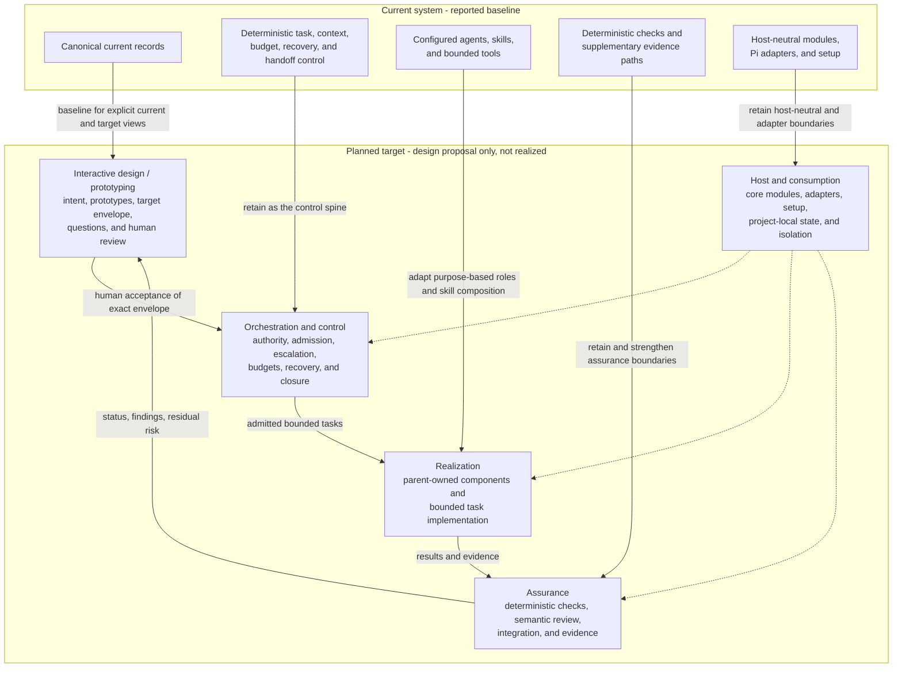
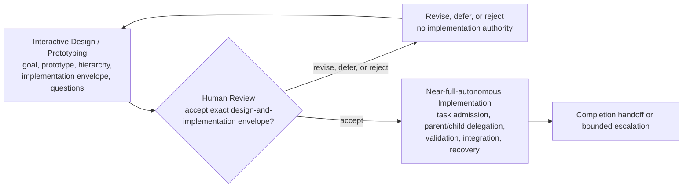
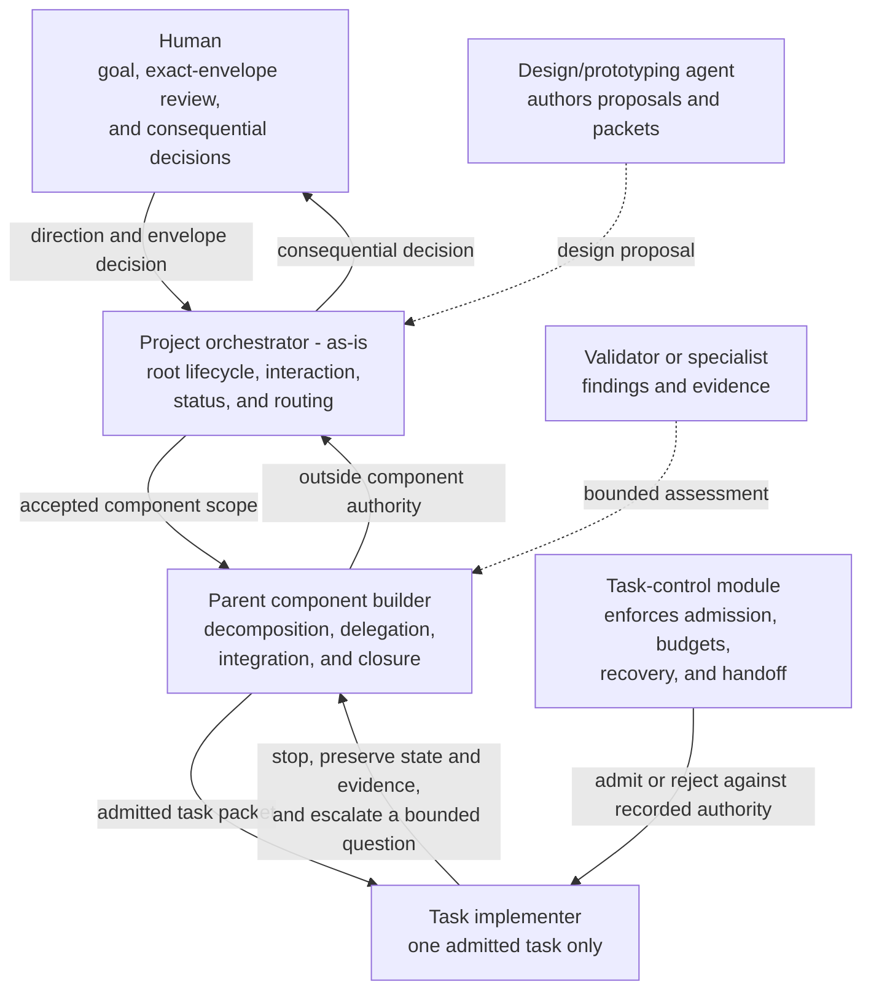
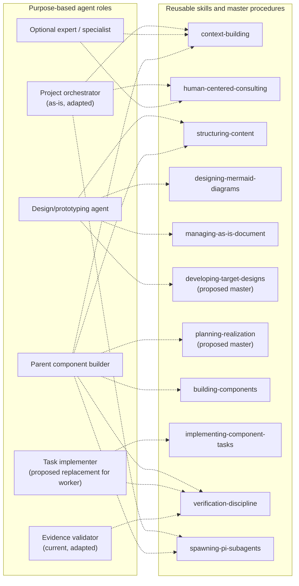

# Agentic Development System — High-Level Target Design Proposal

## Contents

- [1. Executive orientation](#1-executive-orientation)
- [2. Provenance, status, and limitations](#2-provenance-status-and-limitations)
  - [Observations](#observations)
  - [Assumptions used in this proposal](#assumptions-used-in-this-proposal)
  - [Limitation](#limitation)
- [3. Current system versus planned target](#3-current-system-versus-planned-target)
- [4. Proposed target architecture](#4-proposed-target-architecture)
  - [Human-readable system view](#41-human-readable-system-view)
  - [Architectural planes](#42-architectural-planes)
  - [Component hierarchy and realization ownership](#43-component-hierarchy-and-realization-ownership)
- [5. Human-facing design and representation](#5-human-facing-design-and-representation)
  - [Proposed design package](#51-proposed-design-package)
  - [Workflow benchmark and evaluation](#workflow-benchmark-and-evaluation--advisory-not-authority)
  - [Required human-facing views](#52-required-human-facing-views)
  - [Human status and interaction needs](#53-human-status-and-interaction-needs)
- [6. Lifecycle and control points](#6-lifecycle-and-control-points)
- [7. Authority, orchestration, and escalation](#7-authority-orchestration-and-escalation)
  - [Authority model](#71-authority-model)
  - [Escalation](#72-escalation)
- [8. Proposed agent disposition](#8-proposed-agent-disposition)
- [9. Proposed skill disposition](#9-proposed-skill-disposition)
  - [Current catalog](#91-current-catalog)
  - [Proposed introductions](#92-proposed-introductions)
  - [Proposed compositions](#93-proposed-compositions)
  - [Planned deprecations, replacements, and drops](#94-planned-deprecations-replacements-and-drops)
- [10. Target workflows](#10-target-workflows)
  - [Design and alignment workflow](#101-design-and-alignment-workflow)
  - [Workflow-family disposition](#102-workflow-family-disposition)
  - [Implementation packet and task workflow](#103-implementation-packet-and-task-workflow)
  - [Parent/child implementation and integration](#104-parentchild-implementation-and-integration)
  - [Unresolved-question workflow](#105-unresolved-question-workflow)
  - [Failure and recovery workflow](#106-failure-and-recovery-workflow)
- [11. Tools, capabilities, context, and boundaries](#11-tools-capabilities-context-and-boundaries)
  - [Tool model](#111-tool-model)
  - [Context model](#112-context-model)
  - [Retained deterministic and host boundaries](#113-retained-deterministic-and-host-boundaries)
- [12. Installation and consumption](#12-installation-and-consumption)
- [13. First proof and setup-inclusive evaluation](#13-first-proof-and-setup-inclusive-evaluation)
- [14. Migration and recovery strategy](#14-migration-and-recovery-strategy)
- [15. Risks and mitigations](#15-risks-and-mitigations)
- [16. Non-goals](#16-non-goals)
- [17. Decisions requiring the user](#17-decisions-requiring-the-user)
- [18. Unresolved design questions](#18-unresolved-design-questions)
- [19. Provisional contract questions for target roles](#19-provisional-contract-questions-for-target-roles)
- [20. Recommended next design action](#20-recommended-next-design-action)

## 1. Executive orientation

**Recommendation:** Evolve the existing system through a staged heavy refactor rather than assuming either continuity or a rewrite. Retain the deterministic task-control, context, delegation, validation, setup, and evidence foundations; redesign the human-facing design lifecycle, agent responsibilities, skill composition, model routing, and current-versus-planned representation around them.

The proposed target has five cooperating planes:

1. **Human intent and design** — goals, prototypes, approved target designs, feedback, issues, and decisions.
2. **Orchestration and control** — authority-bearing agents, task admission, escalation, budgets, and recovery.
3. **Realization** — parent-owned bounded component work and authorized task implementation.
4. **Assurance** — deterministic checks, semantic review, evidence, and supplementary observability.
5. **Host and consumption** — canonical agent/skill resources, host adapters, project-local state, compatibility, setup, and provider isolation.

The target lifecycle is intentionally simple:

```text
Interactive Design / Prototyping Phase → Human Review → Near-full-autonomous Implementation
```

During Interactive Design / Prototyping, the design owner and human may iterate on goals, prototypes, component hierarchy, detailed implementation instructions, acceptance, protected inputs, and unresolved-question dispositions. Human Review decides whether the exact design-and-implementation envelope is accepted, revised, deferred, or rejected. After acceptance, implementation proceeds near-autonomously inside that envelope through deterministic task admission, bounded parent/child delegation, validation, integration, recovery, and escalation controls.

The human-facing design must clearly state what is presented to a task implementer: a detailed, bounded implementation packet intended to be followed substantially blindly. The implementer need not rediscover the architecture or negotiate requirements, but it must preserve safety boundaries and stop rather than invent an answer when the packet is contradictory, incomplete, or outside its authority.

Implementation remains unauthorized until the human accepts one exact, frozen design-and-implementation envelope and the responsible orchestrator admits a task within that envelope. This is a design proposal only. It does not adopt contracts, retire current artifacts, create tasks, or authorize implementation.

---

## 2. Provenance, status, and limitations

### Observations

- The named current records describe a working system with seven configured agent roles, seventeen reusable skills, deterministic host-neutral modules, Pi-facing adapters, and bounded tools.
- Current `as-is.md` records are the current-architecture authority. Existing design drafts, review reports, and model assignments are planning evidence only.
- The current records explicitly separate agents, skills, tools, deterministic modules, adapters, task authority, and supplementary telemetry.
- The composable-skills draft proposes useful composition direction but explicitly does not authorize wholesale skill replacement.
- **Artifact disposition:** The composable-skills draft is retained as non-authoritative design input and provenance. Its composition principles are selectively incorporated, but its proposed catalog is not adopted and wholesale capability creation or skill replacement is rejected as a mandate. It is not a target contract or an artifact scheduled for removal by this design.
- The named context does not contain an implementation-level consumer inventory, migration trial, benchmark run, or proof of installed-package operation.

### Historical exercise provenance — non-normative

Earlier design exercises used named author and reviewer profiles, packet manifests, and bounded review rounds. Those records are retained only to explain how this proposal was developed. They do not define target roles, model selection, reviewer admission, lifecycle sequencing, approval criteria, task admission, or implementation authority. The target system neither requires nor evaluates alternate-model or alternate-family review. Historical reports remain evidence records outside the target-system contract.

### Assumptions used in this proposal

- The current `as-is.md` records are representative of the present architecture.
- The then-current user remains the decision holder for the exact design-and-implementation envelope.
- The first proof can be repository-local and credential-free.
- The active candidate branch can serve as the design and implementation recovery boundary, but does not provide process, network, credential, or security isolation.
- Purpose-based agent roles should remain separate from model identities.
- Existing tool implementations should be retained unless later evidence establishes a deficiency.

### Limitation

Only the named documents and relevant current `as-is.md` records were used. Implementation source, operational skill bodies, backlogs, changelogs, and live consumer behavior were not inspected. Therefore, detailed source-to-target removals, compatibility claims, and enforcement claims remain provisional.

---

# 3. Current system versus planned target

| Concern | Current implementation | Planned target |
| --- | --- | --- |
| Human entry point | `as-is` primarily routes requests and answers bounded questions. | `as-is` becomes the project-level human and orchestration front face while remaining non-implementing. Root lifecycle authority is explicit rather than inferred from routing. |
| Design lifecycle | Durable component records describe architecture; no complete target design lifecycle is established in the current catalog. | A simple three-phase lifecycle covers interactive design/prototyping, one human review decision, and near-full-autonomous implementation inside the accepted envelope. |
| Current/target state | Current records are canonical architecture context; draft proposals remain separate. | Every design representation explicitly labels **current**, **accepted target**, **relationship/migration**, and **realization status**. |
| Agent roster | Seven roles with some consultation and implementation overlap. | Purpose-based orchestrators, design/prototyping, task implementation, validation, and optional advisory roles; model assignments remain replaceable. |
| Skill organization | Seventeen operational skills, with some broad workflows and adjacent responsibilities. | Master-first composition over reusable capabilities, introduced incrementally rather than by replacing every skill at once. |
| Tool availability | Agents declare tools; launch admission validates and forwards them. | Tools are globally catalogued by the platform but admitted per agent, task, host profile, and risk. Skills declare capability needs but never grant tools. |
| Task control | Durable deterministic task state, budget, recovery, validation, and handoff eligibility already exist. | Retained as the control spine, extended only where design, implementation packets, parent/child integration, feedback, and migration states require explicit contracts. |
| Verification | Deterministic checks plus receiving-builder or expert review. | Acceptance-to-evidence mapping is mandatory; semantic review and integration ownership are explicit for every implementation result. |
| Setup | Canonical resources can be wired to detected clients; independent installed-package operation is unproven. | First prove repository-local consumption and isolation; choose a distribution model only after setup-inclusive evaluation. |
| Recovery | Task records, child worktrees, checkpoints, and branch separation support recovery. | Preserve these mechanisms; add design-revision recovery and parent/child closure checkpoints without building an unsupported rollback subsystem. |
| Future workloads | Software development is primary; content and general tasks are future concerns. | Stable goal/design/task/evidence extension points accommodate future workloads, but their workflows remain backlog scope. |

---

# 4. Proposed target architecture

## 4.1 Human-readable system view

The current baseline is shown separately from the planned target so that the diagram does not imply that the target architecture already exists.



## 4.2 Architectural planes

### A. Human intent and design plane

Owns human goals and feature intent, visual prototypes and structured design views, current-versus-target architecture, component hierarchy, implementation packets, decisions, assumptions, unresolved questions, feedback, and exact design revision identity and acceptance evidence. It does not authorize implementation without the human acceptance decision.

### B. Orchestration and control plane

Owns lifecycle phase transitions, agent admission and task authority, dependency and budget controls, escalation state, cancellation, retries, recovery, handoff, integration eligibility, and descendant closure. Probabilistic agents propose work; deterministic task control admits or rejects consequential transitions.

### C. Realization plane

Owns parent-owned bounded component planning and decomposition, one authorized implementation task at a time, scoped changes and tests, structured child handoffs, parent integration, and closure. An implementation agent cannot redefine design, widen scope, integrate itself, or declare overall completion.

### D. Assurance plane

Owns acceptance-to-evidence mapping, deterministic checks, semantic review, integration review and post-integration revalidation, residual-risk reporting, and bounded execution-evidence analysis. Telemetry remains supplementary and cannot become task or completion authority.

### E. Host and consumption plane

Owns host-neutral core modules, host-specific adapters, canonical role and skill resources, bounded tool registration, project-local configuration/records/state, version and compatibility concerns, and setup. Provider credentials remain environmental inputs and must not enter prompts, records, traces, or artifacts.

## 4.3 Component hierarchy and realization ownership

A component is a bounded responsibility with an accountable parent owner. A parent may decompose only the work it owns, create or admit child tasks within the accepted implementation envelope, and integrate child results. A child owns only its assigned component scope and task record. A child may not redefine the parent’s accepted design, edit a separately owned sibling or parent component, widen its authority, or report parent completion.

Delegation does not transfer parent accountability. The parent remains accountable for decomposition quality, dependency coordination, integration, acceptance reconciliation, escalation, and descendant closure.

A child boundary contains:

- assigned component and paths or interfaces;
- exact task result;
- accepted design and implementation-packet references;
- permitted capabilities;
- protected inputs and exclusions;
- dependencies;
- acceptance and validation;
- budget and recovery constraints;
- receiving integration owner;
- escalation route; and
- stop conditions.

A child returns a structured result handoff, not an integration decision. The handoff identifies the task and design revision, changed or proposed artifacts, validation evidence, unmet acceptance, unresolved questions, deviations, residual risks, and recommended parent action.

A parent integrates only after reconciling the child handoff against the accepted envelope and required validation. Parent integration includes interface compatibility, conflicts with sibling results, semantic alignment, and required post-integration checks.

**Descendant closure** means that every admitted descendant is integrated, explicitly rejected, cancelled, or escalated with a recorded disposition; no unresolved blocking dependency, validation failure, or ownership conflict remains hidden beneath a completion claim.

Work spanning multiple components is owned by the nearest common parent that owns the combined outcome. That parent defines the cross-component contract, decomposition, ordering, shared acceptance, and integration plan. A child must not directly instruct, modify, integrate, or close a separately owned sibling. When no common parent exists within the accepted envelope, the responsible orchestrator assigns or escalates ownership before implementation begins. A cross-component requirement that changes an accepted boundary or acceptance condition returns to Human Review.

---

# 5. Human-facing design and representation

## 5.1 Proposed design package

The normal human review unit is one revisioned `target-design.md`, containing the core design followed by appendices for component hierarchy and deltas, implementation packets, migration, setup and benchmark protocol, decision history, and unresolved questions. A minimal `review-manifest.md` identifies the exact revision and attachments but does not duplicate the design narrative. Separate files are used only where an independently owned canonical base record, machine-consumed artifact, or lifecycle boundary requires them; each attachment is frozen and referenced from the combined document.

Current `as-is.md` records are the baseline. Every target change is classified as retained, adapted, introduced, deprecated, replaced, dropped, or deferred. An extension beyond current records must identify the unmet capability, owner, consumers, authority and tool implications, compatibility path, validation evidence, and migration or removal gate. Unjustified extensions remain deferred.

Each frozen revision should identify its revision and predecessor, exact file set or manifest, author, current-state baseline, accepted target envelope, assumptions, unresolved-question dispositions, human decision state, and whether it is a draft, human-reviewed design, accepted envelope, or superseded revision. Historical author/reviewer exercise provenance may be linked as context, but it is not a target-system requirement.

## 5.2 Required human-facing views

| View | Human question answered |
| --- | --- |
| One-page system map | What are the major parts and how do they cooperate? |
| Three-phase lifecycle view | How does interactive design become human acceptance and then near-autonomous implementation? |
| Authority and escalation ladder | Who can decide, authorize, implement, review, integrate, or escalate? |
| Current-versus-target map | What exists now, what is accepted, and what changes? |
| Component hierarchy and dependency view | Which parent owns each child, and how are cross-component results integrated? |
| Implementation-packet example | What detailed instructions does the task implementer receive? |
| Unresolved-question view | Which questions are blocking, who decides them, and what work is stopped or allowed to continue? |
| Agent and skill disposition tables | What is retained, modified, introduced, replaced, deprecated, or dropped? |
| Setup and project-isolation view | What is installed globally, project-local, host-specific, or credential-bearing? |
| First-proof scorecard | How will current and candidate workflows be compared? |
| Migration map | How does each current consumer reach its target replacement safely? |
| Decision brief | What does the human need to decide, and what happens under each option? |

Mermaid is appropriate for architecture and lifecycle diagrams. UI mockups, rendered component views, tables, examples, and screenshots may be used when they communicate intent better. No user-interface implementation is implied.

### Workflow benchmark and evaluation — advisory, not authority

The benchmark discussion concerns the workflow, not reviewer or model selection. The proposed evaluation compares the pinned current workflow and the candidate workflow on the same controlled feature, using the same separately owned seed, setup conditions, primary model settings, budget, retry policy, deterministic checks, protected fixtures, rubric, and scorer. **No project-specific workflow benchmark has run.** This is a proposed evaluation protocol, not a target lifecycle gate or adoption result.

The benchmark should measure setup, correctness, scope discipline, human effort, agent operation, integration, evidence quality, design alignment, and recovery. Before execution, record the exact seed, pinned baseline revision, candidate revision, feature, settings, budget, retry policy, checks, protected inputs, rubric, scorer, safety-critical failures, thresholds, and advancement rule. A model or reviewer-selection experiment must be labelled separately; it must not be presented as evidence that one workflow is superior. Human approval remains required for the benchmark protocol and any advancement decision.

## 5.3 Human status and interaction needs

Without prescribing a UI, the system should make inspectable: current lifecycle phase; exact design/envelope revision; pending human decisions; active, blocked, and stopped bounded units; responsible orchestrator and receiving owner; task scope, budget, dependencies, and elapsed status; deterministic check results; integration and recovery state; differences from the accepted design; unresolved questions and their dispositions; cost and model usage; residual risks; and the next safe action.

Human feedback should be classified as editorial clarification, defect report, design-changing feedback, or new request. Design-changing feedback and new requests return to Interactive Design / Prototyping. They must not be appended silently to an active implementation task.

---

# 6. Lifecycle and control points

The target system has three phases and one human decision point. The phases are intentionally simple; task admission, validation, integration, and recovery are operational controls inside the implementation phase, not additional design gates.



### Interactive Design / Prototyping Phase

The design owner and human may interactively clarify goals, inspect current records, produce prototypes, define the component hierarchy, derive detailed implementation packets, identify dependencies, set acceptance and protected-input rules, classify risks, and record unresolved questions. The design owner may use optional advisory or specialist input when justified, but alternate-model or alternate-family review is not a target-system requirement.

The phase ends when one exact, frozen design-and-implementation envelope is presented for Human Review. The envelope includes goals, accepted outcomes, component boundaries and parent ownership, implementation packets or the method for deriving them, permitted capabilities, protected inputs, dependencies, acceptance, validation, recovery, escalation, and explicit non-goals.

### Human Review

The human reviews the exact frozen envelope and chooses one outcome: **accept**, **request revision**, **defer**, or **reject**. Human acceptance establishes the goals, component boundaries, authorized change envelope, protected inputs, acceptance conditions, validation expectations, escalation path, and stop conditions. It enables deterministic task admission within that envelope; it does not permit changes outside it.

A revised or materially changed envelope returns to Interactive Design / Prototyping. A deferred or rejected envelope has no implementation authority. Editorial clarification may update presentation without changing the accepted envelope, but it must remain traceable to that revision.

### Near-full-autonomous Implementation Phase

After acceptance, the project orchestrator and parent component owners operate near-autonomously within the accepted envelope. Deterministic task admission, budgets, protected controls, parent/child boundaries, validation, result handoff, integration, unresolved-question handling, recovery, and escalation constrain model output. The human is not required for routine implementation choices already made by the envelope, but consequential deviations and blocked decisions return to the appropriate human decision holder.

Operational controls:

- **Task admission:** A task may begin only when its parent verifies that it is within the accepted envelope and has an accountable owner, bounded result, permitted capabilities, protected inputs, validation, dependencies, budget, recovery, and stop conditions.
- **Result handoff:** A child result is eligible for parent integration only when required evidence is present, declared scope is reconciled, and the parent accepts or escalates it.
- **Closure:** A parent cannot report its work complete until descendant closure and required integration validation are satisfied.

---

# 7. Authority, orchestration, and escalation

## 7.1 Authority model

| Actor or mechanism | Proposed authority | Explicit limits |
| --- | --- | --- |
| Human | Goal, feature intent, acceptance or revision of the exact design-and-implementation envelope, consequential exceptions, and decisions on blocking unresolved questions. | Does not need to perform routine implementation. |
| `as-is` project orchestrator | Root lifecycle coordination, human interaction, status synthesis, routing, and escalation. | Does not implement component work or infer human acceptance. |
| Design/prototyping agent | Produces prototypes, target designs, component hierarchies, and implementation packets within design scope. | Cannot accept its own envelope or authorize implementation. |
| Component builder / parent owner | Owns one component, decomposes accepted work, delegates, coordinates dependencies, integrates child results, resolves questions within authority, and closes descendants. | Cannot edit separately owned siblings or silently redefine accepted design. |
| Task implementer / child | Performs one bounded admitted task from its implementation packet and returns evidence. | No delegation, approval, integration, authority expansion, credential access, or external actions unless separately admitted. |
| Evidence validator | Evaluates supplied evidence against acceptance. | No mutation, task admission, parent integration, or human acceptance authority. |
| Optional expert or specialist | Provides bounded advisory or externally required domain judgment when separately justified. | Not an alternate-model/family gate; does not gain authority merely by reviewing. |
| Skills | Provide reusable procedures and composition. | Never select, authorize, admit, launch, integrate, or complete work. |
| Tools | Provide bounded operations. | Never grant role, scope, or transition authority. |
| Task-control module | Owns deterministic task-state transitions, budget admission, checkpoints, cancellation, and handoff eligibility. | Does not implement, review semantics, or execute host operations. |
| Observability | Supplies bounded supplementary evidence. | Never defines task status, budget, recovery, or completion. |

The repository authority order remains applicable: fixed safety invariants → external and governance constraints → component policy → explicit human/project overrides → installed defaults.

## 7.2 Escalation

Escalation travels upward through callers:



Each caller should resolve an issue within authority, stop affected work when it cannot, preserve state and evidence, bubble a bounded question upward, and avoid forwarding irrelevant implementation detail. No automatic restart or retry should acquire new authority.

Escalate when requirements conflict, a component or authority boundary must change, a protected input or credential would be needed, deterministic checks repeatedly fail without a bounded local cause, the task requires wider scope, risk classification increases, budget or retry allowance is exhausted, recovery cannot preserve work safely, or a legal, security, financial, operational, or other specialist concern requires qualified judgment.

---

# 8. Proposed agent disposition

Names are provisional and require naming review before adoption.

| Current agent | Proposed disposition | Planned responsibility | Migration note |
| --- | --- | --- | --- |
| `as-is` | **Modify** | Project-level human front face and root orchestrator: intent interpretation, status, lifecycle coordination, root escalation, and routing. | Its present “router only” boundary must be changed explicitly; it must remain non-implementing. |
| `component-builder` | **Retain and adapt** | Parent component owner, decomposition, delegation, dependency coordination, semantic review, child integration, descendant closure, and recovery. | Preserve current child ownership and integration rules; add accepted-envelope traceability. |
| `evidence-validator` | **Retain and adapt** | Read-only acceptance-to-evidence review across implementation packets, implementations, and controlled checks. | Keep fixed safety profiles; broaden only through explicit code-owned checks. |
| `execution-advisor` | **Retain** | Bounded trace/session analysis, process improvement, and budget evidence. | Continue treating telemetry as supplementary. |
| `expert` | **Retain and compose** | Generic read-only advisory or specialist shell when a project separately requires it. | Not an alternate-model/family target gate. |
| `thinking-companion` | **Deprecate, then replace** | General consultation moves to the human-facing orchestrator and consulting skill; design facilitation moves to the design/prototyping role. | Remove only after direct consumers and behavior tests migrate. |
| `worker` | **Replace** with provisionally named `task-implementer` | One bounded implementation task, tests, checks, and structured evidence report from the supplied packet. | Preserve the existing no-delegation/no-integration boundary; provide a compatibility alias during migration. |
| — | **Introduce** a design/prototyping agent | Produce interactive prototypes, target-design revisions, component hierarchies, implementation packets, alternatives, and decision briefs. | Separate authorship from human acceptance. |

Model assignments are replaceable implementation choices, not target role names or lifecycle stages. The target system does not require alternate-model or alternate-family review.

---

# 9. Proposed skill disposition

## 9.1 Current catalog

| Current skill | Disposition | Planned treatment |
| --- | --- | --- |
| `as-is-setup` | **Retain and adapt** | Setup/consumption master for project-local adoption, host checks, compatibility, and setup evidence. |
| `integrate-as-is-documentation` | **Compose, then deprecate standalone form** | Fold decomposition and record-adoption path into setup and design workflows after behavior parity is proven. |
| `managing-as-is-document` | **Modify substantially** | Support explicit current, accepted-target, design-relationship, revision, and realization semantics. |
| `context-building` | **Retain and adapt** | Add explicit decision question, stopping condition, provenance, and current-versus-target labels. |
| `exploring-execution-evidence` | **Retain** | Continue bounded read-only evidence analysis. |
| `designing-mermaid-diagrams` | **Retain and compose** | Remain the Mermaid-specific capability underneath broader design and prototype procedures. |
| `naming-software-concepts` | **Retain** | Apply to new roles, skills, records, and lifecycle terms before migration. |
| `implementing-component-tasks` | **Adapt; consider rename to `implementing-tasks`** | Preserve task authority and recovery while allowing project-specific completion and history policies. |
| `maintaining-components` | **Retain** | Continue evidence-based bounded maintenance. |
| `deterministic-skills` | **Retain** | Continue advising where deterministic behavior should replace repetition. |
| `managing-backlog` | **Retain and adapt** | Remain a planning index, clearly downstream of accepted design and separate from active task authority. |
| `spawning-pi-subagents` | **Retain and adapt** | Remain the canonical Pi delegation path; add accepted-envelope traceability and setup/compatibility evidence. |
| `structuring-content` | **Retain** | Shape design packages, component records, and human-facing representations. |
| `verification-discipline` | **Retain and strengthen** | Require acceptance-to-evidence matrices, negative cases, semantic review, and residual-risk classification. |
| `building-components` | **Retain and adapt** | Remain the component-builder’s master workflow, now consuming accepted envelopes and implementation packets. |
| `committing-completed-work` | **Adapt** | Preserve scoped durable handoff without making repository-specific commit conventions universal. |
| `human-centered-consulting` | **Retain and broaden composition** | Used by orchestrator, designer, optional expert, and decision presentations while preserving human authority. |

## 9.2 Proposed introductions

Introduce these only through bounded pilots with identified consumers:

| Proposed master skill | Purpose |
| --- | --- |
| `developing-target-designs` | Compose goal clarification, interactive prototypes, structured target-design revisions, implementation-envelope preparation, decision presentation, human-review recording, and design-change feedback. It supports human acceptance but does not determine or record it. |
| `making-changes` | Resolve component versus non-component scope, ownership, method, validation, and applicable history. |
| `planning-realization` | Derive detailed implementation packets from accepted design without changing that design. |

Candidate reusable capabilities include resolving scopes, identifying owners, drafting bounded content, choosing change methods, writing code, applying bounded edits, writing tests, running tests, recording evidence, presenting decisions, delegating bounded work, observing delegated work, locating history, and drafting history entries. Each needs an independent consumer, owner, tool requirements, compatibility route, and focused validation.

## 9.3 Proposed compositions

The following view shows representative agent-to-skill relationships. Dashed arrows mean that a role may use or compose a reusable procedure; they do not grant tools, scope, task admission, human acceptance, integration, or completion authority.



```text
developing-target-designs
  = context building
  → human consultation
  → interactive prototyping
  → structuring content
  → implementation-envelope preparation
  → human decision presentation
  → revision recording
```

```text
building-components
  = context building
  → scope and owner resolution
  → planning realization
  → implementation-packet delegation
  → bounded child work
  → verification
  → parent integration
  → descendant closure
```

## 9.4 Planned deprecations, replacements, and drops

| Item | Planned treatment |
| --- | --- |
| Standalone documentation-integration workflow | Deprecate after setup/design compositions prove parity. |
| `thinking-companion` role | Replace with orchestrator consultation plus the design/prototyping agent. |
| `worker` role name and broad identity | Replace with purpose-specific task implementer; preserve compatibility temporarily. |
| Alternate-model or alternate-family review as a target control | Remove from target lifecycle and contract; historical exercise records remain non-normative provenance only. |
| Fixed model names as architecture roles | Drop from target architecture. Retain only as replaceable assignments where useful. |
| Skill-granted authority or tool access | Explicitly reject. |
| Path B as normal design lifecycle | Drop from the normal flow; retain only as an explicitly approved contingency. |
| Universal `master` working-branch assumption | Drop. A pinned `master` revision remains an evaluation baseline where applicable. |
| Universal two-commit cross-project lifecycle | Drop as a target-system invariant; retain where the consuming project’s contract requires it. |
| Wholesale replacement of all current skills | Reject absent consumer and migration evidence. |
| Current artifacts without migration evidence | Do not drop. |

---

# 10. Target workflows

## 10.1 Design and alignment workflow

1. Human supplies a goal, feature idea, feedback, or issue.
2. The project orchestrator identifies the responsible design scope.
3. The design/prototyping agent interactively clarifies the goal, inspects applicable current records, builds prototypes or structured views, defines the component hierarchy and parent ownership, and derives the implementation envelope.
4. The design owner records implementation packets or enough exact detail to derive them deterministically, including outcomes, ordered instructions, scope, protected inputs, acceptance, validation, dependencies, recovery, escalation, and stop conditions.
5. The exact frozen design-and-implementation envelope is presented to the human.
6. The human accepts, requests revision, defers, or rejects that exact envelope.
7. Acceptance enters Near-full-autonomous Implementation. Revision, deferral, or rejection returns to design and gives no implementation authority.

No alternate-model or alternate-family review is required by this workflow. Optional advisory or specialist input may be used during Interactive Design / Prototyping when a project or external governance requires it, but it is not a generic target gate.

## 10.2 Workflow-family disposition

| Workflow family | Successor disposition |
| --- | --- |
| Interactive design and prototyping | **Introduce** the revisioned human-facing flow; the inspected current catalog does not establish one. |
| Human review of exact implementation envelope | **Introduce/formalize** as the single human lifecycle decision. |
| Parent/child component realization | **Retain and strengthen** current ownership and integration boundaries with explicit handoffs and descendant closure. |
| Task control, delegation, recovery, and bounded implementation | **Retain and adapt** the existing deterministic control spine and ownership boundaries. |
| Validation, evidence, semantic review, and integration | **Retain and strengthen** through explicit acceptance-to-evidence mapping and receiving-owner integration. |
| Setup and consumption | **Retain and adapt**, with repository-local proof before broader distribution claims. |
| Documentation integration standalone workflow | **Compose, then deprecate** only after replacement parity and consumer migration evidence. |
| Post-implementation feedback classification | **Retain/formalize** defect, design-change, new-request, and no-action paths. |
| Alternate-model/family review loop | **Remove from target system; retain only as historical exercise provenance.** |
| Path B planning-branch lifecycle | **Drop as the normal path; retain only as an explicitly approved contingency.** |

## 10.3 Implementation packet and task workflow

Each admitted task implementer receives a detailed bounded implementation packet. The packet is intended to permit implementation substantially blindly with respect to broader design discovery: the implementer should be able to carry out the stated steps and validations without independently reconstructing architecture, selecting requirements, negotiating component ownership, or exploring unrelated repository context.

“Substantially blindly” never removes task authority or safety boundaries. The implementer must still read applicable instructions, preserve protected inputs, obey tool and scope restrictions, execute or supply the specified validation, report evidence honestly, and stop on a contradiction, missing dependency, prohibited access, failed required validation, or condition outside the packet.

Every packet contains:

1. immutable task identifier and accepted design/envelope revision;
2. parent owner, receiving integration owner, and escalation recipient;
3. one bounded outcome and explicit non-goals;
4. affected component, allowed paths/interfaces, and prohibited paths/interfaces;
5. ordered implementation instructions and required dependency assumptions;
6. permitted tools/capabilities and prohibited external, credential, or destructive actions;
7. protected inputs, fixtures, baselines, validators, secrets, and authority-bearing records;
8. exact acceptance conditions and deterministic validation instructions;
9. required result-handoff evidence;
10. budget, recovery/checkpoint expectations, and cancellation conditions; and
11. explicit stop conditions.

The implementer may make only local discretionary choices necessary to execute unambiguous instructions and preserve stated constraints. It must not resolve a design ambiguity by invention, relax an acceptance condition, substitute a dependency or validation method, reinterpret a protected input as editable, or convert an unresolved question into a requirement.

The parent admits a task only after checking that the packet is within the accepted envelope, the named holder and receiving owner are available, dependencies and protected controls are present, and deterministic task control has admitted the task. A task result is a proposal for parent integration until its evidence and scope are reconciled.

## 10.4 Parent/child implementation and integration

The parent component builder is accountable for the component outcome. It may create or admit children only for bounded work within its accepted scope. The child receives the implementation packet and may work only within its assigned component and allowed paths/interfaces.

The child must:

- follow the packet’s ordered instructions and acceptance/validation requirements;
- preserve prohibited paths, protected inputs, and authority-bearing records;
- stop and escalate when a stop condition or blocking question is reached;
- return a structured result handoff with changed artifacts, evidence, deviations, residual risks, and unresolved questions; and
- never delegate, integrate a sibling, redefine the accepted design, widen scope, or declare parent completion.

The parent must:

- coordinate dependencies and sibling ordering;
- inspect the child result and required evidence;
- reconcile scope and acceptance against the accepted envelope;
- resolve conflicts and interface compatibility at the nearest common parent;
- perform or obtain semantic and post-integration validation;
- explicitly integrate, reject, cancel, or escalate each child result; and
- close the component only after descendant closure.

For work spanning multiple components, the nearest common parent owns the combined outcome and cross-component contract. Children may not directly modify or close separately owned siblings. A boundary-changing cross-component request returns to Human Review.

## 10.5 Unresolved-question workflow

Every unresolved question is recorded with its question, affected design/task revision, owner, dependencies, deadline or decision point where relevant, proposed options if known, and status: **resolved**, **non-blocking**, or **blocking**.

A question is **blocking** when its answer could change task scope, component ownership, interface behavior, protected inputs, authority, acceptance, validation, budget, risk classification, or recovery. The affected task and dependent descendants stop at the safe checkpoint; unrelated siblings may continue only when the parent records that they are independent.

A parent may resolve a question only when the answer is already determined by the accepted envelope and does not alter a protected concern. Otherwise, the parent escalates through its caller to the human decision holder. The parent records the escalation and does not silently choose an answer.

A **non-blocking** question may remain open only when the accepted envelope explicitly permits the stated default and the question cannot alter acceptance, safety, authority, or another component’s contract. It remains visible in the result handoff and closure evidence.

An unresolved blocking question prevents affected descendant closure and prevents the parent from claiming completion. Escalation, deferral, cancellation, or an accepted design revision supplies its disposition; retry alone does not create an answer or new authority.

## 10.6 Failure and recovery workflow

- Preserve partial work in the task record and isolated worktree.
- Report failed, blocked, budget-exhausted, or recovery-candidate states explicitly.
- Do not infer completion from process exit, model output, telemetry, or a child commit.
- Do not restart or retry automatically without caller or human authority.
- Do not silently widen scope to obtain a missing dependency.
- Preserve prior design and packet revisions when producing successors.
- Make the parent or receiving builder responsible for semantic integration.
- Escalate persistent correctness failures or architectural contradictions.

---

# 11. Tools, capabilities, context, and boundaries

## 11.1 Tool model

Interpret “globally available tools” as a globally discoverable platform catalog, not universal runtime permission. Agents declare or are admitted to capability classes; tasks may narrow them; hosts may impose stronger profiles; skills identify capability requirements but cannot grant, register, or widen tools; missing or denied capabilities fail closed before work starts.

## 11.2 Context model

For the first slice, use separate worktrees and working directories, provide only the implementation packet, applicable instructions, accepted design, and named dependencies, ask children not to explore unrelated context, require them to stop on a missing dependency, and treat reported reads as evidence rather than proof of isolation.

| Risk | Boundary |
| --- | --- |
| Low | Separate worktree/CWD plus packet-guided context discipline. |
| Medium | Read auditing, protected fixtures, and stronger independent validation. |
| High or security-sensitive | Enforced filesystem/network/credential boundary or explicit human decision. |

## 11.3 Retained deterministic and host boundaries

Retain task-control, context resolution, agent resolution, supplementary observability, bounded process supervision, host setup, and agent/context/evidence tools. Modify these only to support accepted contracts or demonstrated consumers. Do not merge them merely because they participate in the same workflow.

---

# 12. Installation and consumption

| Layer | Planned ownership |
| --- | --- |
| Canonical reusable resources | Versioned bundle of agents, skills, and host adapters. |
| Project design and task records | Consuming project, not global package state. |
| Project policy and overrides | Project-local configuration. |
| Provider credentials | Environment or host secret mechanism only. |
| Runtime sessions and traces | Host-local bounded state with explicit retention. |
| Tool implementations | Platform or bundle implementation, admitted per agent/task. |
| Compatibility and upgrades | Versioned resource and adapter contract with migration evidence. |

The first proof claims only repository-local setup, deterministic detection and wiring, no overwrite of unrelated configuration, separate project-local state, candidate and baseline operation in different directories, and no credential or external-effect requirement. It does not claim independent package installation, untrusted-project operation, network/filesystem sandboxing, upgrade/downgrade support, multi-project production isolation, uninstall correctness, or provider portability.

---

# 13. First proof and setup-inclusive evaluation

Use a separately owned mock project seed and one simple feature that requires setup, component or scope resolution, a small human-facing design, one bounded code change, focused tests, deterministic validation, implementation review, integration, and status reporting.

Create from the same seed one baseline consumer using a pinned `master` revision and one candidate consumer using the active candidate revision, in separate directories and worktrees, with identical feature request, model settings, budget, retry policy, deterministic checks, protected fixture, rubric, validators, and scorer outside worker write scope.

Measure setup, correctness, scope discipline, human effort, agent operation, integration, evidence, design alignment, and recovery. **No project-specific workflow benchmark has run.** Pre-register the exact seed, revisions, feature, settings, budget, retry policy, checks, protected inputs, rubric, scorer, safety-critical failures, thresholds, and advancement rule before execution. Workflow comparison is distinct from any model-selection or reviewer-selection experiment.

---

# 14. Migration and recovery strategy

1. **Baseline and inventory:** Freeze current and candidate revisions; identify current consumers for every agent, skill, adapter, and tool.
2. **Approve target envelope:** Complete the interactive design package, human review, decision log, and migration ledger without implementation.
3. **Pilot composition:** Add one master workflow and the smallest supporting reusable capabilities while retaining existing skill paths.
4. **Run setup-inclusive proof:** Compare baseline and candidate on the same mock project and feature.
5. **Migrate agent responsibilities:** Introduce the design role and task implementer; adapt `as-is` and `component-builder`; retain aliases and old paths temporarily.
6. **Migrate workflow consumers:** Move each proven consumer to the target composition with compatibility and behavioral tests.
7. **Broaden adoption:** Apply the candidate to additional representative software-development tasks.
8. **Retire superseded artifacts:** Deprecate or drop only when consumer inventory, replacement parity, recovery value, and migration evidence are complete.

For every source artifact, record source identity, current purpose and consumers, target identity/composition, disposition, compatibility mechanism, migration owner, dependencies, evidence required, recovery path, removal gate, and unresolved authority. Staged heavy refactoring is the default; a total rewrite remains available if controlled evidence shows lower total risk or cost while considering compatibility, migration, maintenance, safety, isolation, recoverability, correctness, setup, and benchmark results.

The active candidate branch and isolated worktrees preserve comparison and reversal boundaries. Prior design and implementation-packet revisions remain immutable evidence. Failed migration stages stop before retiring source behavior. No separate rollback subsystem is recommended without demonstrated need.

---

# 15. Risks and mitigations

| Risk | Mitigation |
| --- | --- |
| Current and accepted target designs become conflated | Explicit sections, revision identity, migration relationship, and realization status. |
| `as-is` becomes an overpowered universal agent | Limit it to root orchestration and human interaction; component and task authority remain delegated and recorded. |
| Skills become hidden authority or permission boundaries | Agent/task admission remains authoritative; skills only provide procedures and capability requirements. |
| Near-full autonomy silently widens scope | Provide detailed packets, protected inputs, explicit stop conditions, deterministic admission, and escalation. |
| Parent/child work is incomplete or conflicts | Define nearest-common-parent ownership, structured handoffs, parent integration, sibling boundaries, and descendant closure. |
| Unresolved questions silently become implementation assumptions | Classify questions, stop affected work for blocking questions, preserve non-blocking defaults, and escalate consequential decisions. |
| Over-splitting skills creates unusable ceremony | Require independent consumers and pilot evidence before extracting a capability. |
| A wholesale rewrite discards working safety boundaries | Preserve deterministic modules and adapters unless evidence justifies replacement. |
| Human review becomes a rubber stamp | Present visual views, implementation packets, explicit choices, residual risks, and exact envelope identity. |
| Passing tests creates false confidence | Require semantic review, negative cases, integration checks, and design traceability. |
| Telemetry becomes de facto authority | Keep task records and deterministic control authoritative. |
| Prompt-guided isolation is mistaken for enforcement | State limitations and use stronger boundaries for higher-risk work. |
| Setup works only in this repository | Include a separately owned mock consumer and setup in the first evaluation. |
| Migration silently removes consumers | Use a sole migration ledger and evidence-gated retirement. |
| Specialist concerns are treated as solved | Keep legal, security, financial, and operational requirements as explicit project or external-governance decisions. |

---

# 16. Non-goals

- Implementing this proposal.
- Designing a user interface.
- Authorizing a branch, task, commit, or release.
- Selecting a permanent distribution model.
- Claiming production-grade package installation or multi-project isolation.
- Implementing content-generation or general-task workflows in the first slice.
- Solving specialist legal, financial, security, privacy, or operational review with generic orchestration.
- Creating a universal workflow abstraction before multiple consumers demonstrate it.
- Replacing all current tools or skills.
- Treating model confidence, benchmark rank, process exit, or telemetry as completion authority.
- Enforcing filesystem or network isolation without a risk or evidence basis.
- Requiring every change to use a component task or update a changelog regardless of project policy.
- Requiring alternate-model or alternate-family review in the target system.
- Requiring `master` to be the working branch.

---

# 17. Decisions requiring the user

| Decision | Recommendation |
| --- | --- |
| Accept or revise the exact three-phase lifecycle | Use Interactive Design / Prototyping → Human Review → Near-full-autonomous Implementation. |
| Accept the design-and-implementation envelope as the single human lifecycle decision | Require exact revision identity and record accept/revise/defer/reject. |
| Accept parent/child ownership and nearest-common-parent cross-component rule | Require parent accountability, child boundaries, structured handoffs, integration, and descendant closure. |
| Accept the detailed implementation-packet contract | Require substantially blind execution within explicit scope, protected inputs, validation, escalation, and stop conditions. |
| Accept unresolved-question handling | Blocking questions stop affected descendants and escalate; permitted non-blocking defaults remain visible. |
| Confirm `as-is` as root orchestrator rather than router only | Recommended, with explicit non-implementation limits. |
| Approve a dedicated design/prototyping role | Recommended. |
| Approve replacing `worker` with a task-implementer role | Recommended after compatibility review. |
| Approve deprecating `thinking-companion` | Recommended only after consultation and design consumers migrate. |
| Confirm staged heavy refactor with broad rewrite escape | Recommended. |
| Select first mock feature and technology | Required before evaluation. |
| Appoint design, setup, fixture, evaluation, semantic-review, migration, and task-authorization holders | Required. One holder may cover several roles if conflicts are controlled. |
| Approve benchmark rubric and tolerances | Required before running the proof. |
| Confirm first-slice setup boundary | Recommend repository-local, credential-free, and without external effects. |
| Decide whether specialist governance applies to a consuming project | Record separately from the generic target lifecycle. |
| Decide exact names for new roles and skills | Defer to naming review after responsibilities are accepted. |

The target system does not require alternate-model or alternate-family review. Historical exercise review records do not require a new disposition here.

---

# 18. Unresolved design questions

These questions remain visible and do not silently become implementation requirements:

- Can the root `as-is` role safely combine routing, status, and project orchestration without becoming a universal mediation bottleneck?
- Which complete set of base component records or equivalent design artifacts represents the accepted implementation envelope for a given project?
- Should human acceptance be recorded directly in each component record or in a revisioned package manifest linked from them?
- Which target skills have enough independent consumers to justify extraction?
- Which current consumers depend on the exact `worker`, `thinking-companion`, integration, or commit behavior?
- What project history policy should replace repository-specific assumptions for external consumers?
- Which task classes require enforced isolation in the first release?
- What distribution unit—repository bundle, package, host extension, or another form—best fits real consumers?
- What compatibility, upgrade, downgrade, and uninstall promises are needed?
- Who owns release authority after implementation and integration?
- What specialist gates become mandatory for particular consuming projects?
- Which first feature provides a fair comparison without testing only mechanical editing?
- What exact result would trigger the rewrite escape?

An unresolved question is not itself an implementation task. During implementation, each question must be classified as resolved, non-blocking, or blocking under §10.5. Blocking questions stop affected work and return to the responsible decision holder; non-blocking questions remain visible with their permitted default; resolution may require a revised envelope and another Human Review.

---

# 19. Provisional contract questions for target roles

These are questions, not adopted contracts.

## Design and revision

- What uniquely identifies a design/envelope revision and its exact file set?
- How are current, accepted target, superseded target, and realization status represented?
- What constitutes attributable human acceptance?
- How are component hierarchies and derived implementation packets linked to the accepted envelope?
- Which design changes reopen Human Review?

## Feedback and issues

- What fields distinguish clarification, defect, design change, and new request?
- Who may classify feedback, dispute a classification, or reopen design?
- How is post-implementation feedback linked to relevant design and task evidence?

## Agent admission and tools

- What capability classes must an agent declare?
- How do role, task, host, and project restrictions combine?
- How does admission fail closed?
- How are model assignment and agent identity kept separate?

## Task, hierarchy, and delegation

- What is the minimum implementation-packet representation?
- What proves task authorization, scope, budget, dependencies, and protected inputs?
- What is the bounded child return contract?
- What proves parent integration, caller ancestry, and descendant closure?
- How are nearest-common-parent ownership and sibling boundaries represented?
- What retry and cancellation transitions are permitted?

## Validation and completion

- How are acceptance conditions mapped to evidence?
- Which checks are deterministic, semantic, specialist, or human?
- Who can declare a task eligible for integration and completion?
- What evidence remains required after a no-change result?

## Escalation and questions

- What information must each escalation contain?
- When may a caller resolve an unresolved question versus bubble it upward?
- Which risks require a human or domain expert?
- What happens to active siblings while an ancestor decision is pending?
- How are blocking and non-blocking statuses represented and propagated to descendants?

## Setup and consumption

- What is canonical bundle identity and version?
- Which records and configuration are project-local?
- What compatibility and migration evidence is required for upgrades?
- How are credentials, provider configuration, and external effects excluded from durable output?
- What must be proven before claiming independent package operation?

## Migration

- What fields and transitions make the migration ledger authoritative?
- What evidence permits alias removal, deprecation, or drop?
- How are failed migrations resumed without conflating current and accepted target state?

## Evaluation

- What identifies the seed, baseline, candidate, task, model settings, rubric, and protected scorer?
- What constitutes a safety-critical failure?
- What advancement rule is fixed before execution?
- How are missing-dependency failures distinguished from implementation failures?

## Risk and isolation

- What risk classification controls context, filesystem, network, credential, review, and approval requirements?
- Which protections are prompt-guided, audited, or enforced?
- How is an unsupported isolation claim prevented?

---

# 20. Recommended next design action

Present this exact frozen design-and-implementation envelope for Human Review. The human may accept, request revision, defer, or reject it. Do not start alternate-model review, detail-plan review as a separate human gate, task creation, kick-off, or implementation before that decision.

If the human accepts the envelope, the project orchestrator should admit the first bounded task only after verifying its implementation packet, parent owner, receiving integration owner, dependencies, capabilities, protected inputs, acceptance, validation, recovery, budget, and stop conditions. The task implementer should receive the detailed packet and be able to implement it substantially blindly; it must stop and escalate when the packet is insufficient or contradictory. The parent then owns result reconciliation, integration, descendant closure, and any unresolved-question escalation.

A suitable first design/implementation envelope would define the current-versus-accepted-target record model, component hierarchy, implementation-packet schema, and one repository-local mock feature because subsequent agent, skill, migration, and evaluation work depends on those boundaries.

No implementation, artifact retirement, task creation, target-contract adoption, or release authorization is implied by this proposal.
