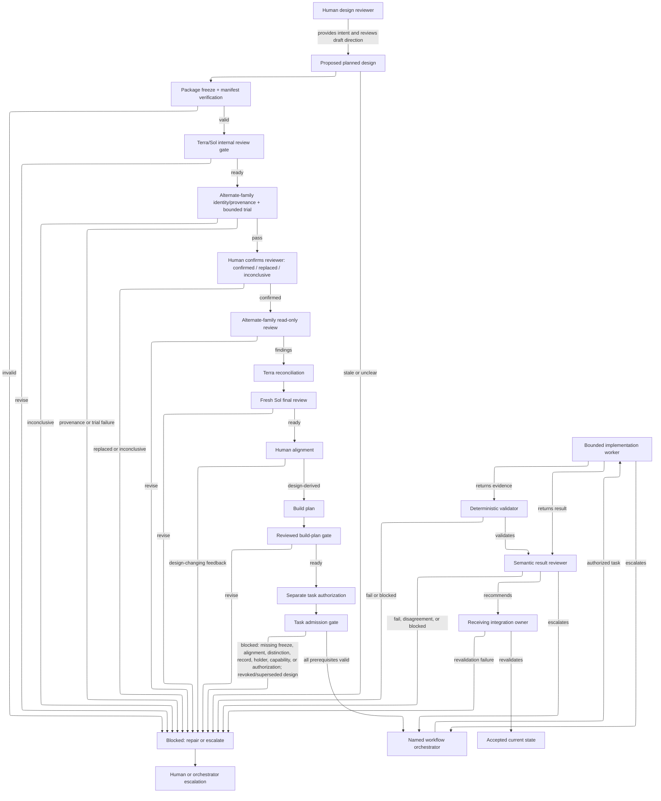

# Architecture and authority — proposed target component

## Status and authority

This is a proposed component design in `target-design-v1-draft-30`. It describes planned boundaries only. Current architecture remains represented by the linked current records. This document does not authorize implementation or task creation.

## Purpose and users

Provide a human-readable control-plane design for moving an aligned feature goal through bounded design, task admission, implementation, evidence review, integration, recovery, and escalation. Primary readers are the human design reviewer, workflow orchestrator, component builder, implementation worker, validator, and evaluator.

## Current reference

The current substrate is documented by the root `as-is.md`, `agents/as-is/as-is.md`, `agents/component-builder/as-is.md`, `agents/worker/as-is.md`, `core/contracts/component-task-record-protocol.md`, `core/contracts/execution-contract.md`, and `skills/spawning-pi-subagents/as-is.md`. Those records remain current-state evidence and are not rewritten by this proposal.

## Planned responsibility and boundary

The target has distinct control-plane responsibilities: intake and status routing; human-facing design facilitation and package revision; task admission against a frozen aligned design reference; bounded component implementation; deterministic evidence validation; semantic result review; receiving-owner integration and revalidation; setup and fixture ownership; evaluation/scoring; and migration governance.

A workflow orchestrator composes these responsibilities but does not become a universal domain implementer. A skill supplies procedure but never becomes a hidden authority boundary.

**Lineage**: [as-is](../../as-is.md#design) / [Drafts](../as-is.md#design) / **architecture and authority**

### Proposed control flow

## Relationships and authority

The design package provides planned context to the named orchestrator. The orchestrator uses current task and component records, delegates to the admitted worker, and routes results to independent validation and semantic review. The integration owner writes only its owned ancestor scope. The evaluator observes controlled runs without allowing the candidate to alter the experiment.

Human alignment applies to a package revision and defined scope; it is not implementation or external-effect approval. The task record is the sole active implementation authority. Worker exit, commit, report, validator output, reviewer recommendation, and benchmark result are evidence, not completion authority. Escalation bubbles to the applicable orchestrator but grants no capability, budget, retry, scope, or approval authority.

## Inputs, outputs, and consequential flows

Inputs are an aligned package revision, bounded task record, applicable current records, named dependencies, admitted capability profile, and frozen evaluation manifest. Outputs are proposed task admission, worker handoff, deterministic evidence, semantic disposition, integration result, escalation, or recoverable failure. The consequential flow crosses human, task, component, worker, review, and integration authority boundaries; each transition requires its owning evidence.

## Migration mapping

The sole source-to-target mapping is `../migration-ledger.md`. This document does not independently decide migration or retirement.

## Acceptance and validation proposal

A future bounded implementation unit must show design-reference currentness before launch, durable task evidence, actual changed-scope inspection, acceptance mapping, semantic review, integration revalidation, safe failure/recovery, and no protected-control mutation. These are proposed acceptance conditions until a human aligns on the package and a later task adopts them.

## Open decisions and dependencies

- exact design-reference and currentness representation;
- holder identities for each workflow responsibility;
- risk classification and capability profiles;
- exact fixture and scoring schema;
- host enforcement of credential, filesystem, network, and process boundaries.
