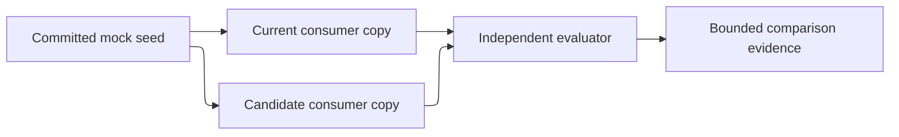

# Consuming project and evaluation — proposed target component

## Status and authority

This is a proposed repository-local evaluation design in `target-design-v1-draft-28`. It makes no package, distribution, security-isolation, or multi-project production claim.

## Purpose and users

Establish a separately owned mock-project seed and compare current and candidate workflows against the same feature and controlled cases. Readers are the human design reviewer, setup owner, fixture owner, evaluator/scorer, workflow orchestrator, and migration owner.

## Current reference

Current setup evidence is split between `skills/as-is-setup`, `core/adapters/host-setup`, the root `as-is.md` records, and the existing validation fixtures. Those artifacts remain current evidence. The planned consuming-project setup and evaluation boundary is new and is mapped in `../migration-ledger.md`.

## Planned responsibility and boundary

The evaluator owns the comparison protocol and protected scoring controls. The fixture owner owns the committed seed. The setup owner creates separate consumer copies within the approved fixture boundary. Candidate workers write only their assigned consumer/task scope. No candidate may write the seed, other consumer copy, validators, rubric, scorer, case matrix, run manifest, or result record.

**Lineage**: [as-is](../../as-is.md#design) / [Drafts](../as-is.md#design) / **consuming project and evaluation**

### Controlled comparison

## Relationships and authority

The fixture owner provides an immutable seed to the setup owner. The setup owner creates current and candidate copies for a run. Each system may write only its own copy within its declared scope. The evaluator reads both results and protected controls, applies the approved rubric, and records evidence. The host/runtime owner controls sessions, traces, and temporary state. The resource/action matrix in `../setup-and-benchmark.md` is authoritative for ownership and actions; this document does not assign ownership independently. A failure to establish a declared boundary is an explicit blocked result, not a successful isolation claim.

## Inputs, outputs, and consequential flows

Inputs are a committed seed revision, pinned current/candidate system revisions, approved feature and risk envelope, frozen run manifest, and protected validator/scorer controls. Outputs are separate consumer copies, declared setup observations, case results, comparison evidence, cleanup/recovery observations, and a bounded recommendation. Setup crosses fixture, system, evaluator, and host-runtime boundaries; no run may infer unsupported isolation.

## Migration mapping

The planned setup/evaluation boundary and its fixture relationships are mapped in `../migration-ledger.md`. Current setup and host-adapter contracts remain current evidence and are not silently replaced.

## Acceptance and validation proposal

Setup must report its declared writes, support boundary, idempotence, and partial-failure recovery. The evaluator must prove that the seed, current copy, candidate copy, validators, scorer, rubric, run manifest, and result records remain outside candidate write scope. The comparison must record exact revisions and all permitted differences before execution. A result is incomplete if any protected input is missing or unavailable.

## Open decisions and dependencies

- exact mock feature and seed revision;
- functional setup, fixture, evaluator, scorer, and review holders;
- baseline and candidate revisions;
- exact scorer and rubric version;
- host evidence for filesystem, process, credential, and network boundaries;
- number of repeated paired runs justified by variance.
