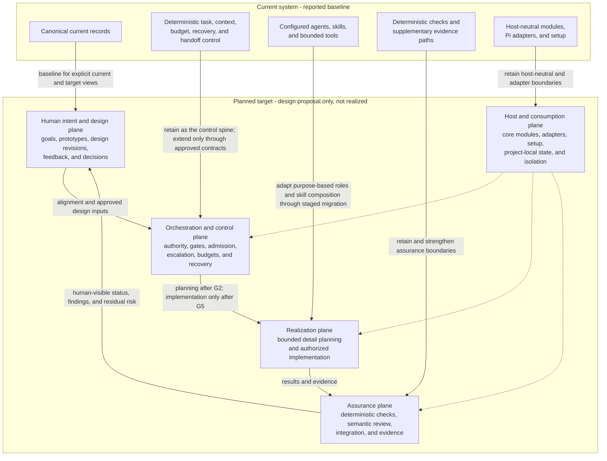
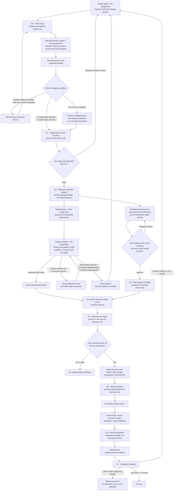
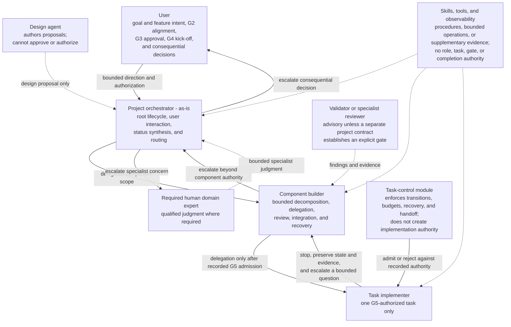

# Sol Mermaid diagram proposal — high-level design draft 5

This is a bounded, read-only advisory proposal requested for the human-facing presentation packet. It does not approve the design, adopt target contracts, create tasks, or authorize implementation.

## Provenance

- Packet considered: `drafts/agentic-development-system-high-level-design-draft5/`
- Existing packet predecessor: draft 4
- Reviewer role: Sol architectural design advisor
- Requested change: add proper Mermaid diagrams without creating another draft
- Renderer validation: unavailable in this environment; syntax was kept to basic Mermaid `flowchart` constructs

## Recommendation

Use three diagrams: replace the current architecture view, add a gate lifecycle, and replace the text-only escalation ladder. These diagrams restate the existing draft and do not change its substantive design direction.

## 1. Architecture diagram

Replace the Mermaid block immediately after `## 4.1 Human-readable system view` with a diagram that separates the reported current baseline from the planned target and preserves the five target planes.

## 2. Gate lifecycle diagram

Insert after the opening recommendation in `## 6.1 Recommended gate model` and before `## 6.2 Current and planned state representation`. It shows the Sol → Kimi → user → Terra → Sol → user sequence, parallel G3 work, distinct gates, and the separation between kick-off and task authorization.

## 3. Authority and escalation diagram

Replace only the fenced text block in `## 7.2 Escalation` beginning with `task implementer` and ending with `user or required human domain expert`.

No implementation authority is implied by these diagrams. They are presentation aids for the existing proposal.